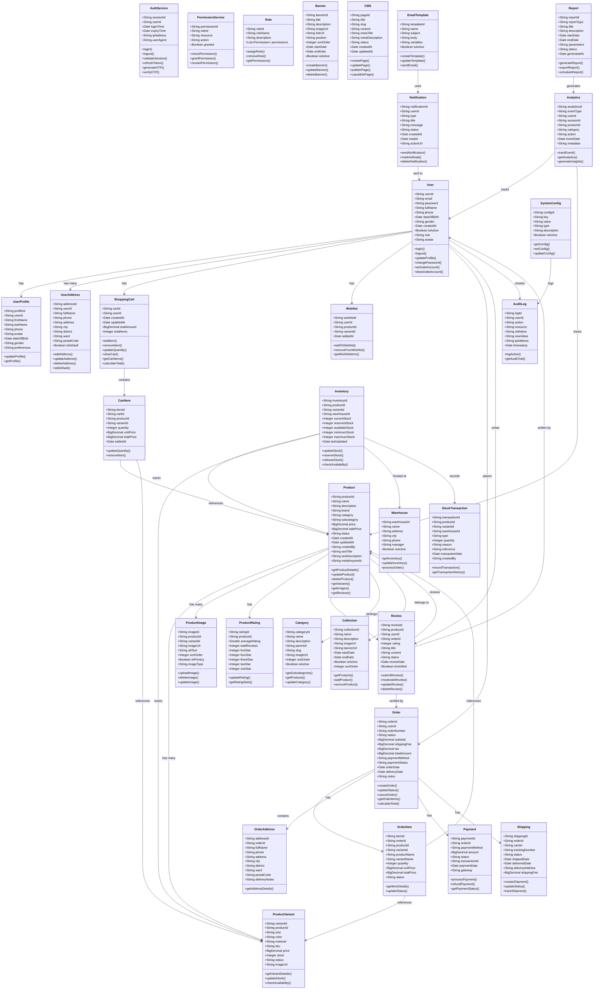

### **CLASS DIAGRAM - KIẾN TRÚC HỆ THỐNG TỔNG THỂ**

```mermaid
classDiagram
    %% Core User Management
    class User {
        +String userId
        +String email
        +String password
        +String fullName
        +String phone
        +Date dateOfBirth
        +String gender
        +Date createdAt
        +Boolean isActive
        +String role
        +String avatar
        +login()
        +logout()
        +updateProfile()
        +changePassword()
        +activateAccount()
        +deactivateAccount()
    }
    
    class UserProfile {
        +String profileId
        +String userId
        +String firstName
        +String lastName
        +String phone
        +String avatar
        +Date dateOfBirth
        +String gender
        +String preferences
        +updateProfile()
        +getProfile()
    }
    
    class UserAddress {
        +String addressId
        +String userId
        +String fullName
        +String phone
        +String address
        +String city
        +String district
        +String ward
        +String postalCode
        +Boolean isDefault
        +addAddress()
        +updateAddress()
        +deleteAddress()
        +setDefault()
    }
    
    %% Authentication and Security
    class AuthService {
        +String sessionId
        +String userId
        +Date loginTime
        +Date expiryTime
        +String ipAddress
        +String userAgent
        +login()
        +logout()
        +validateSession()
        +refreshToken()
        +generateOTP()
        +verifyOTP()
    }
    
    class PermissionService {
        +String permissionId
        +String roleId
        +String resource
        +String action
        +Boolean granted
        +checkPermission()
        +grantPermission()
        +revokePermission()
    }
    
    class Role {
        +String roleId
        +String roleName
        +String description
        +List~Permission~ permissions
        +assignRole()
        +removeRole()
        +getPermissions()
    }
    
    %% Product Management
    class Product {
        +String productId
        +String name
        +String description
        +String brand
        +String category
        +String subcategory
        +BigDecimal price
        +BigDecimal salePrice
        +String status
        +Date createdAt
        +Date updatedAt
        +String createdBy
        +String seoTitle
        +String seoDescription
        +String metaKeywords
        +getProductDetails()
        +updateProduct()
        +deleteProduct()
        +getVariants()
        +getImages()
        +getReviews()
    }
    
    class ProductVariant {
        +String variantId
        +String productId
        +String size
        +String color
        +String material
        +String sku
        +BigDecimal price
        +Integer stock
        +String status
        +String imageUrl
        +getVariantDetails()
        +updateStock()
        +checkAvailability()
    }
    
    class ProductImage {
        +String imageId
        +String productId
        +String variantId
        +String imageUrl
        +String altText
        +Integer sortOrder
        +Boolean isPrimary
        +String imageType
        +uploadImage()
        +deleteImage()
        +updateImage()
    }
    
    class Category {
        +String categoryId
        +String name
        +String description
        +String parentId
        +String slug
        +String imageUrl
        +Integer sortOrder
        +Boolean isActive
        +getSubcategories()
        +getProducts()
        +updateCategory()
    }
    
    class Collection {
        +String collectionId
        +String name
        +String description
        +String imageUrl
        +String bannerUrl
        +Date startDate
        +Date endDate
        +Boolean isActive
        +Integer sortOrder
        +getProducts()
        +addProduct()
        +removeProduct()
    }
    
    %% Shopping and Cart
    class ShoppingCart {
        +String cartId
        +String userId
        +Date createdAt
        +Date updatedAt
        +BigDecimal totalAmount
        +Integer totalItems
        +addItem()
        +removeItem()
        +updateQuantity()
        +clearCart()
        +getCartItems()
        +calculateTotal()
    }
    
    class CartItem {
        +String itemId
        +String cartId
        +String productId
        +String variantId
        +Integer quantity
        +BigDecimal unitPrice
        +BigDecimal totalPrice
        +Date addedAt
        +updateQuantity()
        +removeItem()
    }
    
    class Wishlist {
        +String wishlistId
        +String userId
        +String productId
        +String variantId
        +Date addedAt
        +addToWishlist()
        +removeFromWishlist()
        +getWishlistItems()
    }
    
    %% Order Management
    class Order {
        +String orderId
        +String userId
        +String orderNumber
        +String status
        +BigDecimal subtotal
        +BigDecimal shippingFee
        +BigDecimal tax
        +BigDecimal totalAmount
        +String paymentMethod
        +String paymentStatus
        +Date orderDate
        +Date deliveryDate
        +String notes
        +createOrder()
        +updateStatus()
        +cancelOrder()
        +getOrderItems()
        +calculateTotal()
    }
    
    class OrderItem {
        +String itemId
        +String orderId
        +String productId
        +String variantId
        +String productName
        +String variantName
        +Integer quantity
        +BigDecimal unitPrice
        +BigDecimal totalPrice
        +String status
        +getItemDetails()
        +updateStatus()
    }
    
    class OrderAddress {
        +String addressId
        +String orderId
        +String fullName
        +String phone
        +String address
        +String city
        +String district
        +String ward
        +String postalCode
        +String deliveryNotes
        +getAddressDetails()
    }
    
    %% Inventory Management
    class Inventory {
        +String inventoryId
        +String productId
        +String variantId
        +String warehouseId
        +Integer currentStock
        +Integer reservedStock
        +Integer availableStock
        +Integer minimumStock
        +Integer maximumStock
        +Date lastUpdated
        +updateStock()
        +reserveStock()
        +releaseStock()
        +checkAvailability()
    }
    
    class Warehouse {
        +String warehouseId
        +String name
        +String address
        +String city
        +String phone
        +String manager
        +Boolean isActive
        +getInventory()
        +updateInventory()
        +processOrder()
    }
    
    class StockTransaction {
        +String transactionId
        +String productId
        +String variantId
        +String warehouseId
        +String type
        +Integer quantity
        +String reason
        +String reference
        +Date transactionDate
        +String createdBy
        +recordTransaction()
        +getTransactionHistory()
    }
    
    %% Payment and Shipping
    class Payment {
        +String paymentId
        +String orderId
        +String paymentMethod
        +BigDecimal amount
        +String status
        +String transactionId
        +Date paymentDate
        +String gateway
        +processPayment()
        +refundPayment()
        +getPaymentStatus()
    }
    
    class Shipping {
        +String shippingId
        +String orderId
        +String carrier
        +String trackingNumber
        +String status
        +Date shippedDate
        +Date deliveredDate
        +String deliveryAddress
        +BigDecimal shippingFee
        +createShipment()
        +updateStatus()
        +trackShipment()
    }
    
    %% Reviews and Ratings
    class Review {
        +String reviewId
        +String productId
        +String userId
        +String orderId
        +Integer rating
        +String title
        +String content
        +String status
        +Date reviewDate
        +Boolean isVerified
        +submitReview()
        +moderateReview()
        +updateReview()
        +deleteReview()
    }
    
    class ProductRating {
        +String ratingId
        +String productId
        +Double averageRating
        +Integer totalReviews
        +Integer fiveStar
        +Integer fourStar
        +Integer threeStar
        +Integer twoStar
        +Integer oneStar
        +updateRating()
        +getRatingStats()
    }
    
    %% Content Management
    class Banner {
        +String bannerId
        +String title
        +String description
        +String imageUrl
        +String linkUrl
        +String position
        +Integer sortOrder
        +Date startDate
        +Date endDate
        +Boolean isActive
        +createBanner()
        +updateBanner()
        +deleteBanner()
    }
    
    class CMS {
        +String pageId
        +String title
        +String slug
        +String content
        +String metaTitle
        +String metaDescription
        +String status
        +Date createdAt
        +Date updatedAt
        +createPage()
        +updatePage()
        +publishPage()
        +unpublishPage()
    }
    
    %% Notification System
    class Notification {
        +String notificationId
        +String userId
        +String type
        +String title
        +String message
        +String status
        +Date createdAt
        +Date readAt
        +String actionUrl
        +sendNotification()
        +markAsRead()
        +deleteNotification()
    }
    
    class EmailTemplate {
        +String templateId
        +String name
        +String subject
        +String body
        +String variables
        +Boolean isActive
        +createTemplate()
        +updateTemplate()
        +sendEmail()
    }
    
    %% Reporting and Analytics
    class Report {
        +String reportId
        +String reportType
        +String title
        +String description
        +Date startDate
        +Date endDate
        +String parameters
        +String status
        +Date generatedAt
        +generateReport()
        +exportReport()
        +scheduleReport()
    }
    
    class Analytics {
        +String analyticsId
        +String eventType
        +String userId
        +String sessionId
        +String productId
        +String category
        +String action
        +Date eventDate
        +String metadata
        +trackEvent()
        +getAnalytics()
        +generateInsights()
    }
    
    %% System Configuration
    class SystemConfig {
        +String configId
        +String key
        +String value
        +String type
        +String description
        +Boolean isActive
        +getConfig()
        +setConfig()
        +updateConfig()
    }
    
    class AuditLog {
        +String logId
        +String userId
        +String action
        +String resource
        +String oldValue
        +String newValue
        +String ipAddress
        +Date timestamp
        +logAction()
        +getAuditTrail()
    }
    
    %% Relationships
    User --> UserProfile : has
    User --> UserAddress : has many
    User --> ShoppingCart : has
    User --> Wishlist : has
    User --> Order : places
    User --> Review : writes
    
    Product --> ProductVariant : has many
    Product --> ProductImage : has many
    Product --> ProductRating : has
    Product --> Review : receives
    Product --> Category : belongs to
    Product --> Collection : belongs to
    
    ShoppingCart --> CartItem : contains
    CartItem --> Product : references
    CartItem --> ProductVariant : references
    
    Order --> OrderItem : contains
    Order --> OrderAddress : has
    Order --> Payment : has
    Order --> Shipping : has
    OrderItem --> Product : references
    OrderItem --> ProductVariant : references
    
    Inventory --> Product : tracks
    Inventory --> ProductVariant : tracks
    Inventory --> Warehouse : located at
    Inventory --> StockTransaction : records
    
    Review --> Product : reviews
    Review --> User : written by
    Review --> Order : verified by
    
    Notification --> User : sent to
    EmailTemplate --> Notification : uses
    
    Report --> Analytics : generates
    Analytics --> User : tracks
    Analytics --> Product : tracks
    
    SystemConfig --> AuditLog : logs
    User --> AuditLog : creates
```
