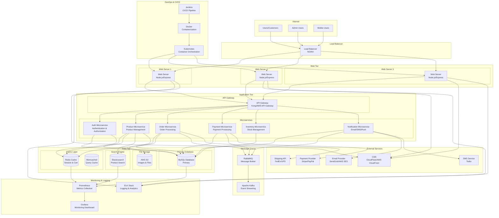

### **DEPLOYMENT DIAGRAM - SƠ ĐỒ TRIỂN KHAI**

```mermaid
graph TB
    subgraph "Internet"
        Users[Users/Customers]
        AdminUsers[Admin Users]
        MobileUsers[Mobile Users]
    end
    
    subgraph "Load Balancer"
        LB[Load Balancer<br/>NGINX]
    end
    
    subgraph "Web Tier"
        subgraph "Web Server 1"
            Web1[Web Server<br/>Node.js/Express]
        end
        subgraph "Web Server 2"
            Web2[Web Server<br/>Node.js/Express]
        end
        subgraph "Web Server 3"
            Web3[Web Server<br/>Node.js/Express]
        end
    end
    
    subgraph "Application Tier"
        subgraph "API Gateway"
            Gateway[API Gateway<br/>Kong/AWS API Gateway]
        end
        
        subgraph "Microservices"
            AuthMS[Auth Microservice<br/>Authentication & Authorization]
            ProductMS[Product Microservice<br/>Product Management]
            OrderMS[Order Microservice<br/>Order Processing]
            PaymentMS[Payment Microservice<br/>Payment Processing]
            InventoryMS[Inventory Microservice<br/>Stock Management]
            NotificationMS[Notification Microservice<br/>Email/SMS/Push]
        end
    end
    
    subgraph "Data Tier"
        subgraph "Primary Database"
            MySQL[(MySQL Database<br/>Primary)]
        end
        
        subgraph "Cache Layer"
            Redis[(Redis Cache<br/>Session & Cart)]
            Memcached[(Memcached<br/>Query Cache)]
        end
        
        subgraph "Search Engine"
            Elasticsearch[(Elasticsearch<br/>Product Search)]
        end
        
        subgraph "File Storage"
            S3[(AWS S3<br/>Images & Files)]
        end
    end
    
    subgraph "Message Queue"
        RabbitMQ[RabbitMQ<br/>Message Broker]
        Kafka[Apache Kafka<br/>Event Streaming]
    end
    
    subgraph "Monitoring & Logging"
        Prometheus[Prometheus<br/>Metrics Collection]
        Grafana[Grafana<br/>Monitoring Dashboard]
        ELK[ELK Stack<br/>Logging & Analytics]
    end
    
    subgraph "External Services"
        PaymentProvider[Payment Provider<br/>Stripe/PayPal]
        EmailProvider[Email Provider<br/>SendGrid/AWS SES]
        SMSService[SMS Service<br/>Twilio]
        ShippingAPI[Shipping API<br/>FedEx/UPS]
        CDN[CDN<br/>CloudFlare/AWS CloudFront]
    end
    
    subgraph "DevOps & CI/CD"
        Jenkins[Jenkins<br/>CI/CD Pipeline]
        Docker[Docker<br/>Containerization]
        Kubernetes[Kubernetes<br/>Container Orchestration]
    end
    
    %% Connections
    Users --> LB
    AdminUsers --> LB
    MobileUsers --> LB
    
    LB --> Web1
    LB --> Web2
    LB --> Web3
    
    Web1 --> Gateway
    Web2 --> Gateway
    Web3 --> Gateway
    
    Gateway --> AuthMS
    Gateway --> ProductMS
    Gateway --> OrderMS
    Gateway --> PaymentMS
    Gateway --> InventoryMS
    Gateway --> NotificationMS
    
    AuthMS --> MySQL
    ProductMS --> MySQL
    OrderMS --> MySQL
    PaymentMS --> MySQL
    InventoryMS --> MySQL
    NotificationMS --> MySQL
    
    AuthMS --> Redis
    ProductMS --> Redis
    OrderMS --> Redis
    
    ProductMS --> Elasticsearch
    ProductMS --> S3
    
    OrderMS --> RabbitMQ
    PaymentMS --> RabbitMQ
    NotificationMS --> RabbitMQ
    
    RabbitMQ --> Kafka
    
    PaymentMS --> PaymentProvider
    NotificationMS --> EmailProvider
    NotificationMS --> SMSService
    OrderMS --> ShippingAPI
    
    Web1 --> CDN
    Web2 --> CDN
    Web3 --> CDN
    
    MySQL --> Prometheus
    Redis --> Prometheus
    Elasticsearch --> Prometheus
    
    Prometheus --> Grafana
    Web1 --> ELK
    Web2 --> ELK
    Web3 --> ELK
    
    Jenkins --> Docker
    Docker --> Kubernetes
    Kubernetes --> Web1
    Kubernetes --> Web2
    Kubernetes --> Web3
```