## Comprehensive System Diagrams

### A. Tài Khoản & Xác Thực (Account & Authentication)

#### 1. Đăng Ký Tài Khoản (Account Registration)

**Activity Diagram:**
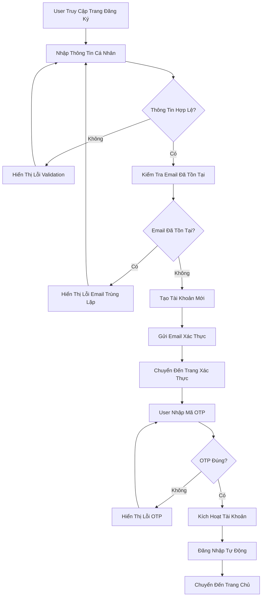
```mermaid
flowchart TD
    A[User Truy Cập Trang Đăng Ký] --> B[Nhập Thông Tin Cá Nhân]
    B --> C{Thông Tin Hợp Lệ?}
    C -->|Không| D[Hiển Thị Lỗi Validation]
    D --> B
    C -->|Có| E[Kiểm Tra Email Đã Tồn Tại]
    E --> F{Email Đã Tồn Tại?}
    F -->|Có| G[Hiển Thị Lỗi Email Trùng Lặp]
    G --> B
    F -->|Không| H[Tạo Tài Khoản Mới]
    H --> I[Gửi Email Xác Thực]
    I --> J[Chuyển Đến Trang Xác Thực]
    J --> K[User Nhập Mã OTP]
    K --> L{OTP Đúng?}
    L -->|Không| M[Hiển Thị Lỗi OTP]
    M --> K
    L -->|Có| N[Kích Hoạt Tài Khoản]
    N --> O[Đăng Nhập Tự Động]
    O --> P[Chuyển Đến Trang Chủ]
```

**Sequence Diagram:**
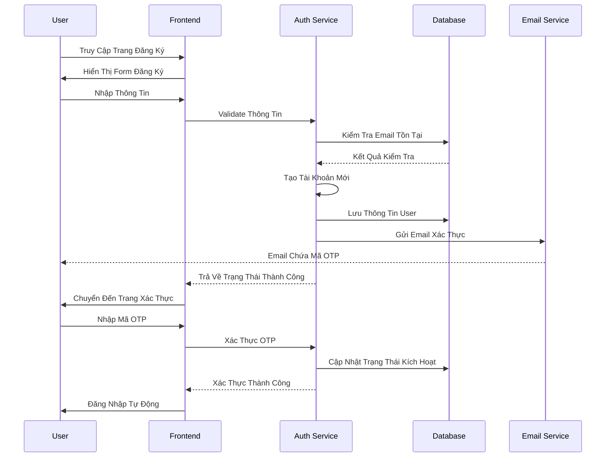
```mermaid
sequenceDiagram
    participant U as User
    participant F as Frontend
    participant A as Auth Service
    participant D as Database
    participant E as Email Service

    U->>F: Truy Cập Trang Đăng Ký
    F->>U: Hiển Thị Form Đăng Ký
    U->>F: Nhập Thông Tin
    F->>A: Validate Thông Tin
    A->>D: Kiểm Tra Email Tồn Tại
    D-->>A: Kết Quả Kiểm Tra
    A->>A: Tạo Tài Khoản Mới
    A->>D: Lưu Thông Tin User
    A->>E: Gửi Email Xác Thực
    E-->>U: Email Chứa Mã OTP
    A-->>F: Trả Về Trạng Thái Thành Công
    F->>U: Chuyển Đến Trang Xác Thực
    U->>F: Nhập Mã OTP
    F->>A: Xác Thực OTP
    A->>D: Cập Nhật Trạng Thái Kích Hoạt
    A-->>F: Xác Thực Thành Công
    F->>U: Đăng Nhập Tự Động
```

**Class Diagram:**
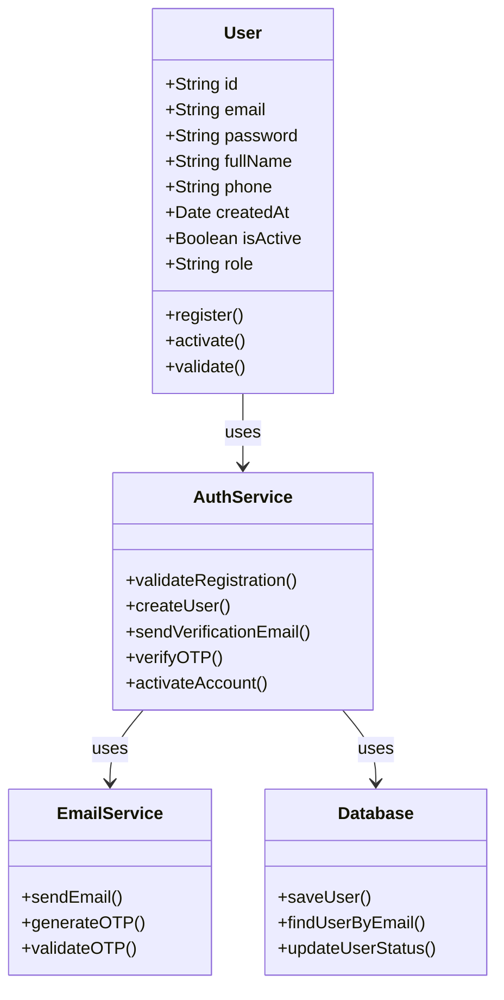
```mermaid
classDiagram
    class User {
        +String id
        +String email
        +String password
        +String fullName
        +String phone
        +Date createdAt
        +Boolean isActive
        +String role
        +register()
        +activate()
        +validate()
    }
    
    class AuthService {
        +validateRegistration()
        +createUser()
        +sendVerificationEmail()
        +verifyOTP()
        +activateAccount()
    }
    
    class EmailService {
        +sendEmail()
        +generateOTP()
        +validateOTP()
    }
    
    class Database {
        +saveUser()
        +findUserByEmail()
        +updateUserStatus()
    }
    
    User --> AuthService : uses
    AuthService --> EmailService : uses
    AuthService --> Database : uses
```

#### 2. Đăng Nhập Email/Mật Khẩu (Email/Password Login)

**Activity Diagram:**
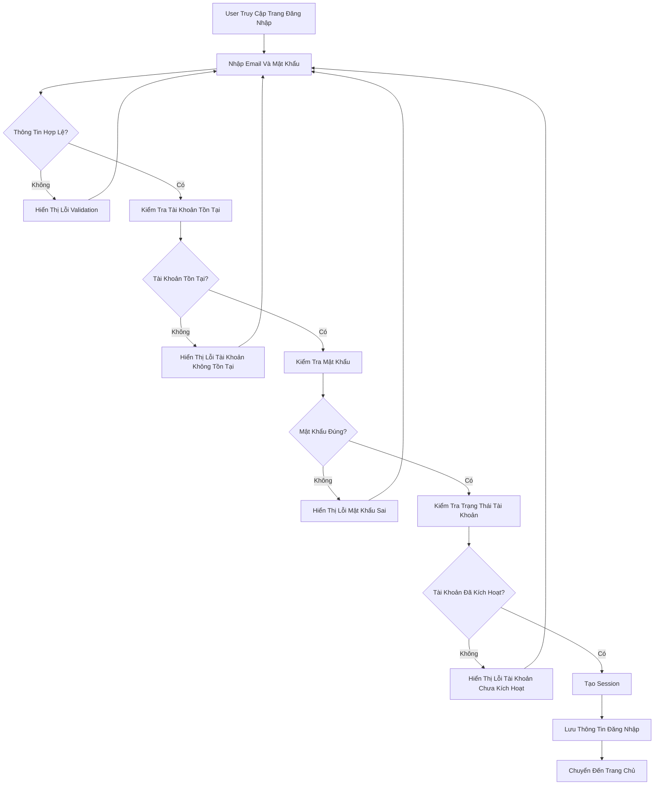
```mermaid
flowchart TD
    A[User Truy Cập Trang Đăng Nhập] --> B[Nhập Email Và Mật Khẩu]
    B --> C{Thông Tin Hợp Lệ?}
    C -->|Không| D[Hiển Thị Lỗi Validation]
    D --> B
    C -->|Có| E[Kiểm Tra Tài Khoản Tồn Tại]
    E --> F{Tài Khoản Tồn Tại?}
    F -->|Không| G[Hiển Thị Lỗi Tài Khoản Không Tồn Tại]
    G --> B
    F -->|Có| H[Kiểm Tra Mật Khẩu]
    H --> I{Mật Khẩu Đúng?}
    I -->|Không| J[Hiển Thị Lỗi Mật Khẩu Sai]
    J --> B
    I -->|Có| K[Kiểm Tra Trạng Thái Tài Khoản]
    K --> L{Tài Khoản Đã Kích Hoạt?}
    L -->|Không| M[Hiển Thị Lỗi Tài Khoản Chưa Kích Hoạt]
    M --> B
    L -->|Có| N[Tạo Session]
    N --> O[Lưu Thông Tin Đăng Nhập]
    O --> P[Chuyển Đến Trang Chủ]
```

**Sequence Diagram:**
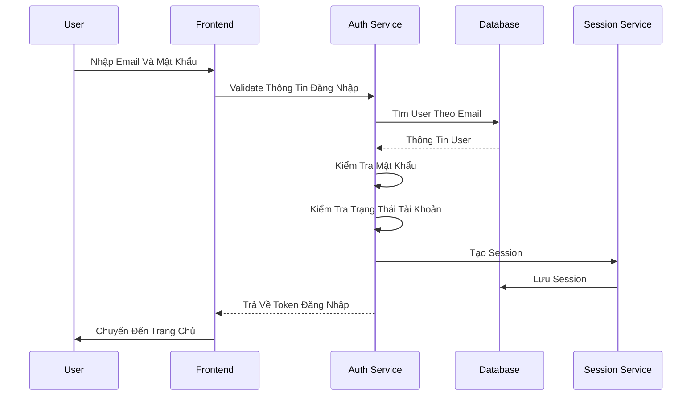
```mermaid
sequenceDiagram
    participant U as User
    participant F as Frontend
    participant A as Auth Service
    participant D as Database
    participant S as Session Service

    U->>F: Nhập Email Và Mật Khẩu
    F->>A: Validate Thông Tin Đăng Nhập
    A->>D: Tìm User Theo Email
    D-->>A: Thông Tin User
    A->>A: Kiểm Tra Mật Khẩu
    A->>A: Kiểm Tra Trạng Thái Tài Khoản
    A->>S: Tạo Session
    S->>D: Lưu Session
    A-->>F: Trả Về Token Đăng Nhập
    F->>U: Chuyển Đến Trang Chủ
```

**Class Diagram:**
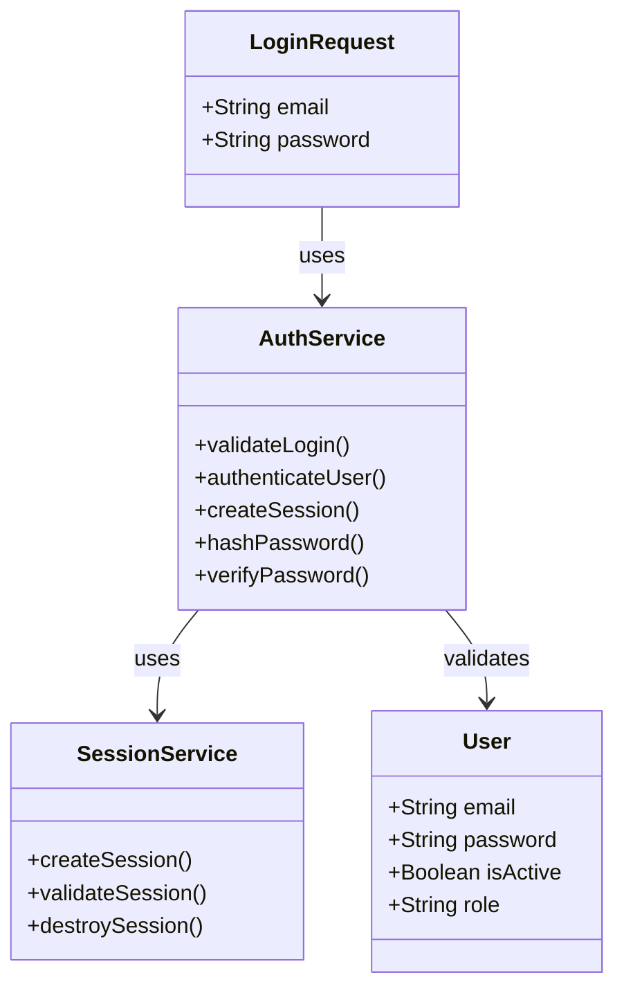
```mermaid
classDiagram
    class LoginRequest {
        +String email
        +String password
    }
    
    class AuthService {
        +validateLogin()
        +authenticateUser()
        +createSession()
        +hashPassword()
        +verifyPassword()
    }
    
    class SessionService {
        +createSession()
        +validateSession()
        +destroySession()
    }
    
    class User {
        +String email
        +String password
        +Boolean isActive
        +String role
    }
    
    LoginRequest --> AuthService : uses
    AuthService --> SessionService : uses
    AuthService --> User : validates
```

#### 3. Đăng Nhập OTP Email (OTP Email Login)

**Activity Diagram:**
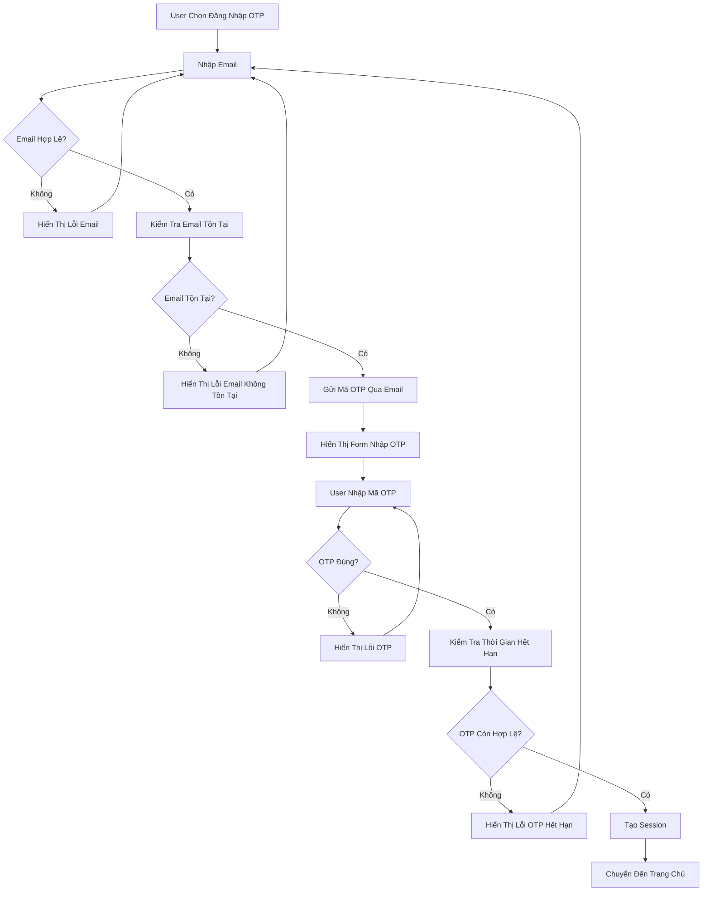
```mermaid
flowchart TD
    A[User Chọn Đăng Nhập OTP] --> B[Nhập Email]
    B --> C{Email Hợp Lệ?}
    C -->|Không| D[Hiển Thị Lỗi Email]
    D --> B
    C -->|Có| E[Kiểm Tra Email Tồn Tại]
    E --> F{Email Tồn Tại?}
    F -->|Không| G[Hiển Thị Lỗi Email Không Tồn Tại]
    G --> B
    F -->|Có| H[Gửi Mã OTP Qua Email]
    H --> I[Hiển Thị Form Nhập OTP]
    I --> J[User Nhập Mã OTP]
    J --> K{OTP Đúng?}
    K -->|Không| L[Hiển Thị Lỗi OTP]
    L --> J
    K -->|Có| M[Kiểm Tra Thời Gian Hết Hạn]
    M --> N{OTP Còn Hợp Lệ?}
    N -->|Không| O[Hiển Thị Lỗi OTP Hết Hạn]
    O --> B
    N -->|Có| P[Tạo Session]
    P --> Q[Chuyển Đến Trang Chủ]
```

**Sequence Diagram:**
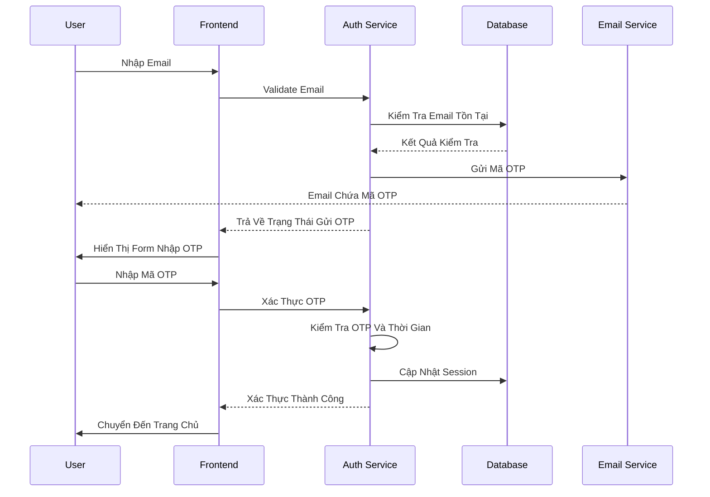
```mermaid
sequenceDiagram
    participant U as User
    participant F as Frontend
    participant A as Auth Service
    participant D as Database
    participant E as Email Service

    U->>F: Nhập Email
    F->>A: Validate Email
    A->>D: Kiểm Tra Email Tồn Tại
    D-->>A: Kết Quả Kiểm Tra
    A->>E: Gửi Mã OTP
    E-->>U: Email Chứa Mã OTP
    A-->>F: Trả Về Trạng Thái Gửi OTP
    F->>U: Hiển Thị Form Nhập OTP
    U->>F: Nhập Mã OTP
    F->>A: Xác Thực OTP
    A->>A: Kiểm Tra OTP Và Thời Gian
    A->>D: Cập Nhật Session
    A-->>F: Xác Thực Thành Công
    F->>U: Chuyển Đến Trang Chủ
```

**Class Diagram:**
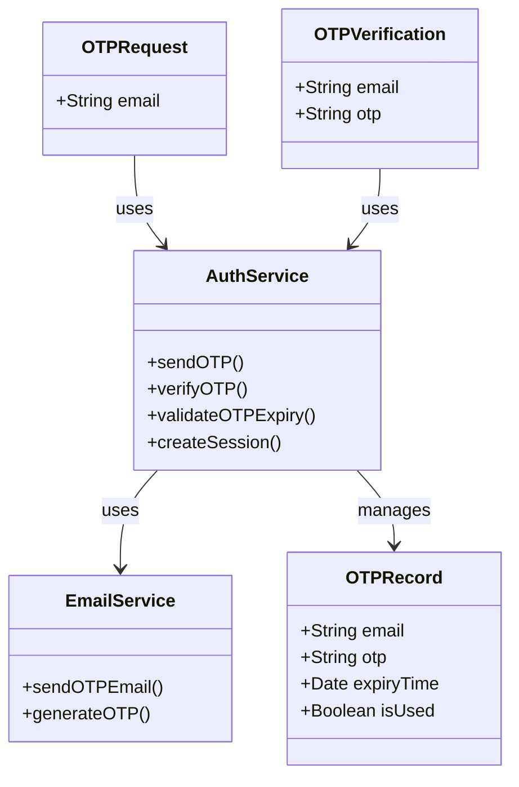
```mermaid
classDiagram
    class OTPRequest {
        +String email
    }
    
    class OTPVerification {
        +String email
        +String otp
    }
    
    class AuthService {
        +sendOTP()
        +verifyOTP()
        +validateOTPExpiry()
        +createSession()
    }
    
    class EmailService {
        +sendOTPEmail()
        +generateOTP()
    }
    
    class OTPRecord {
        +String email
        +String otp
        +Date expiryTime
        +Boolean isUsed
    }
    
    OTPRequest --> AuthService : uses
    OTPVerification --> AuthService : uses
    AuthService --> EmailService : uses
    AuthService --> OTPRecord : manages
```

#### 4. Quên Mật Khẩu / Đặt Lại (Forgot Password / Reset)

**Activity Diagram:**
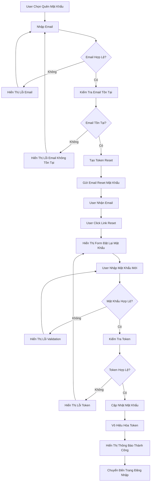
```mermaid
flowchart TD
    A[User Chọn Quên Mật Khẩu] --> B[Nhập Email]
    B --> C{Email Hợp Lệ?}
    C -->|Không| D[Hiển Thị Lỗi Email]
    D --> B
    C -->|Có| E[Kiểm Tra Email Tồn Tại]
    E --> F{Email Tồn Tại?}
    F -->|Không| G[Hiển Thị Lỗi Email Không Tồn Tại]
    G --> B
    F -->|Có| H[Tạo Token Reset]
    H --> I[Gửi Email Reset Mật Khẩu]
    I --> J[User Nhận Email]
    J --> K[User Click Link Reset]
    K --> L[Hiển Thị Form Đặt Lại Mật Khẩu]
    L --> M[User Nhập Mật Khẩu Mới]
    M --> N{Mật Khẩu Hợp Lệ?}
    N -->|Không| O[Hiển Thị Lỗi Validation]
    O --> M
    N -->|Có| P[Kiểm Tra Token]
    P --> Q{Token Hợp Lệ?}
    Q -->|Không| R[Hiển Thị Lỗi Token]
    R --> L
    Q -->|Có| S[Cập Nhật Mật Khẩu]
    S --> T[Vô Hiệu Hóa Token]
    T --> U[Hiển Thị Thông Báo Thành Công]
    U --> V[Chuyển Đến Trang Đăng Nhập]
```

**Sequence Diagram:**
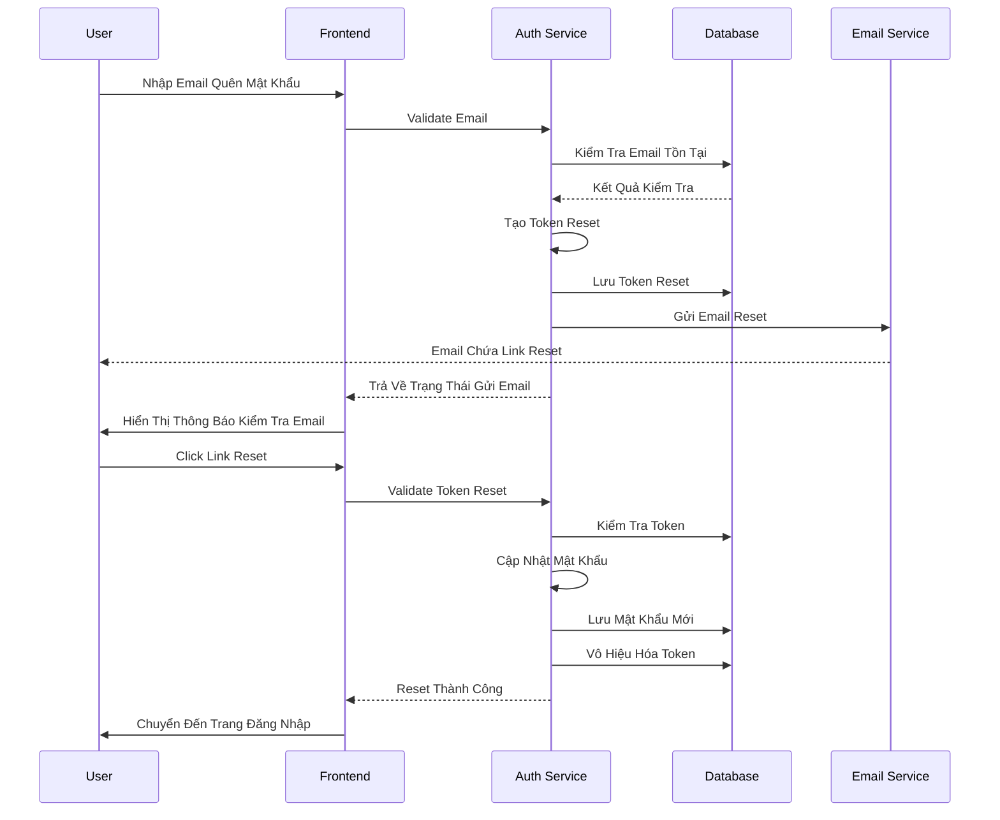
```mermaid
sequenceDiagram
    participant U as User
    participant F as Frontend
    participant A as Auth Service
    participant D as Database
    participant E as Email Service

    U->>F: Nhập Email Quên Mật Khẩu
    F->>A: Validate Email
    A->>D: Kiểm Tra Email Tồn Tại
    D-->>A: Kết Quả Kiểm Tra
    A->>A: Tạo Token Reset
    A->>D: Lưu Token Reset
    A->>E: Gửi Email Reset
    E-->>U: Email Chứa Link Reset
    A-->>F: Trả Về Trạng Thái Gửi Email
    F->>U: Hiển Thị Thông Báo Kiểm Tra Email
    U->>F: Click Link Reset
    F->>A: Validate Token Reset
    A->>D: Kiểm Tra Token
    A->>A: Cập Nhật Mật Khẩu
    A->>D: Lưu Mật Khẩu Mới
    A->>D: Vô Hiệu Hóa Token
    A-->>F: Reset Thành Công
    F->>U: Chuyển Đến Trang Đăng Nhập
```

**Class Diagram:**
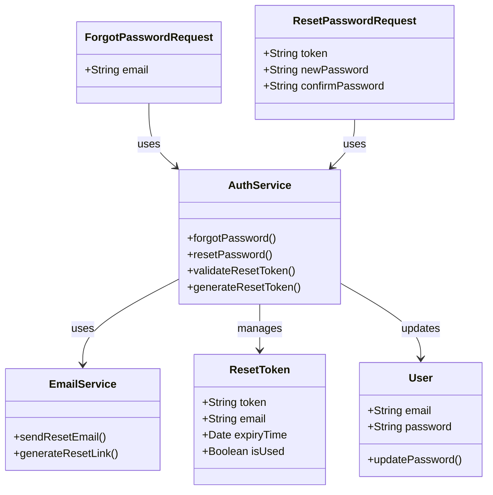
```mermaid
classDiagram
    class ForgotPasswordRequest {
        +String email
    }
    
    class ResetPasswordRequest {
        +String token
        +String newPassword
        +String confirmPassword
    }
    
    class AuthService {
        +forgotPassword()
        +resetPassword()
        +validateResetToken()
        +generateResetToken()
    }
    
    class EmailService {
        +sendResetEmail()
        +generateResetLink()
    }
    
    class ResetToken {
        +String token
        +String email
        +Date expiryTime
        +Boolean isUsed
    }
    
    class User {
        +String email
        +String password
        +updatePassword()
    }
    
    ForgotPasswordRequest --> AuthService : uses
    ResetPasswordRequest --> AuthService : uses
    AuthService --> EmailService : uses
    AuthService --> ResetToken : manages
    AuthService --> User : updates
```

#### 5. Đăng Xuất (Logout)

**Activity Diagram:**
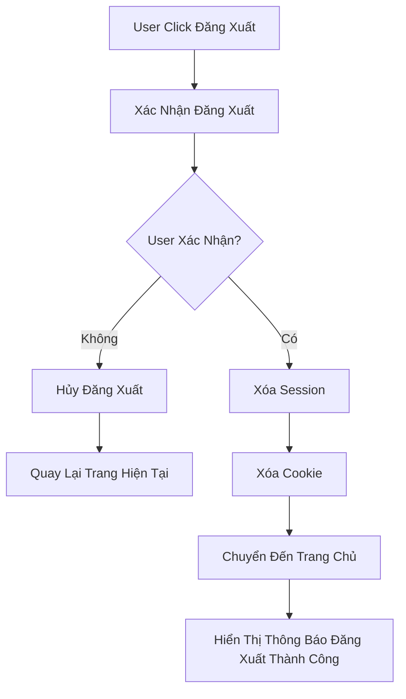
```mermaid
flowchart TD
    A[User Click Đăng Xuất] --> B[Xác Nhận Đăng Xuất]
    B --> C{User Xác Nhận?}
    C -->|Không| D[Hủy Đăng Xuất]
    D --> E[Quay Lại Trang Hiện Tại]
    C -->|Có| F[Xóa Session]
    F --> G[Xóa Cookie]
    G --> H[Chuyển Đến Trang Chủ]
    H --> I[Hiển Thị Thông Báo Đăng Xuất Thành Công]
```

**Sequence Diagram:**
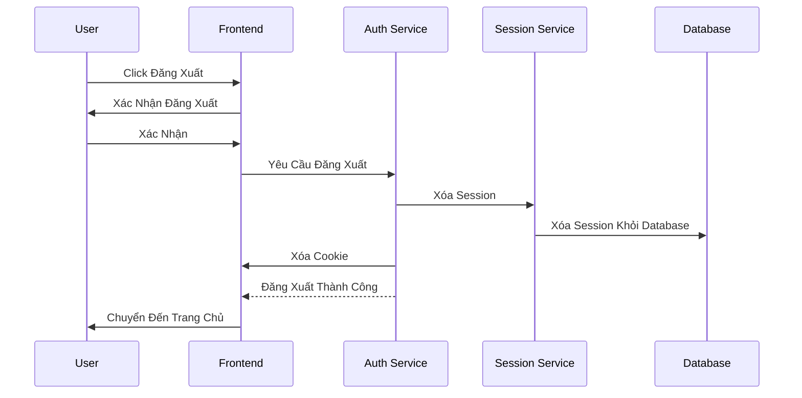
```mermaid
sequenceDiagram
    participant U as User
    participant F as Frontend
    participant A as Auth Service
    participant S as Session Service
    participant D as Database

    U->>F: Click Đăng Xuất
    F->>U: Xác Nhận Đăng Xuất
    U->>F: Xác Nhận
    F->>A: Yêu Cầu Đăng Xuất
    A->>S: Xóa Session
    S->>D: Xóa Session Khỏi Database
    A->>F: Xóa Cookie
    A-->>F: Đăng Xuất Thành Công
    F->>U: Chuyển Đến Trang Chủ
```

**Class Diagram:**
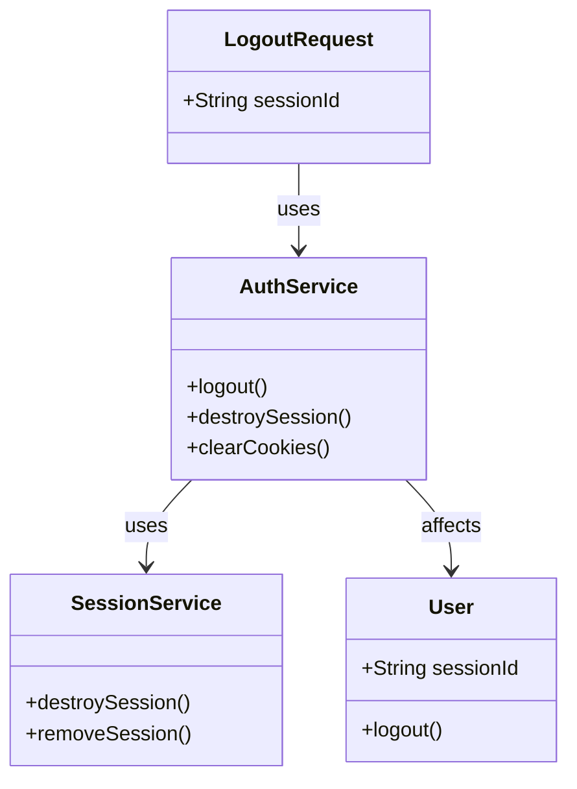
```mermaid
classDiagram
    class LogoutRequest {
        +String sessionId
    }
    
    class AuthService {
        +logout()
        +destroySession()
        +clearCookies()
    }
    
    class SessionService {
        +destroySession()
        +removeSession()
    }
    
    class User {
        +String sessionId
        +logout()
    }
    
    LogoutRequest --> AuthService : uses
    AuthService --> SessionService : uses
    AuthService --> User : affects
```

#### 6. Quản Lý Địa Chỉ Giao Hàng (Delivery Address Management)

**Activity Diagram:**
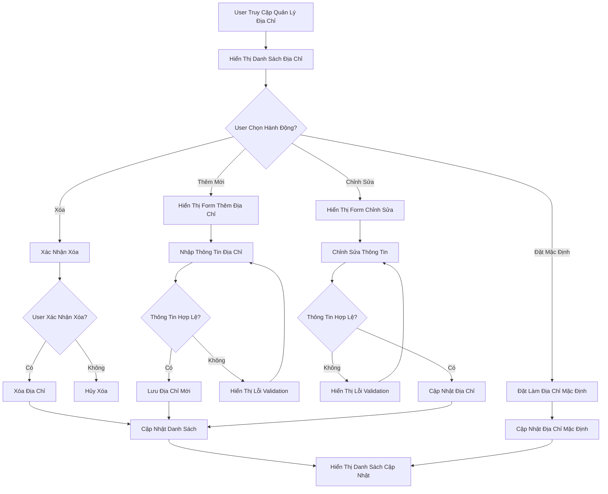
```mermaid
flowchart TD
    A[User Truy Cập Quản Lý Địa Chỉ] --> B[Hiển Thị Danh Sách Địa Chỉ]
    B --> C{User Chọn Hành Động?}
    C -->|Thêm Mới| D[Hiển Thị Form Thêm Địa Chỉ]
    C -->|Chỉnh Sửa| E[Hiển Thị Form Chỉnh Sửa]
    C -->|Xóa| F[Xác Nhận Xóa]
    C -->|Đặt Mặc Định| G[Đặt Làm Địa Chỉ Mặc Định]
    
    D --> H[Nhập Thông Tin Địa Chỉ]
    E --> I[Chỉnh Sửa Thông Tin]
    F --> J{User Xác Nhận Xóa?}
    J -->|Không| K[Hủy Xóa]
    J -->|Có| L[Xóa Địa Chỉ]
    
    H --> M{Thông Tin Hợp Lệ?}
    I --> N{Thông Tin Hợp Lệ?}
    M -->|Không| O[Hiển Thị Lỗi Validation]
    N -->|Không| P[Hiển Thị Lỗi Validation]
    O --> H
    P --> I
    
    M -->|Có| Q[Lưu Địa Chỉ Mới]
    N -->|Có| R[Cập Nhật Địa Chỉ]
    L --> S[Cập Nhật Danh Sách]
    Q --> S
    R --> S
    G --> T[Cập Nhật Địa Chỉ Mặc Định]
    S --> U[Hiển Thị Danh Sách Cập Nhật]
    T --> U
```

**Sequence Diagram:**
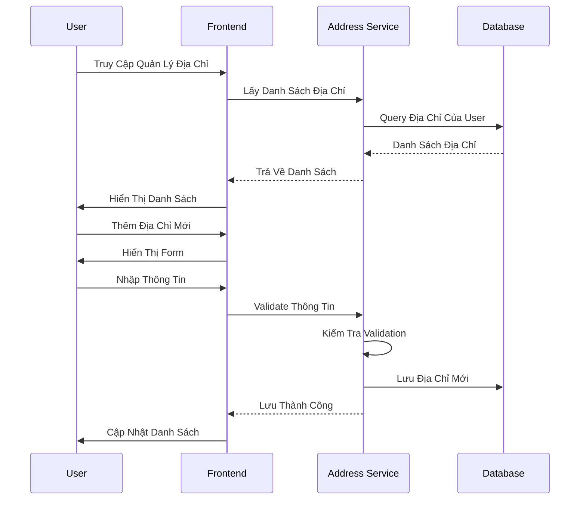
```mermaid
sequenceDiagram
    participant U as User
    participant F as Frontend
    participant A as Address Service
    participant D as Database

    U->>F: Truy Cập Quản Lý Địa Chỉ
    F->>A: Lấy Danh Sách Địa Chỉ
    A->>D: Query Địa Chỉ Của User
    D-->>A: Danh Sách Địa Chỉ
    A-->>F: Trả Về Danh Sách
    F->>U: Hiển Thị Danh Sách
    
    U->>F: Thêm Địa Chỉ Mới
    F->>U: Hiển Thị Form
    U->>F: Nhập Thông Tin
    F->>A: Validate Thông Tin
    A->>A: Kiểm Tra Validation
    A->>D: Lưu Địa Chỉ Mới
    A-->>F: Lưu Thành Công
    F->>U: Cập Nhật Danh Sách
```

**Class Diagram:**
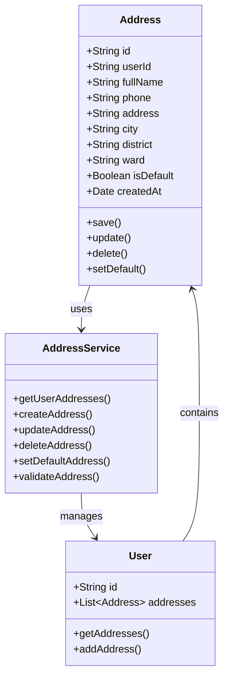
```mermaid
classDiagram
    class Address {
        +String id
        +String userId
        +String fullName
        +String phone
        +String address
        +String city
        +String district
        +String ward
        +Boolean isDefault
        +Date createdAt
        +save()
        +update()
        +delete()
        +setDefault()
    }
    
    class AddressService {
        +getUserAddresses()
        +createAddress()
        +updateAddress()
        +deleteAddress()
        +setDefaultAddress()
        +validateAddress()
    }
    
    class User {
        +String id
        +List~Address~ addresses
        +getAddresses()
        +addAddress()
    }
    
    Address --> AddressService : uses
    AddressService --> User : manages
    User --> Address : contains
```

#### 7. Lưu Phương Thức Thanh Toán Ảo (Save Virtual Payment Method)

**Activity Diagram:**
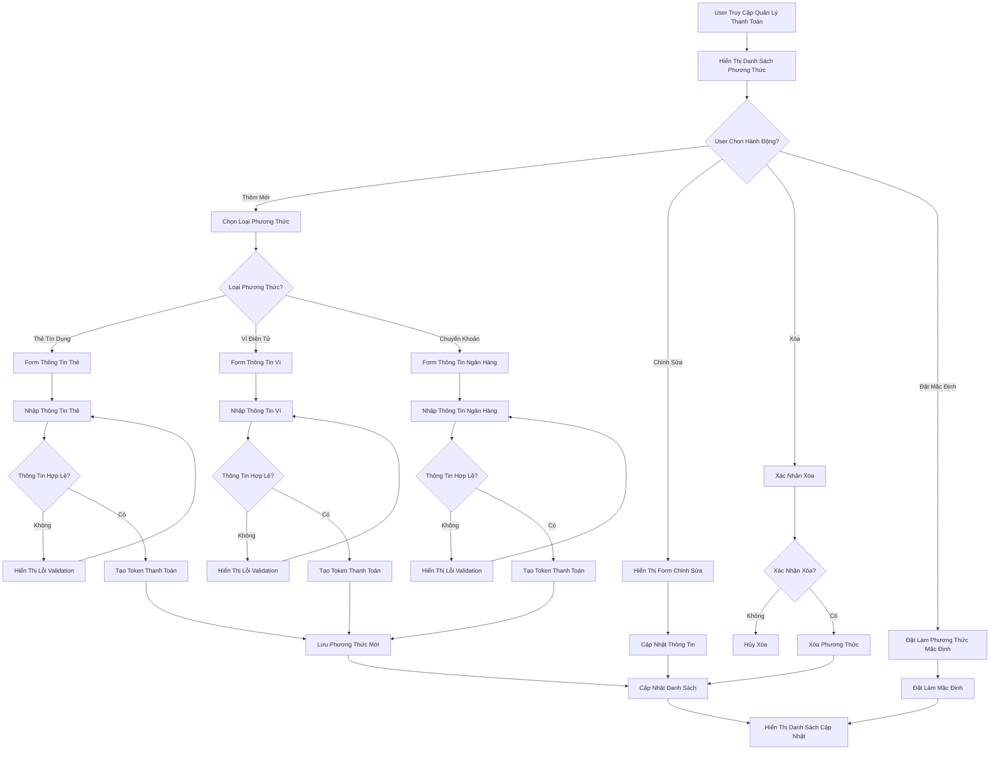
```mermaid
flowchart TD
    A[User Truy Cập Quản Lý Thanh Toán] --> B[Hiển Thị Danh Sách Phương Thức]
    B --> C{User Chọn Hành Động?}
    C -->|Thêm Mới| D[Chọn Loại Phương Thức]
    C -->|Chỉnh Sửa| E[Hiển Thị Form Chỉnh Sửa]
    C -->|Xóa| F[Xác Nhận Xóa]
    C -->|Đặt Mặc Định| G[Đặt Làm Phương Thức Mặc Định]
    
    D --> H{Loại Phương Thức?}
    H -->|Thẻ Tín Dụng| I[Form Thông Tin Thẻ]
    H -->|Ví Điện Tử| J[Form Thông Tin Ví]
    H -->|Chuyển Khoản| K[Form Thông Tin Ngân Hàng]
    
    I --> L[Nhập Thông Tin Thẻ]
    J --> M[Nhập Thông Tin Ví]
    K --> N[Nhập Thông Tin Ngân Hàng]
    
    L --> O{Thông Tin Hợp Lệ?}
    M --> P{Thông Tin Hợp Lệ?}
    N --> Q{Thông Tin Hợp Lệ?}
    
    O -->|Không| R[Hiển Thị Lỗi Validation]
    P -->|Không| S[Hiển Thị Lỗi Validation]
    Q -->|Không| T[Hiển Thị Lỗi Validation]
    
    R --> L
    S --> M
    T --> N
    
    O -->|Có| U[Tạo Token Thanh Toán]
    P -->|Có| V[Tạo Token Thanh Toán]
    Q -->|Có| W[Tạo Token Thanh Toán]
    
    U --> X[Lưu Phương Thức Mới]
    V --> X
    W --> X
    E --> Y[Cập Nhật Thông Tin]
    F --> Z{Xác Nhận Xóa?}
    Z -->|Không| AA[Hủy Xóa]
    Z -->|Có| BB[Xóa Phương Thức]
    
    X --> CC[Cập Nhật Danh Sách]
    Y --> CC
    BB --> CC
    G --> DD[Đặt Làm Mặc Định]
    CC --> EE[Hiển Thị Danh Sách Cập Nhật]
    DD --> EE
```

**Sequence Diagram:**
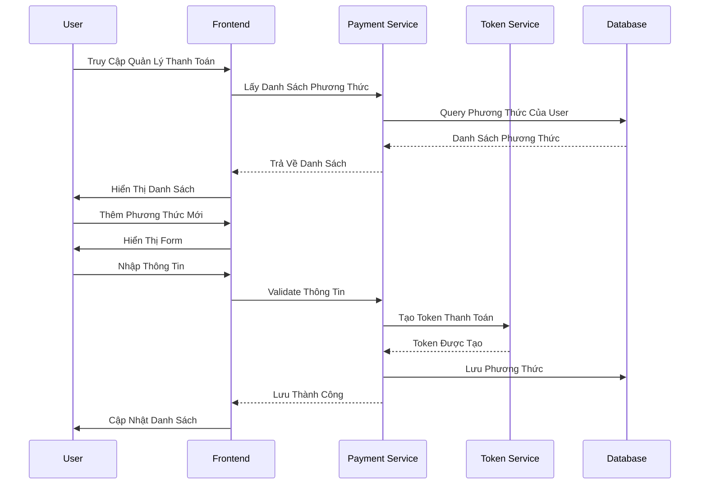
```mermaid
sequenceDiagram
    participant U as User
    participant F as Frontend
    participant P as Payment Service
    participant T as Token Service
    participant D as Database

    U->>F: Truy Cập Quản Lý Thanh Toán
    F->>P: Lấy Danh Sách Phương Thức
    P->>D: Query Phương Thức Của User
    D-->>P: Danh Sách Phương Thức
    P-->>F: Trả Về Danh Sách
    F->>U: Hiển Thị Danh Sách
    
    U->>F: Thêm Phương Thức Mới
    F->>U: Hiển Thị Form
    U->>F: Nhập Thông Tin
    F->>P: Validate Thông Tin
    P->>T: Tạo Token Thanh Toán
    T-->>P: Token Được Tạo
    P->>D: Lưu Phương Thức
    P-->>F: Lưu Thành Công
    F->>U: Cập Nhật Danh Sách
```

**Class Diagram:**
```mermaid
classDiagram
    class PaymentMethod {
        +String id
        +String userId
        +String type
        +String token
        +String lastFourDigits
        +String brand
        +Boolean isDefault
        +Date createdAt
        +save()
        +update()
        +delete()
        +setDefault()
    }
    
    class PaymentService {
        +getUserPaymentMethods()
        +createPaymentMethod()
        +updatePaymentMethod()
        +deletePaymentMethod()
        +setDefaultPaymentMethod()
        +validatePaymentInfo()
    }
    
    class TokenService {
        +createToken()
        +validateToken()
        +encryptData()
        +decryptData()
    }
    
    class User {
        +String id
        +List~PaymentMethod~ paymentMethods
        +getPaymentMethods()
        +addPaymentMethod()
    }
    
    PaymentMethod --> PaymentService : uses
    PaymentService --> TokenService : uses
    PaymentService --> User : manages
    User --> PaymentMethod : contains
```

#### 8. Xem Lịch Sử Đơn Hàng (View Order History)

**Activity Diagram:**
```mermaid
flowchart TD
    A[User Truy Cập Lịch Sử Đơn Hàng] --> B[Hiển Thị Danh Sách Đơn Hàng]
    B --> C{User Chọn Hành Động?}
    C -->|Xem Chi Tiết| D[Hiển Thị Chi Tiết Đơn Hàng]
    C -->|Lọc Theo Trạng Thái| E[Hiển Thị Đơn Theo Trạng Thái]
    C -->|Lọc Theo Thời Gian| F[Hiển Thị Đơn Theo Khoảng Thời Gian]
    C -->|Tìm Kiếm| G[Nhập Từ Khóa Tìm Kiếm]
    
    D --> H[Hiển Thị Thông Tin Đơn Hàng]
    H --> I[Hiển Thị Danh Sách Sản Phẩm]
    I --> J[Hiển Thị Trạng Thái Giao Hàng]
    J --> K[Hiển Thị Thông Tin Thanh Toán]
    
    E --> L[Lọc Đơn Theo Trạng Thái]
    F --> M[Lọc Đơn Theo Thời Gian]
    G --> N[Tìm Kiếm Đơn Hàng]
    
    L --> O[Cập Nhật Danh Sách]
    M --> O
    N --> O
    O --> P[Hiển Thị Kết Quả Lọc]
```

**Sequence Diagram:**
```mermaid
sequenceDiagram
    participant U as User
    participant F as Frontend
    participant O as Order Service
    participant D as Database

    U->>F: Truy Cập Lịch Sử Đơn Hàng
    F->>O: Lấy Danh Sách Đơn Hàng
    O->>D: Query Đơn Hàng Của User
    D-->>O: Danh Sách Đơn Hàng
    O-->>F: Trả Về Danh Sách
    F->>U: Hiển Thị Danh Sách
    
    U->>F: Xem Chi Tiết Đơn Hàng
    F->>O: Lấy Chi Tiết Đơn Hàng
    O->>D: Query Chi Tiết Đơn Hàng
    D-->>O: Chi Tiết Đơn Hàng
    O-->>F: Trả Về Chi Tiết
    F->>U: Hiển Thị Chi Tiết
    
    U->>F: Lọc Đơn Hàng
    F->>O: Lọc Theo Điều Kiện
    O->>D: Query Với Điều Kiện Lọc
    D-->>O: Kết Quả Lọc
    O-->>F: Trả Về Kết Quả
    F->>U: Hiển Thị Kết Quả Lọc
```

**Class Diagram:**
```mermaid
classDiagram
    class Order {
        +String id
        +String userId
        +String status
        +Date orderDate
        +Double totalAmount
        +String shippingAddress
        +String paymentMethod
        +List~OrderItem~ items
        +getDetails()
        +getStatus()
        +updateStatus()
    }
    
    class OrderItem {
        +String productId
        +String productName
        +Integer quantity
        +Double price
        +String variant
    }
    
    class OrderService {
        +getUserOrders()
        +getOrderDetails()
        +filterOrders()
        +searchOrders()
        +getOrderStatus()
    }
    
    class User {
        +String id
        +List~Order~ orders
        +getOrderHistory()
    }
    
    Order --> OrderItem : contains
    Order --> OrderService : uses
    OrderService --> User : manages
    User --> Order : has
```

### B. Danh Mục & Sản Phẩm (Categories & Products)

#### 9. Duyệt Danh Mục (Browse Categories)

**Activity Diagram:**
```mermaid
flowchart TD
    A[User Truy Cập Trang Danh Mục] --> B[Hiển Thị Danh Sách Danh Mục]
    B --> C{User Chọn Danh Mục?}
    C -->|Có| D[Hiển Thị Sản Phẩm Trong Danh Mục]
    C -->|Không| E[Hiển Thị Tất Cả Sản Phẩm]
    
    D --> F[Hiển Thị Thông Tin Danh Mục]
    F --> G[Hiển Thị Danh Sách Sản Phẩm]
    G --> H[Hiển Thị Phân Trang]
    
    E --> I[Hiển Thị Tất Cả Sản Phẩm]
    I --> J[Hiển Thị Phân Trang]
    
    H --> K{User Chọn Hành Động?}
    J --> K
    
    K -->|Xem Chi Tiết Sản Phẩm| L[Chuyển Đến Trang Chi Tiết]
    K -->|Thêm Vào Giỏ| M[Thêm Sản Phẩm Vào Giỏ]
    K -->|Thêm Vào Wishlist| N[Thêm Vào Wishlist]
    K -->|Lọc Sản Phẩm| O[Hiển Thị Bộ Lọc]
    K -->|Sắp Xếp| P[Hiển Thị Tùy Chọn Sắp Xếp]
    K -->|Trang Tiếp| Q[Chuyển Đến Trang Tiếp]
    
    O --> R[Áp Dụng Bộ Lọc]
    P --> S[Áp Dụng Sắp Xếp]
    R --> T[Cập Nhật Danh Sách Sản Phẩm]
    S --> T
    T --> U[Hiển Thị Kết Quả Mới]
```

**Sequence Diagram:**
```mermaid
sequenceDiagram
    participant U as User
    participant F as Frontend
    participant C as Category Service
    participant P as Product Service
    participant D as Database

    U->>F: Truy Cập Trang Danh Mục
    F->>C: Lấy Danh Sách Danh Mục
    C->>D: Query Danh Mục
    D-->>C: Danh Sách Danh Mục
    C-->>F: Trả Về Danh Mục
    F->>U: Hiển Thị Danh Mục
    
    U->>F: Chọn Danh Mục
    F->>P: Lấy Sản Phẩm Theo Danh Mục
    P->>D: Query Sản Phẩm
    D-->>P: Danh Sách Sản Phẩm
    P-->>F: Trả Về Sản Phẩm
    F->>U: Hiển Thị Sản Phẩm
    
    U->>F: Lọc Sản Phẩm
    F->>P: Áp Dụng Bộ Lọc
    P->>D: Query Với Điều Kiện Lọc
    D-->>P: Kết Quả Lọc
    P-->>F: Trả Về Kết Quả
    F->>U: Hiển Thị Kết Quả Mới
```

**Class Diagram:**
```mermaid
classDiagram
    class Category {
        +String id
        +String name
        +String description
        +String image
        +Boolean isActive
        +Integer sortOrder
        +getProducts()
        +getSubCategories()
    }
    
    class Product {
        +String id
        +String name
        +String description
        +Double price
        +String categoryId
        +String image
        +Boolean isActive
        +getVariants()
        +getStock()
    }
    
    class CategoryService {
        +getAllCategories()
        +getCategoryById()
        +getCategoryProducts()
        +getSubCategories()
    }
    
    class ProductService {
        +getProductsByCategory()
        +filterProducts()
        +sortProducts()
        +searchProducts()
    }
    
    Category --> Product : contains
    Category --> CategoryService : uses
    Product --> ProductService : uses
```

#### 10. Tìm Kiếm Theo Từ Khóa (Search By Keywords)

**Activity Diagram:**
```mermaid
flowchart TD
    A[User Nhập Từ Khóa Tìm Kiếm] --> B[Hiển Thị Gợi Ý Tìm Kiếm]
    B --> C{User Chọn Gợi Ý?}
    C -->|Có| D[Chọn Gợi Ý]
    C -->|Không| E[Tiếp Tục Nhập]
    
    D --> F[Thực Hiện Tìm Kiếm]
    E --> G[Kiểm Tra Độ Dài Từ Khóa]
    G --> H{Từ Khóa Đủ Dài?}
    H -->|Không| I[Tiếp Tục Nhập]
    H -->|Có| J[Thực Hiện Tìm Kiếm]
    
    F --> K[Hiển Thị Kết Quả Tìm Kiếm]
    J --> K
    
    K --> L[Hiển Thị Số Lượng Kết Quả]
    L --> M[Hiển Thị Danh Sách Sản Phẩm]
    M --> N[Hiển Thị Phân Trang]
    
    N --> O{User Chọn Hành Động?}
    O -->|Xem Chi Tiết| P[Chuyển Đến Trang Chi Tiết]
    O -->|Thêm Vào Giỏ| Q[Thêm Vào Giỏ Hàng]
    O -->|Thêm Vào Wishlist| R[Thêm Vào Wishlist]
    O -->|Lọc Kết Quả| S[Hiển Thị Bộ Lọc]
    O -->|Sắp Xếp| T[Hiển Thị Tùy Chọn Sắp Xếp]
    O -->|Trang Tiếp| U[Chuyển Đến Trang Tiếp]
    
    S --> V[Áp Dụng Bộ Lọc]
    T --> W[Áp Dụng Sắp Xếp]
    V --> X[Cập Nhật Kết Quả]
    W --> X
    X --> Y[Hiển Thị Kết Quả Mới]
```

**Sequence Diagram:**
```mermaid
sequenceDiagram
    participant U as User
    participant F as Frontend
    participant S as Search Service
    participant P as Product Service
    participant D as Database

    U->>F: Nhập Từ Khóa Tìm Kiếm
    F->>S: Lấy Gợi Ý Tìm Kiếm
    S->>D: Query Gợi Ý
    D-->>S: Danh Sách Gợi Ý
    S-->>F: Trả Về Gợi Ý
    F->>U: Hiển Thị Gợi Ý
    
    U->>F: Thực Hiện Tìm Kiếm
    F->>S: Tìm Kiếm Sản Phẩm
    S->>P: Query Sản Phẩm Theo Từ Khóa
    P->>D: Tìm Kiếm Trong Database
    D-->>P: Kết Quả Tìm Kiếm
    P-->>S: Danh Sách Sản Phẩm
    S-->>F: Trả Về Kết Quả
    F->>U: Hiển Thị Kết Quả
    
    U->>F: Lọc Kết Quả
    F->>S: Áp Dụng Bộ Lọc
    S->>P: Lọc Sản Phẩm
    P->>D: Query Với Điều Kiện Lọc
    D-->>P: Kết Quả Lọc
    P-->>S: Kết Quả Đã Lọc
    S-->>F: Trả Về Kết Quả
    F->>U: Hiển Thị Kết Quả Mới
```

**Class Diagram:**
```mermaid
classDiagram
    class SearchRequest {
        +String keyword
        +String category
        +String sortBy
        +String filter
        +Integer page
        +Integer limit
    }
    
    class SearchResult {
        +List~Product~ products
        +Integer totalCount
        +Integer currentPage
        +Integer totalPages
        +String searchKeyword
    }
    
    class SearchService {
        +searchProducts()
        +getSearchSuggestions()
        +filterSearchResults()
        +sortSearchResults()
        +getSearchHistory()
    }
    
    class Product {
        +String id
        +String name
        +String description
        +Double price
        +String category
        +String image
        +Boolean isActive
        +getSearchScore()
    }
    
    SearchRequest --> SearchService : uses
    SearchService --> SearchResult : returns
    SearchService --> Product : searches
```

#### 11. Lọc Theo Size/Màu/Khoảng Giá (Filter By Size/Color/Price Range)

**Activity Diagram:**
```mermaid
flowchart TD
    A[User Truy Cập Trang Sản Phẩm] --> B[Hiển Thị Bộ Lọc]
    B --> C[Hiển Thị Lọc Theo Size]
    C --> D[Hiển Thị Lọc Theo Màu]
    D --> E[Hiển Thị Lọc Theo Khoảng Giá]
    E --> F[Hiển Thị Lọc Theo Thương Hiệu]
    
    F --> G{User Chọn Bộ Lọc?}
    G -->|Size| H[Chọn Size]
    G -->|Màu| I[Chọn Màu]
    G -->|Giá| J[Chọn Khoảng Giá]
    G -->|Thương Hiệu| K[Chọn Thương Hiệu]
    G -->|Xóa Tất Cả| L[Xóa Tất Cả Bộ Lọc]
    
    H --> M[Áp Dụng Lọc Size]
    I --> N[Áp Dụng Lọc Màu]
    J --> O[Áp Dụng Lọc Giá]
    K --> P[Áp Dụng Lọc Thương Hiệu]
    L --> Q[Hiển Thị Tất Cả Sản Phẩm]
    
    M --> R[Cập Nhật Kết Quả Lọc]
    N --> R
    O --> R
    P --> R
    
    R --> S[Hiển Thị Số Lượng Kết Quả]
    S --> T[Hiển Thị Danh Sách Sản Phẩm Đã Lọc]
    T --> U[Hiển Thị Phân Trang]
    
    U --> V{User Chọn Hành Động?}
    V -->|Xem Chi Tiết| W[Chuyển Đến Trang Chi Tiết]
    V -->|Thêm Vào Giỏ| X[Thêm Vào Giỏ Hàng]
    V -->|Thêm Vào Wishlist| Y[Thêm Vào Wishlist]
    V -->|Thêm Bộ Lọc| Z[Thêm Bộ Lọc Khác]
    V -->|Trang Tiếp| AA[Chuyển Đến Trang Tiếp]
    
    Z --> BB[Hiển Thị Bộ Lọc Bổ Sung]
    BB --> CC[Áp Dụng Bộ Lọc Mới]
    CC --> DD[Cập Nhật Kết Quả]
    DD --> EE[Hiển Thị Kết Quả Mới]
```

**Sequence Diagram:**
```mermaid
sequenceDiagram
    participant U as User
    participant F as Frontend
    participant P as Product Service
    participant D as Database

    U->>F: Truy Cập Trang Sản Phẩm
    F->>P: Lấy Danh Sách Sản Phẩm
    P->>D: Query Sản Phẩm
    D-->>P: Danh Sách Sản Phẩm
    P-->>F: Trả Về Sản Phẩm
    F->>U: Hiển Thị Sản Phẩm Và Bộ Lọc
    
    U->>F: Chọn Bộ Lọc
    F->>P: Áp Dụng Bộ Lọc
    P->>D: Query Với Điều Kiện Lọc
    D-->>P: Kết Quả Đã Lọc
    P-->>F: Trả Về Kết Quả
    F->>U: Hiển Thị Kết Quả Mới
    
    U->>F: Thêm Bộ Lọc
    F->>P: Áp Dụng Bộ Lọc Bổ Sung
    P->>D: Query Với Điều Kiện Lọc Mới
    D-->>P: Kết Quả Lọc Mới
    P-->>F: Trả Về Kết Quả
    F->>U: Hiển Thị Kết Quả Cập Nhật
```

**Class Diagram:**
```mermaid
classDiagram
    class Filter {
        +String type
        +String value
        +String operator
        +Boolean isActive
        +apply()
        +remove()
    }
    
    class SizeFilter {
        +String size
        +List~String~ availableSizes
        +apply()
    }
    
    class ColorFilter {
        +String color
        +List~String~ availableColors
        +apply()
    }
    
    class PriceFilter {
        +Double minPrice
        +Double maxPrice
        +apply()
    }
    
    class BrandFilter {
        +String brand
        +List~String~ availableBrands
        +apply()
    }
    
    class ProductService {
        +getProducts()
        +applyFilters()
        +getAvailableFilters()
        +getFilteredProducts()
    }
    
    Filter --> ProductService : uses
    SizeFilter --> Filter : extends
    ColorFilter --> Filter : extends
    PriceFilter --> Filter : extends
    BrandFilter --> Filter : extends
```

#### 12. Xem Chi Tiết Sản Phẩm (View Product Details)

**Activity Diagram:**
```mermaid
flowchart TD
    A[User Click Vào Sản Phẩm] --> B[Hiển Thị Thông Tin Cơ Bản]
    B --> C[Hiển Thị Hình Ảnh Sản Phẩm]
    C --> D[Hiển Thị Giá Sản Phẩm]
    D --> E[Hiển Thị Mô Tả Chi Tiết]
    E --> F[Hiển Thị Thông Tin Size]
    F --> G[Hiển Thị Thông Tin Màu]
    G --> H[Hiển Thị Trạng Thái Tồn Kho]
    
    H --> I[Hiển Thị Đánh Giá Sản Phẩm]
    I --> J[Hiển Thị Sản Phẩm Liên Quan]
    J --> K[Hiển Thị Thông Tin Giao Hàng]
    
    K --> L{User Chọn Hành Động?}
    L -->|Chọn Size| M[Chọn Size]
    L -->|Chọn Màu| N[Chọn Màu]
    L -->|Chọn Số Lượng| O[Chọn Số Lượng]
    L -->|Thêm Vào Giỏ| P[Thêm Vào Giỏ Hàng]
    L -->|Thêm Vào Wishlist| Q[Thêm Vào Wishlist]
    L -->|Chia Sẻ| R[Chia Sẻ Sản Phẩm]
    L -->|Xem Size Guide| S[Hiển Thị Size Guide]
    L -->|Xem Đánh Giá| T[Hiển Thị Đánh Giá Chi Tiết]
    
    M --> U[Cập Nhật Thông Tin Size]
    N --> V[Cập Nhật Thông Tin Màu]
    O --> W[Cập Nhật Số Lượng]
    
    U --> X[Kiểm Tra Tồn Kho]
    V --> X
    W --> X
    
    X --> Y{Tồn Kho Có Đủ?}
    Y -->|Không| Z[Hiển Thị Thông Báo Hết Hàng]
    Y -->|Có| AA[Hiển Thị Trạng Thái Còn Hàng]
    
    P --> BB[Thêm Vào Giỏ Thành Công]
    Q --> CC[Thêm Vào Wishlist Thành Công]
    R --> DD[Hiển Thị Link Chia Sẻ]
    S --> EE[Hiển Thị Bảng Size Guide]
    T --> FF[Hiển Thị Tất Cả Đánh Giá]
```

**Sequence Diagram:**
```mermaid
sequenceDiagram
    participant U as User
    participant F as Frontend
    participant P as Product Service
    participant I as Inventory Service
    participant R as Review Service
    participant D as Database

    U->>F: Click Vào Sản Phẩm
    F->>P: Lấy Chi Tiết Sản Phẩm
    P->>D: Query Chi Tiết Sản Phẩm
    D-->>P: Thông Tin Sản Phẩm
    P->>I: Kiểm Tra Tồn Kho
    I->>D: Query Tồn Kho
    D-->>I: Thông Tin Tồn Kho
    I-->>P: Trạng Thái Tồn Kho
    P->>R: Lấy Đánh Giá Sản Phẩm
    R->>D: Query Đánh Giá
    D-->>R: Danh Sách Đánh Giá
    R-->>P: Đánh Giá Sản Phẩm
    P-->>F: Trả Về Chi Tiết Sản Phẩm
    F->>U: Hiển Thị Chi Tiết Sản Phẩm
    
    U->>F: Chọn Biến Thể
    F->>I: Kiểm Tra Tồn Kho Biến Thể
    I->>D: Query Tồn Kho Biến Thể
    D-->>I: Thông Tin Tồn Kho
    I-->>F: Trạng Thái Tồn Kho
    F->>U: Cập Nhật Trạng Thái Tồn Kho
```

**Class Diagram:**
```mermaid
classDiagram
    class Product {
        +String id
        +String name
        +String description
        +Double price
        +String category
        +String brand
        +String image
        +Boolean isActive
        +getDetails()
        +getVariants()
        +getReviews()
        +getRelatedProducts()
    }
    
    class ProductVariant {
        +String id
        +String productId
        +String size
        +String color
        +Integer stock
        +Double price
        +String sku
        +getStock()
        +updateStock()
    }
    
    class ProductService {
        +getProductDetails()
        +getProductVariants()
        +getProductReviews()
        +getRelatedProducts()
        +getProductImages()
    }
    
    class InventoryService {
        +checkStock()
        +getVariantStock()
        +updateStock()
        +getStockStatus()
    }
    
    class ReviewService {
        +getProductReviews()
        +getAverageRating()
        +getReviewCount()
    }
    
    Product --> ProductVariant : has
    Product --> ProductService : uses
    ProductVariant --> InventoryService : uses
    Product --> ReviewService : uses
```

#### 13. Xem Lookbook/Collection (View Lookbook/Collection)

**Activity Diagram:**
```mermaid
flowchart TD
    A[User Truy Cập Lookbook/Collection] --> B[Hiển Thị Danh Sách Lookbook]
    B --> C{User Chọn Lookbook?}
    C -->|Có| D[Hiển Thị Chi Tiết Lookbook]
    C -->|Không| E[Hiển Thị Tất Cả Lookbook]
    
    D --> F[Hiển Thị Hình Ảnh Lookbook]
    F --> G[Hiển Thị Thông Tin Lookbook]
    G --> H[Hiển Thị Danh Sách Sản Phẩm Trong Lookbook]
    
    E --> I[Hiển Thị Tất Cả Lookbook]
    I --> J[Hiển Thị Phân Trang]
    
    H --> K[Hiển Thị Thông Tin Sản Phẩm]
    K --> L[Hiển Thị Giá Sản Phẩm]
    L --> M[Hiển Thị Trạng Thái Tồn Kho]
    
    J --> N{User Chọn Hành Động?}
    M --> N
    
    N -->|Xem Chi Tiết Sản Phẩm| O[Chuyển Đến Trang Chi Tiết]
    N -->|Thêm Vào Giỏ| P[Thêm Vào Giỏ Hàng]
    N -->|Thêm Vào Wishlist| Q[Thêm Vào Wishlist]
    N -->|Chia Sẻ Lookbook| R[Chia Sẻ Lookbook]
    N -->|Xem Lookbook Khác| S[Chuyển Đến Lookbook Khác]
    N -->|Trang Tiếp| T[Chuyển Đến Trang Tiếp]
    
    P --> U[Thêm Vào Giỏ Thành Công]
    Q --> V[Thêm Vào Wishlist Thành Công]
    R --> W[Hiển Thị Link Chia Sẻ]
    S --> X[Hiển Thị Lookbook Mới]
    T --> Y[Hiển Thị Trang Tiếp]
```

**Sequence Diagram:**
```mermaid
sequenceDiagram
    participant U as User
    participant F as Frontend
    participant L as Lookbook Service
    participant P as Product Service
    participant D as Database

    U->>F: Truy Cập Lookbook/Collection
    F->>L: Lấy Danh Sách Lookbook
    L->>D: Query Lookbook
    D-->>L: Danh Sách Lookbook
    L-->>F: Trả Về Lookbook
    F->>U: Hiển Thị Danh Sách Lookbook
    
    U->>F: Chọn Lookbook
    F->>L: Lấy Chi Tiết Lookbook
    L->>P: Lấy Sản Phẩm Trong Lookbook
    P->>D: Query Sản Phẩm
    D-->>P: Danh Sách Sản Phẩm
    P-->>L: Sản Phẩm Trong Lookbook
    L-->>F: Trả Về Chi Tiết Lookbook
    F->>U: Hiển Thị Chi Tiết Lookbook
    
    U->>F: Thêm Sản Phẩm Vào Giỏ
    F->>P: Thêm Vào Giỏ Hàng
    P->>D: Cập Nhật Giỏ Hàng
    D-->>P: Cập Nhật Thành Công
    P-->>F: Thêm Thành Công
    F->>U: Hiển Thị Thông Báo Thành Công
```

**Class Diagram:**
```mermaid
classDiagram
    class Lookbook {
        +String id
        +String name
        +String description
        +String image
        +String category
        +Boolean isActive
        +Date createdAt
        +getProducts()
        +getImages()
    }
    
    class LookbookService {
        +getAllLookbooks()
        +getLookbookById()
        +getLookbookProducts()
        +getLookbookImages()
        +getLookbookByCategory()
    }
    
    class Product {
        +String id
        +String name
        +String description
        +Double price
        +String image
        +String lookbookId
        +getLookbook()
    }
    
    class LookbookImage {
        +String id
        +String lookbookId
        +String imageUrl
        +String altText
        +Integer sortOrder
    }
    
    Lookbook --> Product : contains
    Lookbook --> LookbookImage : has
    Lookbook --> LookbookService : uses
    Product --> Lookbook : belongs to
```

#### 14. Xem Size Guide (View Size Guide)

**Activity Diagram:**
```mermaid
flowchart TD
    A[User Click Xem Size Guide] --> B[Hiển Thị Bảng Size Guide]
    B --> C[Hiển Thị Hướng Dẫn Đo Size]
    C --> D[Hiển Thị Bảng Quy Đổi Size]
    D --> E[Hiển Thị Lưu Ý Khi Chọn Size]
    
    E --> F{User Chọn Hành Động?}
    F -->|Xem Hướng Dẫn Đo| G[Hiển Thị Hướng Dẫn Chi Tiết]
    F -->|Xem Bảng Quy Đổi| H[Hiển Thị Bảng Quy Đổi Chi Tiết]
    F -->|Xem Lưu Ý| I[Hiển Thị Lưu Ý Chi Tiết]
    F -->|Đóng Size Guide| J[Đóng Size Guide]
    F -->|In Size Guide| K[In Size Guide]
    
    G --> L[Hiển Thị Hình Ảnh Hướng Dẫn]
    H --> M[Hiển Thị Bảng Quy Đổi Theo Vùng]
    I --> N[Hiển Thị Lưu Ý Theo Loại Sản Phẩm]
    
    L --> O[Hiển Thị Hướng Dẫn Đo Theo Bộ Phận]
    M --> P[Hiển Thị Quy Đổi Size Quốc Tế]
    N --> Q[Hiển Thị Lưu Ý Chọn Size]
    
    O --> R[Hiển Thị Kết Thúc Hướng Dẫn]
    P --> R
    Q --> R
    
    R --> S{User Chọn Hành Động?}
    S -->|Quay Lại| T[Quay Lại Trang Sản Phẩm]
    S -->|Xem Lại| U[Xem Lại Size Guide]
    S -->|Đóng| V[Đóng Size Guide]
```

**Sequence Diagram:**
```mermaid
sequenceDiagram
    participant U as User
    participant F as Frontend
    participant S as Size Guide Service
    participant D as Database

    U->>F: Click Xem Size Guide
    F->>S: Lấy Thông Tin Size Guide
    S->>D: Query Size Guide
    D-->>S: Thông Tin Size Guide
    S-->>F: Trả Về Size Guide
    F->>U: Hiển Thị Size Guide
    
    U->>F: Chọn Loại Size Guide
    F->>S: Lấy Size Guide Theo Loại
    S->>D: Query Size Guide Theo Loại
    D-->>S: Size Guide Theo Loại
    S-->>F: Trả Về Size Guide
    F->>U: Hiển Thị Size Guide Chi Tiết
    
    U->>F: In Size Guide
    F->>S: Lấy Size Guide Để In
    S->>D: Query Size Guide
    D-->>S: Size Guide
    S-->>F: Trả Về Size Guide
    F->>U: Hiển Thị Size Guide Để In
```

**Class Diagram:**
```mermaid
classDiagram
    class SizeGuide {
        +String id
        +String productCategory
        +String sizeType
        +String description
        +String image
        +Boolean isActive
        +getSizeChart()
        +getMeasurementGuide()
        +getSizeNotes()
    }
    
    class SizeChart {
        +String id
        +String sizeGuideId
        +String size
        +Double chest
        +Double waist
        +Double hip
        +Double length
        +String region
    }
    
    class SizeGuideService {
        +getSizeGuide()
        +getSizeChart()
        +getMeasurementGuide()
        +getSizeNotes()
        +getSizeGuideByCategory()
    }
    
    class MeasurementGuide {
        +String id
        +String sizeGuideId
        +String bodyPart
        +String measurement
        +String instruction
        +String image
    }
    
    SizeGuide --> SizeChart : has
    SizeGuide --> MeasurementGuide : has
    SizeGuide --> SizeGuideService : uses
```

#### 15. Kiểm Tra Tồn Kho Theo Biến Thể (Check Stock By Variant)

**Activity Diagram:**
```mermaid
flowchart TD
    A[User Chọn Biến Thể Sản Phẩm] --> B[Kiểm Tra Tồn Kho Biến Thể]
    B --> C{Tồn Kho Có Đủ?}
    C -->|Có| D[Hiển Thị Trạng Thái Còn Hàng]
    C -->|Không| E[Hiển Thị Trạng Thái Hết Hàng]
    
    D --> F[Hiển Thị Số Lượng Tồn Kho]
    F --> G[Hiển Thị Trạng Thái Khả Dụng]
    G --> H[Cho Phép Thêm Vào Giỏ]
    
    E --> I[Hiển Thị Thông Báo Hết Hàng]
    I --> J[Ẩn Nút Thêm Vào Giỏ]
    J --> K[Hiển Thị Nút Thông Báo Khi Có Hàng]
    
    H --> L{User Chọn Hành Động?}
    L -->|Thêm Vào Giỏ| M[Thêm Vào Giỏ Hàng]
    L -->|Chọn Biến Thể Khác| N[Chọn Biến Thể Khác]
    L -->|Thêm Vào Wishlist| O[Thêm Vào Wishlist]
    
    M --> P[Kiểm Tra Số Lượng Yêu Cầu]
    P --> Q{Số Lượng Hợp Lệ?}
    Q -->|Không| R[Hiển Thị Lỗi Số Lượng]
    Q -->|Có| S[Thêm Vào Giỏ Thành Công]
    
    N --> T[Hiển Thị Biến Thể Khác]
    T --> U[Kiểm Tra Tồn Kho Biến Thể Mới]
    U --> V[Tồn Kho Biến Thể Mới]
    
    O --> W[Thêm Vào Wishlist Thành Công]
    S --> X[Cập Nhật Giỏ Hàng]
    W --> Y[Cập Nhật Wishlist]
    X --> Z[Hiển Thị Thông Báo Thành Công]
    Y --> Z
```

**Sequence Diagram:**
```mermaid
sequenceDiagram
    participant U as User
    participant F as Frontend
    participant I as Inventory Service
    participant P as Product Service
    participant D as Database

    U->>F: Chọn Biến Thể Sản Phẩm
    F->>I: Kiểm Tra Tồn Kho Biến Thể
    I->>D: Query Tồn Kho Biến Thể
    D-->>I: Thông Tin Tồn Kho
    I-->>F: Trạng Thái Tồn Kho
    F->>U: Hiển Thị Trạng Thái Tồn Kho
    
    U->>F: Thêm Vào Giỏ Hàng
    F->>I: Kiểm Tra Tồn Kho Lần Nữa
    I->>D: Query Tồn Kho
    D-->>I: Thông Tin Tồn Kho
    I-->>F: Trạng Thái Tồn Kho
    F->>P: Thêm Vào Giỏ Hàng
    P->>D: Cập Nhật Giỏ Hàng
    D-->>P: Cập Nhật Thành Công
    P-->>F: Thêm Thành Công
    F->>U: Hiển Thị Thông Báo Thành Công
```

**Class Diagram:**
```mermaid
classDiagram
    class ProductVariant {
        +String id
        +String productId
        +String size
        +String color
        +Integer stock
        +Double price
        +String sku
        +getStock()
        +updateStock()
        +checkAvailability()
    }
    
    class InventoryService {
        +checkStock()
        +getVariantStock()
        +updateStock()
        +getStockStatus()
        +reserveStock()
        +releaseStock()
    }
    
    class StockStatus {
        +String variantId
        +Integer availableStock
        +Boolean isInStock
        +String status
        +getStatus()
        +isAvailable()
    }
    
    class ProductService {
        +getProductVariants()
        +getVariantDetails()
        +addToCart()
        +addToWishlist()
    }
    
    ProductVariant --> InventoryService : uses
    InventoryService --> StockStatus : returns
    ProductVariant --> ProductService : uses
```

#### 16. Đề Xuất Sản Phẩm Liên Quan (Suggest Related Products)

**Activity Diagram:**
```mermaid
flowchart TD
    A[User Xem Sản Phẩm] --> B[Phân Tích Sản Phẩm Hiện Tại]
    B --> C[Lấy Thông Tin Danh Mục]
    C --> D[Lấy Thông Tin Thương Hiệu]
    D --> E[Lấy Thông Tin Giá]
    E --> F[Lấy Thông Tin Màu Sắc]
    
    F --> G[Tìm Sản Phẩm Cùng Danh Mục]
    G --> H[Tìm Sản Phẩm Cùng Thương Hiệu]
    H --> I[Tìm Sản Phẩm Cùng Màu Sắc]
    I --> J[Tìm Sản Phẩm Cùng Khoảng Giá]
    
    J --> K[Tính Điểm Đề Xuất]
    K --> L[Sắp Xếp Theo Điểm Đề Xuất]
    L --> M[Lọc Sản Phẩm Đã Xem]
    M --> N[Chọn Top Sản Phẩm Đề Xuất]
    
    N --> O[Hiển Thị Sản Phẩm Đề Xuất]
    O --> P[Hiển Thị Thông Tin Sản Phẩm]
    P --> Q[Hiển Thị Giá Sản Phẩm]
    Q --> R[Hiển Thị Trạng Thái Tồn Kho]
    
    R --> S{User Chọn Hành Động?}
    S -->|Xem Chi Tiết| T[Chuyển Đến Trang Chi Tiết]
    S -->|Thêm Vào Giỏ| U[Thêm Vào Giỏ Hàng]
    S -->|Thêm Vào Wishlist| V[Thêm Vào Wishlist]
    S -->|Xem Thêm| W[Hiển Thị Thêm Sản Phẩm]
    S -->|Bỏ Qua| X[Ẩn Sản Phẩm Đề Xuất]
    
    T --> Y[Chuyển Đến Trang Sản Phẩm Mới]
    U --> Z[Thêm Vào Giỏ Thành Công]
    V --> AA[Thêm Vào Wishlist Thành Công]
    W --> BB[Hiển Thị Thêm Sản Phẩm Đề Xuất]
    X --> CC[Cập Nhật Danh Sách Đề Xuất]
```

**Sequence Diagram:**
```mermaid
sequenceDiagram
    participant U as User
    participant F as Frontend
    participant R as Recommendation Service
    participant P as Product Service
    participant D as Database

    U->>F: Xem Sản Phẩm
    F->>R: Lấy Sản Phẩm Đề Xuất
    R->>P: Phân Tích Sản Phẩm Hiện Tại
    P->>D: Query Thông Tin Sản Phẩm
    D-->>P: Thông Tin Sản Phẩm
    P-->>R: Thông Tin Phân Tích
    R->>D: Query Sản Phẩm Liên Quan
    D-->>R: Danh Sách Sản Phẩm Liên Quan
    R->>R: Tính Điểm Đề Xuất
    R->>R: Sắp Xếp Theo Điểm
    R-->>F: Trả Về Sản Phẩm Đề Xuất
    F->>U: Hiển Thị Sản Phẩm Đề Xuất
    
    U->>F: Chọn Sản Phẩm Đề Xuất
    F->>P: Lấy Chi Tiết Sản Phẩm
    P->>D: Query Chi Tiết Sản Phẩm
    D-->>P: Chi Tiết Sản Phẩm
    P-->>F: Trả Về Chi Tiết
    F->>U: Hiển Thị Chi Tiết Sản Phẩm
```

**Class Diagram:**
```mermaid
classDiagram
    class Product {
        +String id
        +String name
        +String category
        +String brand
        +String color
        +Double price
        +String image
        +getSimilarProducts()
        +getRecommendationScore()
    }
    
    class RecommendationService {
        +getRelatedProducts()
        +calculateRecommendationScore()
        +filterViewedProducts()
        +getTopRecommendations()
        +updateRecommendationAlgorithm()
    }
    
    class RecommendationAlgorithm {
        +String algorithmType
        +Double categoryWeight
        +Double brandWeight
        +Double colorWeight
        +Double priceWeight
        +calculateScore()
    }
    
    class UserBehavior {
        +String userId
        +String productId
        +String action
        +Date timestamp
        +getUserPreferences()
        +updateBehavior()
    }
    
    Product --> RecommendationService : uses
    RecommendationService --> RecommendationAlgorithm : uses
    RecommendationService --> UserBehavior : analyzes
```

### C. Giỏ Hàng & Mua Sắm (Shopping Cart & Purchase)

#### 17. Thêm Biến Thể Vào Giỏ (Add Variant To Cart)

**Activity Diagram:**
```mermaid
flowchart TD
    A[User Chọn Sản Phẩm] --> B[Chọn Biến Thể Sản Phẩm]
    B --> C[Chọn Số Lượng]
    C --> D[Kiểm Tra Tồn Kho]
    D --> E{Tồn Kho Có Đủ?}
    E -->|Không| F[Hiển Thị Lỗi Hết Hàng]
    E -->|Có| G[Kiểm Tra Biến Thể Đã Có Trong Giỏ]
    
    F --> H[Đề Xuất Biến Thể Khác]
    H --> I{User Chọn Biến Thể Khác?}
    I -->|Có| J[Chọn Biến Thể Khác]
    I -->|Không| K[Quay Lại Trang Sản Phẩm]
    
    G --> L{Biến Thể Đã Có Trong Giỏ?}
    L -->|Có| M[Cập Nhật Số Lượng]
    L -->|Không| N[Thêm Biến Thể Mới]
    
    J --> O[Kiểm Tra Tồn Kho Biến Thể Mới]
    O --> P{Tồn Kho Biến Thể Mới?}
    P -->|Không| Q[Hiển Thị Lỗi Hết Hàng]
    P -->|Có| R[Thêm Biến Thể Mới Vào Giỏ]
    
    M --> S[Tính Tổng Số Lượng]
    N --> T[Tính Tổng Số Lượng]
    R --> U[Tính Tổng Số Lượng]
    
    S --> V[Kiểm Tra Tồn Kho Tổng]
    T --> V
    U --> V
    
    V --> W{Tồn Kho Tổng Có Đủ?}
    W -->|Không| X[Hiển Thị Lỗi Vượt Quá Tồn Kho]
    W -->|Có| Y[Thêm Vào Giỏ Thành Công]
    
    X --> Z[Đề Xuất Số Lượng Tối Đa]
    Z --> AA{User Chọn Số Lượng Mới?}
    AA -->|Có| BB[Cập Nhật Số Lượng]
    AA -->|Không| CC[Hủy Thêm Vào Giỏ]
    
    Y --> DD[Hiển Thị Thông Báo Thành Công]
    BB --> EE[Cập Nhật Giỏ Hàng]
    CC --> FF[Quay Lại Trang Sản Phẩm]
    
    DD --> GG[Cập Nhật Số Lượng Giỏ Hàng]
    EE --> GG
    GG --> HH[Hiển Thị Giỏ Hàng Cập Nhật]
```

**Sequence Diagram:**
```mermaid
sequenceDiagram
    participant U as User
    participant F as Frontend
    participant C as Cart Service
    participant I as Inventory Service
    participant D as Database

    U->>F: Chọn Biến Thể Và Số Lượng
    F->>C: Thêm Vào Giỏ Hàng
    C->>I: Kiểm Tra Tồn Kho
    I->>D: Query Tồn Kho Biến Thể
    D-->>I: Thông Tin Tồn Kho
    I-->>C: Trạng Thái Tồn Kho
    C->>C: Kiểm Tra Biến Thể Đã Có
    C->>D: Cập Nhật Giỏ Hàng
    D-->>C: Cập Nhật Thành Công
    C-->>F: Thêm Thành Công
    F->>U: Hiển Thị Thông Báo Thành Công
    
    U->>F: Xem Giỏ Hàng
    F->>C: Lấy Giỏ Hàng
    C->>D: Query Giỏ Hàng
    D-->>C: Thông Tin Giỏ Hàng
    C-->>F: Trả Về Giỏ Hàng
    F->>U: Hiển Thị Giỏ Hàng
```

**Class Diagram:**
```mermaid
classDiagram
    class Cart {
        +String id
        +String userId
        +List~CartItem~ items
        +Double totalAmount
        +Date createdAt
        +Date updatedAt
        +addItem()
        +removeItem()
        +updateQuantity()
        +clear()
        +getTotal()
    }
    
    class CartItem {
        +String id
        +String productId
        +String variantId
        +String size
        +String color
        +Integer quantity
        +Double price
        +Double subtotal
        +addQuantity()
        +updateQuantity()
        +remove()
    }
    
    class CartService {
        +addToCart()
        +removeFromCart()
        +updateCartItem()
        +getCart()
        +clearCart()
        +calculateTotal()
    }
    
    class ProductVariant {
        +String id
        +String productId
        +String size
        +String color
        +Integer stock
        +Double price
        +String sku
    }
    
    Cart --> CartItem : contains
    Cart --> CartService : uses
    CartItem --> ProductVariant : references
```

#### 18. Cập Nhật Số Lượng Trong Giỏ (Update Quantity In Cart)

**Activity Diagram:**
```mermaid
flowchart TD
    A[User Truy Cập Giỏ Hàng] --> B[Hiển Thị Danh Sách Sản Phẩm]
    B --> C[Hiển Thị Số Lượng Hiện Tại]
    C --> D[Hiển Thị Nút Cập Nhật]
    
    D --> E{User Chọn Hành Động?}
    E -->|Tăng Số Lượng| F[Tăng Số Lượng]
    E -->|Giảm Số Lượng| G[Giảm Số Lượng]
    E -->|Nhập Số Lượng Mới| H[Nhập Số Lượng Mới]
    E -->|Xóa Sản Phẩm| I[Xóa Sản Phẩm]
    
    F --> J[Kiểm Tra Tồn Kho]
    G --> K[Kiểm Tra Số Lượng Tối Thiểu]
    H --> L[Kiểm Tra Số Lượng Hợp Lệ]
    I --> M[Xác Nhận Xóa]
    
    J --> N{Tồn Kho Có Đủ?}
    K --> O{Số Lượng >= 1?}
    L --> P{Số Lượng Hợp Lệ?}
    M --> Q{User Xác Nhận Xóa?}
    
    N -->|Không| R[Hiển Thị Lỗi Vượt Quá Tồn Kho]
    N -->|Có| S[Cập Nhật Số Lượng]
    
    O -->|Không| T[Hiển Thị Lỗi Số Lượng Tối Thiểu]
    O -->|Có| U[Cập Nhật Số Lượng]
    
    P -->|Không| V[Hiển Thị Lỗi Số Lượng Không Hợp Lệ]
    P -->|Có| W[Cập Nhật Số Lượng]
    
    Q -->|Không| X[Hủy Xóa]
    Q -->|Có| Y[Xóa Sản Phẩm]
    
    R --> Z[Đề Xuất Số Lượng Tối Đa]
    T --> AA[Đề Xuất Số Lượng Tối Thiểu]
    V --> BB[Đề Xuất Số Lượng Hợp Lệ]
    
    S --> CC[Tính Lại Tổng Tiền]
    U --> CC
    W --> CC
    Y --> DD[Cập Nhật Giỏ Hàng]
    
    CC --> EE[Cập Nhật Database]
    DD --> EE
    
    EE --> FF[Hiển Thị Giỏ Hàng Cập Nhật]
    FF --> GG[Hiển Thị Tổng Tiền Mới]
    GG --> HH[Hiển Thị Thông Báo Cập Nhật Thành Công]
```

**Sequence Diagram:**
```mermaid
sequenceDiagram
    participant U as User
    participant F as Frontend
    participant C as Cart Service
    participant I as Inventory Service
    participant D as Database

    U->>F: Cập Nhật Số Lượng
    F->>C: Validate Số Lượng
    C->>I: Kiểm Tra Tồn Kho
    I->>D: Query Tồn Kho
    D-->>I: Thông Tin Tồn Kho
    I-->>C: Kết Quả Kiểm Tra Tồn
    C->>D: Cập Nhật Số Lượng Trong Giỏ
    D-->>C: Cập Nhật Thành Công
    C->>C: Tính Lại Tổng Tiền
    C-->>F: Trả Về Giỏ Hàng Cập Nhật
    F-->>U: Hiển Thị Giỏ Hàng Mới
```

**Class Diagram:**
```mermaid
classDiagram
    class CartService {
        +updateQuantity()
        +validateQuantity()
        +recalculateTotal()
        +updateCart()
    }
    
    class InventoryService {
        +checkStock()
        +getStockInfo()
        +validateAvailability()
    }
    
    class CartItem {
        +String productId
        +String variantId
        +Integer quantity
        +BigDecimal price
        +updateQuantity()
        +calculateSubtotal()
    }
    
    class Database {
        +updateCartItem()
        +getStockInfo()
        +saveCart()
    }
    
    CartService --> InventoryService : uses
    CartService --> CartItem : manages
    CartService --> Database : uses
```

#### 19. Xóa Dòng Hàng Trong Giỏ (Remove Item From Cart)

**Activity Diagram:**
```mermaid
flowchart TD
    A[User Xem Giỏ Hàng] --> B[Chọn Sản Phẩm Cần Xóa]
    B --> C[Xác Nhận Xóa]
    C --> D{User Xác Nhận?}
    D -->|Không| E[Quay Lại Giỏ Hàng]
    D -->|Có| F[Kiểm Tra Sản Phẩm Tồn Tại]
    F --> G{Sản Phẩm Tồn Tại?}
    G -->|Không| H[Hiển Thị Lỗi Không Tìm Thấy]
    G -->|Có| I[Xóa Dòng Hàng Khỏi Giỏ]
    I --> J[Cập Nhật Database]
    J --> K[Tính Lại Tổng Tiền]
    K --> L[Hiển Thị Giỏ Hàng Cập Nhật]
    L --> M[Hiển Thị Thông Báo Xóa Thành Công]
```

**Sequence Diagram:**
```mermaid
sequenceDiagram
    participant U as User
    participant F as Frontend
    participant C as Cart Service
    participant D as Database

    U->>F: Chọn Xóa Sản Phẩm
    F->>U: Hiển Thị Dialog Xác Nhận
    U->>F: Xác Nhận Xóa
    F->>C: Validate Sản Phẩm
    C->>D: Kiểm Tra Sản Phẩm Tồn Tại
    D-->>C: Kết Quả Kiểm Tra
    C->>D: Xóa Dòng Hàng
    D-->>C: Xóa Thành Công
    C->>C: Tính Lại Tổng Tiền
    C-->>F: Trả Về Giỏ Hàng Cập Nhật
    F-->>U: Hiển Thị Giỏ Hàng Mới
```

**Class Diagram:**
```mermaid
classDiagram
    class CartService {
        +removeItem()
        +validateItem()
        +recalculateTotal()
        +updateCart()
    }
    
    class CartItem {
        +String id
        +String productId
        +String variantId
        +remove()
        +isValid()
    }
    
    class Database {
        +deleteCartItem()
        +getCartItems()
        +saveCart()
    }
    
    CartService --> CartItem : manages
    CartService --> Database : uses
```

#### 20. Ước Tính Phí Vận Chuyển (Estimate Shipping Cost)

**Activity Diagram:**
```mermaid
flowchart TD
    A[User Vào Trang Checkout] --> B[Nhập Địa Chỉ Giao Hàng]
    B --> C[Chọn Phương Thức Vận Chuyển]
    C --> D[Chọn Tốc Độ Giao Hàng]
    D --> E[Kiểm Tra Khu Vực Giao Hàng]
    E --> F{Khu Vực Hỗ Trợ?}
    F -->|Không| G[Hiển Thị Lỗi Không Giao Hàng]
    F -->|Có| H[Tính Trọng Lượng Đơn Hàng]
    H --> I[Tính Khoảng Cách]
    I --> J[Áp Dụng Bảng Giá Vận Chuyển]
    J --> K[Tính Phí Vận Chuyển]
    K --> L[Hiển Thị Phí Vận Chuyển]
    L --> M[User Xác Nhận Phí]
```

**Sequence Diagram:**
```mermaid
sequenceDiagram
    participant U as User
    participant F as Frontend
    participant S as Shipping Service
    participant L as Location Service
    participant D as Database

    U->>F: Nhập Địa Chỉ Giao Hàng
    F->>S: Yêu Cầu Tính Phí Vận Chuyển
    S->>L: Validate Địa Chỉ
    L-->>S: Kết Quả Validate
    S->>D: Lấy Bảng Giá Vận Chuyển
    D-->>S: Thông Tin Bảng Giá
    S->>S: Tính Phí Vận Chuyển
    S-->>F: Trả Về Phí Vận Chuyển
    F-->>U: Hiển Thị Phí Vận Chuyển
```

**Class Diagram:**
```mermaid
classDiagram
    class ShippingService {
        +calculateShippingCost()
        +validateAddress()
        +getShippingRates()
        +estimateDeliveryTime()
    }
    
    class LocationService {
        +validateAddress()
        +getDistance()
        +checkDeliveryArea()
    }
    
    class ShippingRate {
        +String zone
        +BigDecimal baseRate
        +BigDecimal perKgRate
        +Integer deliveryDays
        +calculateCost()
    }
    
    class Order {
        +BigDecimal weight
        +String deliveryAddress
        +String shippingMethod
        +getShippingCost()
    }
    
    ShippingService --> LocationService : uses
    ShippingService --> ShippingRate : uses
    ShippingService --> Order : calculates
```

#### 21. Checkout Thông Tin Giao Hàng (Checkout Shipping Information)

**Activity Diagram:**
```mermaid
flowchart TD
    A[User Vào Trang Checkout] --> B[Kiểm Tra Đăng Nhập]
    B --> C{Đã Đăng Nhập?}
    C -->|Không| D[Chuyển Đến Trang Đăng Nhập]
    C -->|Có| E[Hiển Thị Thông Tin Giao Hàng]
    E --> F[User Nhập Địa Chỉ Giao Hàng]
    F --> G[Chọn Phương Thức Vận Chuyển]
    G --> H[Chọn Phương Thức Thanh Toán]
    H --> I[Xác Nhận Thông Tin]
    I --> J{Tất Cả Thông Tin Hợp Lệ?}
    J -->|Không| K[Hiển Thị Lỗi Validation]
    K --> F
    J -->|Có| L[Tạo Đơn Hàng]
    L --> M[Chuyển Đến Trang Thanh Toán]
```

**Sequence Diagram:**
```mermaid
sequenceDiagram
    participant U as User
    participant F as Frontend
    participant A as Auth Service
    participant C as Checkout Service
    participant O as Order Service
    participant D as Database

    U->>F: Truy Cập Checkout
    F->>A: Kiểm Tra Đăng Nhập
    A-->>F: Trạng Thái Đăng Nhập
    F->>U: Hiển Thị Form Checkout
    U->>F: Nhập Thông Tin Giao Hàng
    F->>C: Validate Thông Tin
    C->>C: Tạo Đơn Hàng Tạm
    C->>D: Lưu Đơn Hàng Tạm
    D-->>C: Lưu Thành Công
    C-->>F: Trả Về ID Đơn Hàng
    F->>U: Chuyển Đến Thanh Toán
```

**Class Diagram:**
```mermaid
classDiagram
    class CheckoutService {
        +validateShippingInfo()
        +createOrder()
        +processCheckout()
        +calculateTotal()
    }
    
    class Order {
        +String id
        +String userId
        +String shippingAddress
        +String shippingMethod
        +String paymentMethod
        +BigDecimal totalAmount
        +String status
        +create()
        +validate()
    }
    
    class ShippingInfo {
        +String fullName
        +String phone
        +String address
        +String city
        +String district
        +String ward
        +validate()
    }
    
    class Database {
        +saveOrder()
        +updateOrder()
        +getOrder()
    }
    
    CheckoutService --> Order : creates
    CheckoutService --> ShippingInfo : validates
    CheckoutService --> Database : uses
```

#### 22. Chọn Phương Thức Thanh Toán (Select Payment Method)

**Activity Diagram:**
```mermaid
flowchart TD
    A[User Vào Trang Thanh Toán] --> B[Hiển Thị Các Phương Thức Thanh Toán]
    B --> C[COD - Thanh Toán Khi Nhận Hàng]
    B --> D[Chuyển Khoản Ngân Hàng]
    B --> E[Ví Điện Tử]
    C --> F[Chọn COD]
    D --> G[Chọn Chuyển Khoản]
    E --> H[Chọn Ví Điện Tử]
    F --> I[Xác Nhận Thông Tin COD]
    G --> J[Nhập Thông Tin Ngân Hàng]
    H --> K[Nhập Thông Tin Ví]
    I --> L[Hoàn Tất Đơn Hàng]
    J --> M[Hiển Thị Thông Tin Chuyển Khoản]
    K --> N[Kết Nối Ví Điện Tử]
    M --> O[Xác Nhận Đã Chuyển Khoản]
    N --> P[Xác Nhận Thanh Toán]
    O --> Q[Cập Nhật Trạng Thái Đơn Hàng]
    P --> Q
    L --> Q
```

**Sequence Diagram:**
```mermaid
sequenceDiagram
    participant U as User
    participant F as Frontend
    participant P as Payment Service
    participant O as Order Service
    participant D as Database

    U->>F: Chọn Phương Thức Thanh Toán
    F->>P: Validate Phương Thức
    P->>P: Xử Lý Thanh Toán
    alt COD
        P->>O: Tạo Đơn Hàng COD
        O->>D: Lưu Đơn Hàng
        D-->>O: Lưu Thành Công
        O-->>P: Đơn Hàng Được Tạo
        P-->>F: Thanh Toán COD Thành Công
    else Chuyển Khoản
        P->>F: Hiển Thị Thông Tin Chuyển Khoản
        F->>U: Hiển Thị Thông Tin
        U->>F: Xác Nhận Đã Chuyển
        F->>P: Xác Nhận Thanh Toán
        P->>O: Cập Nhật Trạng Thái
    end
    F-->>U: Hiển Thị Kết Quả Thanh Toán
```

**Class Diagram:**
```mermaid
classDiagram
    class PaymentService {
        +processPayment()
        +validatePaymentMethod()
        +generatePaymentInfo()
        +confirmPayment()
    }
    
    class PaymentMethod {
        +String id
        +String type
        +String name
        +Boolean isActive
        +validate()
        +process()
    }
    
    class COD {
        +String orderId
        +BigDecimal amount
        +String deliveryAddress
        +process()
    }
    
    class BankTransfer {
        +String bankName
        +String accountNumber
        +String accountHolder
        +String transferContent
        +generateInfo()
    }
    
    class Order {
        +String paymentMethod
        +String paymentStatus
        +updatePaymentStatus()
    }
    
    PaymentService --> PaymentMethod : uses
    PaymentMethod <|-- COD
    PaymentMethod <|-- BankTransfer
    PaymentService --> Order : updates
```

#### 23. Xác Nhận Đơn Hàng (Confirm Order)

**Activity Diagram:**
```mermaid
flowchart TD
    A[User Hoàn Tất Thanh Toán] --> B[Tạo Đơn Hàng]
    B --> C[Gửi Email Xác Nhận]
    C --> D[Cập Nhật Trạng Thái Đơn Hàng]
    D --> E[Trừ Tồn Kho]
    E --> F[Gửi Thông Báo Cho Admin]
    F --> G[Hiển Thị Trang Xác Nhận]
    G --> H[Hiển Thị Mã Đơn Hàng]
    H --> I[Hiển Thị Thông Tin Giao Hàng]
    I --> J[Hiển Thị Thời Gian Dự Kiến]
    J --> K[Gửi SMS Xác Nhận]
    K --> L[Chuyển Đến Trang Theo Dõi Đơn Hàng]
```

**Sequence Diagram:**
```mermaid
sequenceDiagram
    participant U as User
    participant F as Frontend
    participant O as Order Service
    participant I as Inventory Service
    participant E as Email Service
    participant S as SMS Service
    participant D as Database

    U->>F: Xác Nhận Đơn Hàng
    F->>O: Tạo Đơn Hàng
    O->>D: Lưu Đơn Hàng
    D-->>O: Lưu Thành Công
    O->>I: Trừ Tồn Kho
    I-->>O: Cập Nhật Tồn Kho Thành Công
    O->>E: Gửi Email Xác Nhận
    E-->>U: Email Xác Nhận
    O->>S: Gửi SMS Xác Nhận
    S-->>U: SMS Xác Nhận
    O-->>F: Đơn Hàng Được Tạo
    F-->>U: Hiển Thị Trang Xác Nhận
```

**Class Diagram:**
```mermaid
classDiagram
    class OrderService {
        +createOrder()
        +confirmOrder()
        +sendConfirmation()
        +updateInventory()
    }
    
    class Order {
        +String id
        +String userId
        +String status
        +Date createdAt
        +BigDecimal totalAmount
        +confirm()
        +sendNotification()
    }
    
    class InventoryService {
        +deductStock()
        +updateInventory()
        +checkAvailability()
    }
    
    class NotificationService {
        +sendEmail()
        +sendSMS()
        +sendPushNotification()
    }
    
    class Database {
        +saveOrder()
        +updateOrderStatus()
        +getOrder()
    }
    
    OrderService --> Order : creates
    OrderService --> InventoryService : uses
    OrderService --> NotificationService : uses
    OrderService --> Database : uses
```

### D. Đơn Hàng & Giao Nhận (Orders & Delivery)

#### 24. Xem Chi Tiết Đơn Hàng (View Order Details)

**Activity Diagram:**
```mermaid
flowchart TD
    A[User Truy Cập Lịch Sử Đơn Hàng] --> B[Chọn Đơn Hàng Cần Xem]
    B --> C[Kiểm Tra Quyền Truy Cập]
    C --> D{Có Quyền Xem?}
    D -->|Không| E[Hiển Thị Lỗi Không Có Quyền]
    D -->|Có| F[Lấy Thông Tin Đơn Hàng]
    F --> G[Lấy Chi Tiết Sản Phẩm]
    G --> H[Lấy Thông Tin Giao Hàng]
    H --> I[Lấy Lịch Sử Trạng Thái]
    I --> J[Hiển Thị Thông Tin Đầy Đủ]
    J --> K[Hiển Thị Trạng Thái Hiện Tại]
    K --> L[Hiển Thị Thời Gian Dự Kiến]
    L --> M[Hiển Thị Nút Hành Động]
```

**Sequence Diagram:**
```mermaid
sequenceDiagram
    participant U as User
    participant F as Frontend
    participant O as Order Service
    participant P as Product Service
    participant S as Shipping Service
    participant D as Database

    U->>F: Chọn Xem Chi Tiết Đơn Hàng
    F->>O: Yêu Cầu Thông Tin Đơn Hàng
    O->>D: Lấy Thông Tin Đơn Hàng
    D-->>O: Thông Tin Đơn Hàng
    O->>P: Lấy Chi Tiết Sản Phẩm
    P-->>O: Chi Tiết Sản Phẩm
    O->>S: Lấy Thông Tin Giao Hàng
    S-->>O: Thông Tin Giao Hàng
    O-->>F: Thông Tin Đầy Đủ
    F-->>U: Hiển Thị Chi Tiết Đơn Hàng
```

**Class Diagram:**
```mermaid
classDiagram
    class OrderService {
        +getOrderDetails()
        +validateAccess()
        +getOrderHistory()
        +getOrderStatus()
    }
    
    class Order {
        +String id
        +String userId
        +String status
        +Date createdAt
        +BigDecimal totalAmount
        +String shippingAddress
        +getDetails()
        +getStatus()
    }
    
    class OrderItem {
        +String productId
        +String variantId
        +Integer quantity
        +BigDecimal price
        +getProductDetails()
    }
    
    class ShippingInfo {
        +String trackingNumber
        +String carrier
        +Date estimatedDelivery
        +String currentStatus
        +getTrackingInfo()
    }
    
    class Database {
        +getOrder()
        +getOrderItems()
        +getOrderHistory()
    }
    
    OrderService --> Order : manages
    Order --> OrderItem : contains
    Order --> ShippingInfo : has
    OrderService --> Database : uses
```

#### 25. Cập Nhật Trạng Thái Đơn (Update Order Status)

**Activity Diagram:**
```mermaid
flowchart TD
    A[Admin Truy Cập Quản Lý Đơn Hàng] --> B[Chọn Đơn Hàng Cần Cập Nhật]
    B --> C[Chọn Trạng Thái Mới]
    C --> D{Xác Nhận Cập Nhật?}
    D -->|Không| E[Quay Lại Danh Sách]
    D -->|Có| F[Kiểm Tra Quyền Admin]
    F --> G{Có Quyền Cập Nhật?}
    G -->|Không| H[Hiển Thị Lỗi Không Có Quyền]
    G -->|Có| I[Cập Nhật Trạng Thái]
    I --> J[Ghi Log Thay Đổi]
    J --> K[Gửi Thông Báo Cho User]
    K --> L[Gửi Email Cập Nhật]
    L --> M[Cập Nhật Database]
    M --> N[Hiển Thị Thông Báo Thành Công]
```

**Sequence Diagram:**
```mermaid
sequenceDiagram
    participant A as Admin
    participant F as Frontend
    participant O as Order Service
    participant N as Notification Service
    participant D as Database

    A->>F: Chọn Cập Nhật Trạng Thái
    F->>O: Yêu Cầu Cập Nhật
    O->>O: Validate Quyền Admin
    O->>D: Cập Nhật Trạng Thái
    D-->>O: Cập Nhật Thành Công
    O->>D: Ghi Log Thay Đổi
    O->>N: Gửi Thông Báo
    N-->>User: Email Cập Nhật
    O-->>F: Cập Nhật Thành Công
    F-->>A: Hiển Thị Thông Báo
```

**Class Diagram:**
```mermaid
classDiagram
    class OrderService {
        +updateOrderStatus()
        +validateAdminPermission()
        +logStatusChange()
        +notifyUser()
    }
    
    class Order {
        +String id
        +String status
        +Date updatedAt
        +String updatedBy
        +updateStatus()
        +getStatusHistory()
    }
    
    class OrderStatus {
        +String name
        +String description
        +Boolean isActive
        +getNextStatuses()
    }
    
    class StatusLog {
        +String orderId
        +String oldStatus
        +String newStatus
        +Date changedAt
        +String changedBy
        +log()
    }
    
    class NotificationService {
        +sendStatusUpdate()
        +sendEmail()
        +sendSMS()
    }
    
    OrderService --> Order : updates
    Order --> OrderStatus : has
    OrderService --> StatusLog : creates
    OrderService --> NotificationService : uses
```

#### 26. Tạo Vận Đơn (Create Shipping Label)

**Activity Diagram:**
```mermaid
flowchart TD
    A[Admin/Kho Chọn Đơn Hàng] --> B[Kiểm Tra Trạng Thái Đơn Hàng]
    B --> C{Đơn Hàng Sẵn Sàng Giao?}
    C -->|Không| D[Hiển Thị Lỗi Trạng Thái]
    C -->|Có| E[Chọn Nhà Vận Chuyển]
    E --> F[Nhập Thông Tin Giao Hàng]
    F --> G[Tạo Vận Đơn]
    G --> H[In Nhãn Vận Đơn]
    H --> I[Cập Nhật Trạng Thái Đơn Hàng]
    I --> J[Gửi Thông Báo Cho User]
    J --> K[Lưu Thông Tin Vận Đơn]
    K --> L[Hiển Thị Thông Báo Thành Công]
```

**Sequence Diagram:**
```mermaid
sequenceDiagram
    participant A as Admin
    participant F as Frontend
    participant S as Shipping Service
    participant C as Carrier Service
    participant O as Order Service
    participant D as Database

    A->>F: Chọn Tạo Vận Đơn
    F->>S: Yêu Cầu Tạo Vận Đơn
    S->>O: Kiểm Tra Trạng Thái Đơn
    O-->>S: Trạng Thái Đơn Hàng
    S->>C: Tạo Vận Đơn
    C-->>S: Thông Tin Vận Đơn
    S->>D: Lưu Thông Tin Vận Đơn
    D-->>S: Lưu Thành Công
    S->>O: Cập Nhật Trạng Thái
    S-->>F: Vận Đơn Được Tạo
    F-->>A: Hiển Thị Thông Báo
```

**Class Diagram:**
```mermaid
classDiagram
    class ShippingService {
        +createShippingLabel()
        +validateOrderStatus()
        +generateTrackingNumber()
        +updateOrderStatus()
    }
    
    class CarrierService {
        +String name
        +String apiEndpoint
        +createLabel()
        +getTrackingInfo()
    }
    
    class ShippingLabel {
        +String trackingNumber
        +String carrier
        +String serviceType
        +Date createdAt
        +generateLabel()
    }
    
    class Order {
        +String shippingStatus
        +String trackingNumber
        +updateShippingStatus()
    }
    
    class Database {
        +saveShippingLabel()
        +updateOrderShipping()
        +getShippingInfo()
    }
    
    ShippingService --> CarrierService : uses
    ShippingService --> ShippingLabel : creates
    ShippingService --> Order : updates
    ShippingService --> Database : uses
```

#### 27. Xác Nhận Giao Hàng Thành Công (Confirm Successful Delivery)

**Activity Diagram:**
```mermaid
flowchart TD
    A[User Nhận Được Hàng] --> B[Kiểm Tra Tình Trạng Hàng]
    B --> C{Hàng Hóa Đúng Và Đầy Đủ?}
    C -->|Không| D[Báo Cáo Vấn Đề]
    C -->|Có| E[Xác Nhận Nhận Hàng]
    E --> F[Cập Nhật Trạng Thái Đơn Hàng]
    F --> G[Gửi Thông Báo Cho Admin]
    G --> H[Kích Hoạt Thời Gian Đánh Giá]
    H --> I[Gửi Email Cảm Ơn]
    I --> J[Hiển Thị Trang Đánh Giá]
    J --> K[Chuyển Đến Trang Chủ]
```

**Sequence Diagram:**
```mermaid
sequenceDiagram
    participant U as User
    participant F as Frontend
    participant O as Order Service
    participant N as Notification Service
    participant D as Database

    U->>F: Xác Nhận Nhận Hàng
    F->>O: Cập Nhật Trạng Thái
    O->>D: Cập Nhật Trạng Thái Đơn
    D-->>O: Cập Nhật Thành Công
    O->>N: Gửi Thông Báo Admin
    N-->>Admin: Thông Báo Giao Hàng Thành Công
    O->>N: Gửi Email Cảm Ơn
    N-->>U: Email Cảm Ơn
    O-->>F: Cập Nhật Thành Công
    F-->>U: Chuyển Đến Trang Đánh Giá
```

**Class Diagram:**
```mermaid
classDiagram
    class OrderService {
        +confirmDelivery()
        +updateOrderStatus()
        +activateReviewPeriod()
        +sendThankYouEmail()
    }
    
    class Order {
        +String id
        +String status
        +Date deliveredAt
        +Boolean isDelivered
        +confirmDelivery()
        +getDeliveryStatus()
    }
    
    class DeliveryConfirmation {
        +String orderId
        +Date confirmedAt
        +String confirmedBy
        +String notes
        +confirm()
    }
    
    class NotificationService {
        +sendDeliveryConfirmation()
        +sendThankYouEmail()
        +notifyAdmin()
    }
    
    class ReviewService {
        +activateReviewPeriod()
        +sendReviewReminder()
        +getReviewableOrders()
    }
    
    OrderService --> Order : updates
    OrderService --> DeliveryConfirmation : creates
    OrderService --> NotificationService : uses
    OrderService --> ReviewService : activates
```

### E. Đánh Giá, Wishlist, Thông Báo (Reviews, Wishlist, Notifications)

#### 28. Viết Đánh Giá Sản Phẩm (Write Product Review)

**Activity Diagram:**
```mermaid
flowchart TD
    A[User Truy Cập Trang Đánh Giá] --> B[Kiểm Tra Đã Mua Sản Phẩm]
    B --> C{Đã Mua Sản Phẩm?}
    C -->|Không| D[Hiển Thị Lỗi Chưa Mua]
    C -->|Có| E[Kiểm Tra Đã Đánh Giá]
    E --> F{Đã Đánh Giá?}
    F -->|Có| G[Hiển Thị Lỗi Đã Đánh Giá]
    F -->|Không| H[Hiển Thị Form Đánh Giá]
    H --> I[User Nhập Đánh Giá]
    I --> J[Chọn Số Sao]
    J --> K[Viết Nhận Xét]
    K --> L[Tải Ảnh Minh Họa]
    L --> M[Gửi Đánh Giá]
    M --> N[Kiểm Tra Nội Dung]
    N --> O{Nội Dung Hợp Lệ?}
    O -->|Không| P[Hiển Thị Lỗi Validation]
    P --> I
    O -->|Có| Q[Lưu Đánh Giá]
    Q --> R[Gửi Thông Báo Cho Admin]
    R --> S[Hiển Thị Thông Báo Thành Công]
```

**Sequence Diagram:**
```mermaid
sequenceDiagram
    participant U as User
    participant F as Frontend
    participant R as Review Service
    participant O as Order Service
    participant D as Database

    U->>F: Truy Cập Trang Đánh Giá
    F->>R: Kiểm Tra Quyền Đánh Giá
    R->>O: Kiểm Tra Đã Mua
    O-->>R: Kết Quả Kiểm Tra
    R->>D: Kiểm Tra Đã Đánh Giá
    D-->>R: Trạng Thái Đánh Giá
    R-->>F: Cho Phép Đánh Giá
    F->>U: Hiển Thị Form Đánh Giá
    U->>F: Gửi Đánh Giá
    F->>R: Validate Đánh Giá
    R->>D: Lưu Đánh Giá
    D-->>R: Lưu Thành Công
    R-->>F: Đánh Giá Được Lưu
    F-->>U: Hiển Thị Thông Báo Thành Công
```

**Class Diagram:**
```mermaid
classDiagram
    class ReviewService {
        +createReview()
        +validateReview()
        +checkPurchaseHistory()
        +checkExistingReview()
    }
    
    class Review {
        +String id
        +String userId
        +String productId
        +Integer rating
        +String comment
        +List<String> images
        +Date createdAt
        +Boolean isVerified
        +validate()
        +save()
    }
    
    class OrderService {
        +checkPurchaseHistory()
        +validatePurchase()
        +getOrderDetails()
    }
    
    class Database {
        +saveReview()
        +getReviews()
        +checkExistingReview()
    }
    
    ReviewService --> Review : creates
    ReviewService --> OrderService : uses
    ReviewService --> Database : uses
```

#### 29. Báo Cáo Đánh Giá Vi Phạm (Report Review Violation)

**Activity Diagram:**
```mermaid
flowchart TD
    A[User Xem Đánh Giá] --> B[Phát Hiện Đánh Giá Vi Phạm]
    B --> C[Chọn Lý Do Báo Cáo]
    C --> D[Nhập Mô Tả Chi Tiết]
    D --> E[Gửi Báo Cáo]
    E --> F[Kiểm Tra Nội Dung Báo Cáo]
    F --> G{Nội Dung Hợp Lệ?}
    G -->|Không| H[Hiển Thị Lỗi Validation]
    H --> D
    G -->|Có| I[Lưu Báo Cáo]
    I --> J[Gửi Thông Báo Cho Admin]
    J --> K[Ẩn Đánh Giá Tạm Thời]
    K --> L[Hiển Thị Thông Báo Đã Gửi]
    L --> M[Gửi Email Xác Nhận]
```

**Sequence Diagram:**
```mermaid
sequenceDiagram
    participant U as User
    participant F as Frontend
    participant R as Review Service
    participant A as Admin Service
    participant D as Database

    U->>F: Chọn Báo Cáo Đánh Giá
    F->>U: Hiển Thị Form Báo Cáo
    U->>F: Gửi Báo Cáo
    F->>R: Validate Báo Cáo
    R->>D: Lưu Báo Cáo
    D-->>R: Lưu Thành Công
    R->>A: Gửi Thông Báo Admin
    A-->>Admin: Thông Báo Vi Phạm
    R->>R: Ẩn Đánh Giá Tạm Thời
    R-->>F: Báo Cáo Được Gửi
    F-->>U: Hiển Thị Thông Báo
```

**Class Diagram:**
```mermaid
classDiagram
    class ReviewService {
        +reportViolation()
        +validateReport()
        +hideReview()
        +notifyAdmin()
    }
    
    class ReviewReport {
        +String id
        +String reviewId
        +String reporterId
        +String reason
        +String description
        +Date reportedAt
        +String status
        +validate()
        +save()
    }
    
    class Review {
        +String id
        +Boolean isHidden
        +String hiddenReason
        +hide()
        +show()
    }
    
    class AdminService {
        +receiveViolationReport()
        +reviewReport()
        +takeAction()
    }
    
    ReviewService --> ReviewReport : creates
    ReviewService --> Review : manages
    ReviewService --> AdminService : notifies
```

#### 30. Thêm Sản Phẩm Vào Wishlist (Add Product To Wishlist)

**Activity Diagram:**
```mermaid
flowchart TD
    A[User Xem Sản Phẩm] --> B[Click Nút Yêu Thích]
    B --> C[Kiểm Tra Đăng Nhập]
    C --> D{Đã Đăng Nhập?}
    D -->|Không| E[Chuyển Đến Trang Đăng Nhập]
    D -->|Có| F[Kiểm Tra Sản Phẩm Đã Có Trong Wishlist]
    F --> G{Sản Phẩm Đã Có?}
    G -->|Có| H[Xóa Khỏi Wishlist]
    G -->|Không| I[Thêm Vào Wishlist]
    H --> J[Hiển Thị Thông Báo Đã Xóa]
    I --> K[Lưu Vào Database]
    K --> L[Hiển Thị Thông Báo Đã Thêm]
    L --> M[Cập Nhật Icon Wishlist]
```

**Sequence Diagram:**
```mermaid
sequenceDiagram
    participant U as User
    participant F as Frontend
    participant W as Wishlist Service
    participant A as Auth Service
    participant D as Database

    U->>F: Click Nút Yêu Thích
    F->>A: Kiểm Tra Đăng Nhập
    A-->>F: Trạng Thái Đăng Nhập
    F->>W: Kiểm Tra Wishlist
    W->>D: Query Wishlist
    D-->>W: Danh Sách Wishlist
    W->>W: Kiểm Tra Sản Phẩm
    alt Sản Phẩm Chưa Có
        W->>D: Thêm Vào Wishlist
        D-->>W: Thêm Thành Công
        W-->>F: Đã Thêm Vào Wishlist
    else Sản Phẩm Đã Có
        W->>D: Xóa Khỏi Wishlist
        D-->>W: Xóa Thành Công
        W-->>F: Đã Xóa Khỏi Wishlist
    end
    F-->>U: Cập Nhật Giao Diện
```

**Class Diagram:**
```mermaid
classDiagram
    class WishlistService {
        +addToWishlist()
        +removeFromWishlist()
        +getWishlist()
        +checkInWishlist()
    }
    
    class Wishlist {
        +String id
        +String userId
        +String productId
        +Date addedAt
        +add()
        +remove()
    }
    
    class Product {
        +String id
        +String name
        +Boolean inWishlist
        +toggleWishlist()
    }
    
    class Database {
        +saveWishlistItem()
        +removeWishlistItem()
        +getWishlistItems()
    }
    
    WishlistService --> Wishlist : manages
    WishlistService --> Product : updates
    WishlistService --> Database : uses
```

#### 31. Nhận Thông Báo Email Đặt Hàng Thành Công (Receive Order Confirmation Email)

**Activity Diagram:**
```mermaid
flowchart TD
    A[User Hoàn Tất Đặt Hàng] --> B[Hệ Thống Tạo Đơn Hàng]
    B --> C[Trigger Email Service]
    C --> D[Tạo Template Email]
    D --> E[Lấy Thông Tin Đơn Hàng]
    E --> F[Lấy Thông Tin User]
    F --> G[Lấy Chi Tiết Sản Phẩm]
    G --> H[Tạo Nội Dung Email]
    H --> I[Gửi Email]
    I --> J[Ghi Log Email]
    J --> K[User Nhận Email]
    K --> L[User Mở Email]
    L --> M[User Xem Chi Tiết Đơn Hàng]
```

**Sequence Diagram:**
```mermaid
sequenceDiagram
    participant O as Order Service
    participant E as Email Service
    participant T as Template Service
    participant D as Database
    participant U as User

    O->>E: Trigger Gửi Email
    E->>T: Lấy Template Email
    T-->>E: Template Email
    E->>D: Lấy Thông Tin Đơn Hàng
    D-->>E: Thông Tin Đơn Hàng
    E->>D: Lấy Thông Tin User
    D-->>E: Thông Tin User
    E->>E: Tạo Nội Dung Email
    E->>E: Gửi Email
    E->>D: Ghi Log Email
    E-->>U: Email Xác Nhận
    U->>U: Mở Email
    U->>U: Xem Chi Tiết Đơn Hàng
```

**Class Diagram:**
```mermaid
classDiagram
    class EmailService {
        +sendOrderConfirmation()
        +createEmailContent()
        +sendEmail()
        +logEmail()
    }
    
    class EmailTemplate {
        +String templateId
        +String subject
        +String content
        +String type
        +render()
    }
    
    class OrderConfirmationEmail {
        +String orderId
        +String userEmail
        +String subject
        +String content
        +Date sentAt
        +create()
        +send()
    }
    
    class Database {
        +getOrderDetails()
        +getUserInfo()
        +logEmail()
    }
    
    EmailService --> EmailTemplate : uses
    EmailService --> OrderConfirmationEmail : creates
    EmailService --> Database : uses
```

### F. Quản Trị Nội Dung & Marketing (Content Management & Marketing)

#### 32. Quản Lý Banner Trang Chủ (Manage Homepage Banners)

**Activity Diagram:**
```mermaid
flowchart TD
    A[Admin Truy Cập Quản Lý Banner] --> B[Hiển Thị Danh Sách Banner]
    B --> C[Chọn Hành Động]
    C --> D[Tạo Banner Mới]
    C --> E[Chỉnh Sửa Banner]
    C --> F[Xóa Banner]
    C --> G[Thay Đổi Thứ Tự]
    D --> H[Nhập Thông Tin Banner]
    E --> I[Chỉnh Sửa Thông Tin]
    F --> J[Xác Nhận Xóa]
    G --> K[Kéo Thả Sắp Xếp]
    H --> L[Tải Ảnh Banner]
    I --> L
    L --> M[Lưu Banner]
    J --> N[Xóa Banner]
    K --> O[Cập Nhật Thứ Tự]
    M --> P[Hiển Thị Thông Báo Thành Công]
    N --> P
    O --> P
```

**Sequence Diagram:**
```mermaid
sequenceDiagram
    participant A as Admin
    participant F as Frontend
    participant B as Banner Service
    participant I as Image Service
    participant D as Database

    A->>F: Truy Cập Quản Lý Banner
    F->>B: Lấy Danh Sách Banner
    B->>D: Query Banners
    D-->>B: Danh Sách Banner
    B-->>F: Hiển Thị Banners
    F->>A: Hiển Thị Giao Diện Quản Lý
    
    A->>F: Tạo Banner Mới
    F->>B: Validate Thông Tin
    B->>I: Upload Ảnh
    I-->>B: URL Ảnh
    B->>D: Lưu Banner
    D-->>B: Lưu Thành Công
    B-->>F: Banner Được Tạo
    F-->>A: Hiển Thị Thông Báo
```

**Class Diagram:**
```mermaid
classDiagram
    class BannerService {
        +createBanner()
        +updateBanner()
        +deleteBanner()
        +reorderBanners()
        +getBanners()
    }
    
    class Banner {
        +String id
        +String title
        +String imageUrl
        +String linkUrl
        +Integer order
        +Boolean isActive
        +Date createdAt
        +Date updatedAt
        +save()
        +update()
        +delete()
    }
    
    class ImageService {
        +uploadImage()
        +resizeImage()
        +deleteImage()
        +getImageUrl()
    }
    
    class Database {
        +saveBanner()
        +updateBanner()
        +deleteBanner()
        +getBanners()
        +reorderBanners()
    }
    
    BannerService --> Banner : manages
    BannerService --> ImageService : uses
    BannerService --> Database : uses
```

#### 33. Quản Lý Bộ Sưu Tập/Collection (Manage Collections)

**Activity Diagram:**
```mermaid
flowchart TD
    A[Admin Truy Cập Quản Lý Collection] --> B[Hiển Thị Danh Sách Collection]
    B --> C[Chọn Hành Động]
    C --> D[Tạo Collection Mới]
    C --> E[Chỉnh Sửa Collection]
    C --> F[Xóa Collection]
    C --> G[Thêm Sản Phẩm Vào Collection]
    D --> H[Nhập Thông Tin Collection]
    E --> I[Chỉnh Sửa Thông Tin]
    F --> J[Xác Nhận Xóa]
    G --> K[Chọn Sản Phẩm]
    H --> L[Tải Ảnh Collection]
    I --> L
    K --> M[Thêm Sản Phẩm]
    L --> N[Lưu Collection]
    J --> O[Xóa Collection]
    M --> P[Cập Nhật Collection]
    N --> Q[Hiển Thị Thông Báo Thành Công]
    O --> Q
    P --> Q
```

**Sequence Diagram:**
```mermaid
sequenceDiagram
    participant A as Admin
    participant F as Frontend
    participant C as Collection Service
    participant P as Product Service
    participant I as Image Service
    participant D as Database

    A->>F: Truy Cập Quản Lý Collection
    F->>C: Lấy Danh Sách Collection
    C->>D: Query Collections
    D-->>C: Danh Sách Collection
    C-->>F: Hiển Thị Collections
    
    A->>F: Tạo Collection Mới
    F->>C: Validate Thông Tin
    C->>I: Upload Ảnh Collection
    I-->>C: URL Ảnh
    C->>D: Lưu Collection
    D-->>C: Lưu Thành Công
    
    A->>F: Thêm Sản Phẩm
    F->>C: Chọn Sản Phẩm
    C->>P: Validate Sản Phẩm
    P-->>C: Sản Phẩm Hợp Lệ
    C->>D: Thêm Sản Phẩm Vào Collection
    D-->>C: Thêm Thành Công
    C-->>F: Collection Được Cập Nhật
    F-->>A: Hiển Thị Thông Báo
```

**Class Diagram:**
```mermaid
classDiagram
    class CollectionService {
        +createCollection()
        +updateCollection()
        +deleteCollection()
        +addProductToCollection()
        +removeProductFromCollection()
        +getCollections()
    }
    
    class Collection {
        +String id
        +String name
        +String description
        +String imageUrl
        +Boolean isActive
        +Date createdAt
        +Date updatedAt
        +save()
        +update()
        +delete()
    }
    
    class CollectionProduct {
        +String collectionId
        +String productId
        +Integer order
        +Date addedAt
        +add()
        +remove()
    }
    
    class Product {
        +String id
        +String name
        +addToCollection()
        +removeFromCollection()
    }
    
    class Database {
        +saveCollection()
        +updateCollection()
        +deleteCollection()
        +addProductToCollection()
        +getCollections()
    }
    
    CollectionService --> Collection : manages
    CollectionService --> CollectionProduct : manages
    CollectionService --> Product : uses
    CollectionService --> Database : uses
```

#### 34. Quản Lý Trang CMS (Manage CMS Pages)

**Activity Diagram:**
```mermaid
flowchart TD
    A[Admin Truy Cập Quản Lý CMS] --> B[Hiển Thị Danh Sách Trang]
    B --> C[Chọn Hành Động]
    C --> D[Tạo Trang Mới]
    C --> E[Chỉnh Sửa Trang]
    C --> F[Xóa Trang]
    C --> G[Xem Trước Trang]
    D --> H[Nhập Thông Tin Trang]
    E --> I[Chỉnh Sửa Nội Dung]
    F --> J[Xác Nhận Xóa]
    G --> K[Hiển Thị Preview]
    H --> L[Soạn Thảo Nội Dung]
    I --> L
    L --> M[Lưu Trang]
    J --> N[Xóa Trang]
    K --> O[Quay Lại Chỉnh Sửa]
    M --> P[Hiển Thị Thông Báo Thành Công]
    N --> P
    O --> L
```

**Sequence Diagram:**
```mermaid
sequenceDiagram
    participant A as Admin
    participant F as Frontend
    participant C as CMS Service
    participant E as Editor Service
    participant D as Database

    A->>F: Truy Cập Quản Lý CMS
    F->>C: Lấy Danh Sách Trang
    C->>D: Query Pages
    D-->>C: Danh Sách Trang
    C-->>F: Hiển Thị Pages
    
    A->>F: Tạo Trang Mới
    F->>C: Validate Thông Tin
    C->>E: Khởi Tạo Editor
    E-->>C: Editor Ready
    C->>D: Lưu Trang
    D-->>C: Lưu Thành Công
    
    A->>F: Xem Trước
    F->>C: Yêu Cầu Preview
    C->>E: Render Preview
    E-->>C: HTML Preview
    C-->>F: Hiển Thị Preview
    F-->>A: Hiển Thị Trang Preview
```

**Class Diagram:**
```mermaid
classDiagram
    class CMSService {
        +createPage()
        +updatePage()
        +deletePage()
        +getPage()
        +getPages()
        +previewPage()
    }
    
    class CMSPage {
        +String id
        +String title
        +String slug
        +String content
        +String metaDescription
        +Boolean isPublished
        +Date createdAt
        +Date updatedAt
        +save()
        +update()
        +delete()
        +publish()
    }
    
    class EditorService {
        +initializeEditor()
        +renderContent()
        +previewContent()
        +saveContent()
    }
    
    class Database {
        +savePage()
        +updatePage()
        +deletePage()
        +getPage()
        +getPages()
    }
    
    CMSService --> CMSPage : manages
    CMSService --> EditorService : uses
    CMSService --> Database : uses
```

### G. Kho, Tồn, Nhà Cung Cấp (Warehouse, Inventory, Suppliers)

#### 35. Nhập Kho (Stock In)

**Activity Diagram:**
```mermaid
flowchart TD
    A[Kho Truy Cập Nhập Kho] --> B[Tạo Phiếu Nhập]
    B --> C[Nhập Thông Tin Phiếu Nhập]
    C --> D[Chọn Nhà Cung Cấp]
    D --> E[Thêm Sản Phẩm Vào Phiếu]
    E --> F[Nhập Số Lượng Nhập]
    F --> G[Nhập Giá Nhập]
    G --> H[Thêm Sản Phẩm Khác]
    H --> I{Còn Sản Phẩm?}
    I -->|Có| E
    I -->|Không| J[Tính Tổng Giá Trị]
    J --> K[Xác Nhận Phiếu Nhập]
    K --> L[Lưu Phiếu Nhập]
    L --> M[Cập Nhật Tồn Kho]
    M --> N[Gửi Thông Báo Admin]
    N --> O[Hiển Thị Thông Báo Thành Công]
```

**Sequence Diagram:**
```mermaid
sequenceDiagram
    participant K as Kho
    participant F as Frontend
    participant S as Stock Service
    participant I as Inventory Service
    participant D as Database

    K->>F: Tạo Phiếu Nhập
    F->>S: Validate Thông Tin
    S->>D: Lưu Phiếu Nhập
    D-->>S: Lưu Thành Công
    
    K->>F: Thêm Sản Phẩm
    F->>S: Validate Sản Phẩm
    S->>I: Cập Nhật Tồn Kho
    I->>D: Cập Nhật Inventory
    D-->>I: Cập Nhật Thành Công
    I-->>S: Tồn Kho Được Cập Nhật
    S-->>F: Sản Phẩm Được Thêm
    F-->>K: Hiển Thị Phiếu Nhập
```

**Class Diagram:**
```mermaid
classDiagram
    class StockService {
        +createStockIn()
        +addProductToStockIn()
        +calculateTotalValue()
        +confirmStockIn()
    }
    
    class StockIn {
        +String id
        +String supplierId
        +Date stockInDate
        +BigDecimal totalValue
        +String status
        +addProduct()
        +calculateTotal()
        +confirm()
    }
    
    class StockInItem {
        +String productId
        +Integer quantity
        +BigDecimal unitPrice
        +BigDecimal totalPrice
        +calculateTotal()
    }
    
    class InventoryService {
        +updateStock()
        +addStock()
        +getCurrentStock()
    }
    
    class Database {
        +saveStockIn()
        +updateStockIn()
        +getStockIn()
    }
    
    StockService --> StockIn : creates
    StockIn --> StockInItem : contains
    StockService --> InventoryService : uses
    StockService --> Database : uses
```

#### 36. Xuất Kho Theo Đơn (Stock Out by Order)

**Activity Diagram:**
```mermaid
flowchart TD
    A[Đơn Hàng Được Xác Nhận] --> B[Kiểm Tra Tồn Kho]
    B --> C{Tồn Kho Đủ?}
    C -->|Không| D[Thông Báo Hết Hàng]
    C -->|Có| E[Tạo Phiếu Xuất Kho]
    E --> F[Trừ Tồn Kho]
    F --> G[Cập Nhật Trạng Thái Đơn Hàng]
    G --> H[Gửi Thông Báo Kho]
    H --> I[Đóng Gói Hàng Hóa]
    I --> J[Tạo Vận Đơn]
    J --> K[Gửi Hàng]
    K --> L[Cập Nhật Trạng Thái Giao Hàng]
```

**Sequence Diagram:**
```mermaid
sequenceDiagram
    participant O as Order Service
    participant I as Inventory Service
    participant S as Stock Service
    participant W as Warehouse
    participant D as Database

    O->>I: Kiểm Tra Tồn Kho
    I->>D: Query Tồn Kho
    D-->>I: Thông Tin Tồn Kho
    I-->>O: Tồn Kho Đủ
    
    O->>S: Tạo Phiếu Xuất Kho
    S->>I: Trừ Tồn Kho
    I->>D: Cập Nhật Tồn Kho
    D-->>I: Cập Nhật Thành Công
    I-->>S: Tồn Kho Được Trừ
    S->>W: Thông Báo Xuất Kho
    W->>W: Đóng Gói Hàng
    W->>S: Xác Nhận Xuất Kho
    S-->>O: Xuất Kho Thành Công
```

**Class Diagram:**
```mermaid
classDiagram
    class StockService {
        +createStockOut()
        +processStockOut()
        +validateStock()
        +updateInventory()
    }
    
    class StockOut {
        +String id
        +String orderId
        +Date stockOutDate
        +String status
        +process()
        +confirm()
    }
    
    class StockOutItem {
        +String productId
        +Integer quantity
        +String variantId
        +validate()
    }
    
    class InventoryService {
        +deductStock()
        +checkStock()
        +updateStock()
    }
    
    class Order {
        +String id
        +String status
        +updateStatus()
    }
    
    StockService --> StockOut : creates
    StockOut --> StockOutItem : contains
    StockService --> InventoryService : uses
    StockService --> Order : updates
```

#### 37. Điều Chỉnh Tồn (Stock Adjustment)

**Activity Diagram:**
```mermaid
flowchart TD
    A[Kho Truy Cập Điều Chỉnh Tồn] --> B[Chọn Loại Điều Chỉnh]
    B --> C[Kiểm Kê Thực Tế]
    B --> D[Điều Chỉnh Do Lỗi]
    B --> E[Điều Chỉnh Do Hỏng]
    C --> F[Đếm Số Lượng Thực Tế]
    D --> G[Nhập Số Lượng Điều Chỉnh]
    E --> H[Nhập Lý Do Hỏng]
    F --> I[Tính Chênh Lệch]
    G --> I
    H --> I
    I --> J[Nhập Lý Do Điều Chỉnh]
    J --> K[Xác Nhận Điều Chỉnh]
    K --> L[Cập Nhật Tồn Kho]
    L --> M[Ghi Log Điều Chỉnh]
    M --> N[Gửi Thông Báo Admin]
    N --> O[Hiển Thị Thông Báo Thành Công]
```

**Sequence Diagram:**
```mermaid
sequenceDiagram
    participant K as Kho
    participant F as Frontend
    participant S as Stock Service
    participant I as Inventory Service
    participant D as Database

    K->>F: Yêu Cầu Điều Chỉnh Tồn
    F->>S: Validate Yêu Cầu
    S->>I: Kiểm Tra Tồn Kho Hiện Tại
    I->>D: Query Tồn Kho
    D-->>I: Thông Tin Tồn Kho
    I-->>S: Tồn Kho Hiện Tại
    
    K->>F: Nhập Số Lượng Điều Chỉnh
    F->>S: Tính Chênh Lệch
    S->>I: Cập Nhật Tồn Kho
    I->>D: Cập Nhật Database
    D-->>I: Cập Nhật Thành Công
    I-->>S: Tồn Kho Được Cập Nhật
    S->>D: Ghi Log Điều Chỉnh
    S-->>F: Điều Chỉnh Thành Công
    F-->>K: Hiển Thị Thông Báo
```

**Class Diagram:**
```mermaid
classDiagram
    class StockService {
        +createAdjustment()
        +processAdjustment()
        +calculateDifference()
        +updateInventory()
    }
    
    class StockAdjustment {
        +String id
        +String productId
        +Integer currentStock
        +Integer adjustedStock
        +Integer difference
        +String reason
        +Date adjustedAt
        +String adjustedBy
        +process()
        +validate()
    }
    
    class InventoryService {
        +getCurrentStock()
        +updateStock()
        +logAdjustment()
    }
    
    class AdjustmentLog {
        +String adjustmentId
        +String productId
        +Integer oldStock
        +Integer newStock
        +String reason
        +Date createdAt
        +log()
    }
    
    StockService --> StockAdjustment : creates
    StockService --> InventoryService : uses
    StockService --> AdjustmentLog : creates
```

#### 38. Quản Lý Nhà Cung Cấp (Manage Suppliers)

**Activity Diagram:**
```mermaid
flowchart TD
    A[Admin Truy Cập Quản Lý Nhà Cung Cấp] --> B[Hiển Thị Danh Sách Nhà Cung Cấp]
    B --> C[Chọn Hành Động]
    C --> D[Tạo Nhà Cung Cấp Mới]
    C --> E[Chỉnh Sửa Nhà Cung Cấp]
    C --> F[Xóa Nhà Cung Cấp]
    C --> G[Xem Chi Tiết Nhà Cung Cấp]
    D --> H[Nhập Thông Tin Nhà Cung Cấp]
    E --> I[Chỉnh Sửa Thông Tin]
    F --> J[Xác Nhận Xóa]
    G --> K[Hiển Thị Thông Tin Chi Tiết]
    H --> L[Lưu Nhà Cung Cấp]
    I --> L
    J --> M[Xóa Nhà Cung Cấp]
    K --> N[Quay Lại Danh Sách]
    L --> O[Hiển Thị Thông Báo Thành Công]
    M --> O
    N --> B
```

**Sequence Diagram:**
```mermaid
sequenceDiagram
    participant A as Admin
    participant F as Frontend
    participant S as Supplier Service
    participant D as Database

    A->>F: Truy Cập Quản Lý Nhà Cung Cấp
    F->>S: Lấy Danh Sách Nhà Cung Cấp
    S->>D: Query Suppliers
    D-->>S: Danh Sách Nhà Cung Cấp
    S-->>F: Hiển Thị Suppliers
    
    A->>F: Tạo Nhà Cung Cấp Mới
    F->>S: Validate Thông Tin
    S->>D: Lưu Nhà Cung Cấp
    D-->>S: Lưu Thành Công
    S-->>F: Nhà Cung Cấp Được Tạo
    F-->>A: Hiển Thị Thông Báo
```

**Class Diagram:**
```mermaid
classDiagram
    class SupplierService {
        +createSupplier()
        +updateSupplier()
        +deleteSupplier()
        +getSuppliers()
        +getSupplierDetails()
    }
    
    class Supplier {
        +String id
        +String name
        +String contactPerson
        +String email
        +String phone
        +String address
        +Boolean isActive
        +Date createdAt
        +save()
        +update()
        +delete()
    }
    
    class SupplierProduct {
        +String supplierId
        +String productId
        +BigDecimal price
        +Integer minOrderQuantity
        +getPrice()
    }
    
    class Database {
        +saveSupplier()
        +updateSupplier()
        +deleteSupplier()
        +getSuppliers()
    }
    
    SupplierService --> Supplier : manages
    Supplier --> SupplierProduct : has
    SupplierService --> Database : uses
```

### H. Báo Cáo & Hệ Thống (Reports & System)

#### 39. Báo Cáo Doanh Thu Theo Thời Gian (Revenue Report By Time)

**Activity Diagram:**
```mermaid
flowchart TD
    A[Admin Truy Cập Báo Cáo] --> B[Chọn Khoảng Thời Gian]
    B --> C[Chọn Loại Báo Cáo]
    C --> D[Báo Cáo Doanh Thu]
    C --> E[Báo Cáo Sản Phẩm]
    C --> F[Báo Cáo Khách Hàng]
    D --> G[Nhập Ngày Bắt Đầu]
    G --> H[Nhập Ngày Kết Thúc]
    H --> I[Chọn Đơn Vị Thời Gian]
    I --> J[Ngày]
    I --> K[Tuần]
    I --> L[Tháng]
    I --> M[Năm]
    J --> N[Tạo Báo Cáo]
    K --> N
    L --> N
    M --> N
    N --> O[Lấy Dữ Liệu Từ Database]
    O --> P[Tính Toán Doanh Thu]
    P --> Q[Tạo Biểu Đồ]
    Q --> R[Hiển Thị Báo Cáo]
    R --> S[Xuất Báo Cáo PDF/Excel]
```

**Sequence Diagram:**
```mermaid
sequenceDiagram
    participant A as Admin
    participant F as Frontend
    participant R as Report Service
    participant C as Calculation Service
    participant D as Database

    A->>F: Chọn Khoảng Thời Gian
    F->>R: Yêu Cầu Tạo Báo Cáo
    R->>D: Query Dữ Liệu Doanh Thu
    D-->>R: Dữ Liệu Doanh Thu
    R->>C: Tính Toán Doanh Thu
    C-->>R: Kết Quả Tính Toán
    R->>R: Tạo Biểu Đồ
    R-->>F: Báo Cáo Doanh Thu
    F-->>A: Hiển Thị Báo Cáo
    
    A->>F: Xuất Báo Cáo
    F->>R: Yêu Cầu Xuất
    R->>R: Tạo File PDF/Excel
    R-->>F: File Báo Cáo
    F-->>A: Download Báo Cáo
```

**Class Diagram:**
```mermaid
classDiagram
    class ReportService {
        +generateRevenueReport()
        +getReportData()
        +createChart()
        +exportReport()
    }
    
    class RevenueReport {
        +String id
        +Date startDate
        +Date endDate
        +String timeUnit
        +BigDecimal totalRevenue
        +List<RevenueData> data
        +generate()
        +export()
    }
    
    class RevenueData {
        +Date date
        +BigDecimal revenue
        +Integer orderCount
        +BigDecimal averageOrderValue
    }
    
    class CalculationService {
        +calculateRevenue()
        +calculateGrowth()
        +calculateTrends()
    }
    
    class Database {
        +getOrderData()
        +getRevenueData()
        +getSalesData()
    }
    
    ReportService --> RevenueReport : creates
    RevenueReport --> RevenueData : contains
    ReportService --> CalculationService : uses
    ReportService --> Database : uses
```

#### 40. Báo Cáo Sản Phẩm Bán Chạy (Best Selling Products Report)

**Activity Diagram:**
```mermaid
flowchart TD
    A[Admin Truy Cập Báo Cáo Sản Phẩm] --> B[Chọn Khoảng Thời Gian]
    B --> C[Chọn Tiêu Chí Sắp Xếp]
    C --> D[Theo Số Lượng Bán]
    C --> E[Theo Doanh Thu]
    C --> F[Theo Lợi Nhuận]
    D --> G[Lấy Dữ Liệu Sản Phẩm]
    E --> G
    F --> G
    G --> H[Tính Toán Thống Kê]
    H --> I[Tạo Bảng Xếp Hạng]
    I --> J[Hiển Thị Top Sản Phẩm]
    J --> K[Hiển Thị Biểu Đồ]
    K --> L[Xuất Báo Cáo]
    L --> M[Download File Báo Cáo]
```

**Sequence Diagram:**
```mermaid
sequenceDiagram
    participant A as Admin
    participant F as Frontend
    participant R as Report Service
    participant P as Product Service
    participant D as Database

    A->>F: Chọn Tiêu Chí Báo Cáo
    F->>R: Yêu Cầu Báo Cáo Sản Phẩm
    R->>D: Query Dữ Liệu Sản Phẩm
    D-->>R: Dữ Liệu Sản Phẩm
    R->>P: Lấy Thông Tin Sản Phẩm
    P-->>R: Thông Tin Sản Phẩm
    R->>R: Tính Toán Thống Kê
    R->>R: Tạo Bảng Xếp Hạng
    R-->>F: Báo Cáo Sản Phẩm
    F-->>A: Hiển Thị Báo Cáo
```

**Class Diagram:**
```mermaid
classDiagram
    class ReportService {
        +generateProductReport()
        +getBestSellingProducts()
        +calculateProductStats()
        +createRankingTable()
    }
    
    class ProductReport {
        +String id
        +Date startDate
        +Date endDate
        +String sortCriteria
        +List<ProductStats> products
        +generate()
    }
    
    class ProductStats {
        +String productId
        +String productName
        +Integer quantitySold
        +BigDecimal revenue
        +BigDecimal profit
        +Integer rank
        +calculateStats()
    }
    
    class ProductService {
        +getProductInfo()
        +getProductSales()
        +getProductRevenue()
    }
    
    class Database {
        +getProductSalesData()
        +getOrderItems()
        +getProductRevenue()
    }
    
    ReportService --> ProductReport : creates
    ProductReport --> ProductStats : contains
    ReportService --> ProductService : uses
    ReportService --> Database : uses
```

#### 41. Quản Lý Người Dùng (User Management)

**Activity Diagram:**
```mermaid
flowchart TD
    A[Admin Truy Cập Quản Lý User] --> B[Hiển Thị Danh Sách User]
    B --> C[Chọn Hành Động]
    C --> D[Xem Chi Tiết User]
    C --> E[Chỉnh Sửa User]
    C --> F[Khóa/Mở Khóa User]
    C --> G[Xóa User]
    C --> H[Phân Quyền User]
    D --> I[Hiển Thị Thông Tin Chi Tiết]
    E --> J[Chỉnh Sửa Thông Tin]
    F --> K[Xác Nhận Khóa/Mở Khóa]
    G --> L[Xác Nhận Xóa]
    H --> M[Chọn Quyền Hạn]
    I --> N[Quay Lại Danh Sách]
    J --> O[Lưu Thay Đổi]
    K --> P[Cập Nhật Trạng Thái]
    L --> Q[Xóa User]
    M --> R[Lưu Phân Quyền]
    N --> B
    O --> S[Hiển Thị Thông Báo Thành Công]
    P --> S
    Q --> S
    R --> S
```

**Sequence Diagram:**
```mermaid
sequenceDiagram
    participant A as Admin
    participant F as Frontend
    participant U as User Service
    participant P as Permission Service
    participant D as Database

    A->>F: Truy Cập Quản Lý User
    F->>U: Lấy Danh Sách User
    U->>D: Query Users
    D-->>U: Danh Sách User
    U-->>F: Hiển Thị Users
    
    A->>F: Chỉnh Sửa User
    F->>U: Validate Thông Tin
    U->>D: Cập Nhật User
    D-->>U: Cập Nhật Thành Công
    U-->>F: User Được Cập Nhật
    F-->>A: Hiển Thị Thông Báo
    
    A->>F: Phân Quyền User
    F->>P: Cập Nhật Quyền
    P->>D: Lưu Quyền
    D-->>P: Lưu Thành Công
    P-->>F: Quyền Được Cập Nhật
    F-->>A: Hiển Thị Thông Báo
```

**Class Diagram:**
```mermaid
classDiagram
    class UserService {
        +getUsers()
        +updateUser()
        +deleteUser()
        +blockUser()
        +unblockUser()
        +getUserDetails()
    }
    
    class User {
        +String id
        +String email
        +String fullName
        +String role
        +Boolean isActive
        +Boolean isBlocked
        +Date createdAt
        +update()
        +block()
        +unblock()
        +delete()
    }
    
    class PermissionService {
        +assignRole()
        +removeRole()
        +getUserPermissions()
        +updatePermissions()
    }
    
    class Role {
        +String id
        +String name
        +List<String> permissions
        +assignToUser()
        +removeFromUser()
    }
    
    class Database {
        +getUsers()
        +updateUser()
        +deleteUser()
        +savePermissions()
    }
    
    UserService --> User : manages
    UserService --> PermissionService : uses
    PermissionService --> Role : manages
    UserService --> Database : uses
```