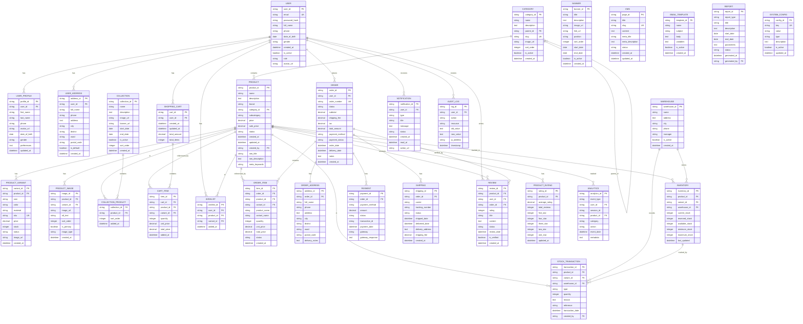

### **ENTITY RELATIONSHIP DIAGRAM (ERD) - SƠ ĐỒ THỰC THỂ QUAN HỆ**

```mermaid
erDiagram
    USER {
        string user_id PK
        string email UK
        string password_hash
        string full_name
        string phone
        date date_of_birth
        string gender
        datetime created_at
        boolean is_active
        string role
        string avatar_url
    }
    
    USER_PROFILE {
        string profile_id PK
        string user_id FK
        string first_name
        string last_name
        string phone
        string avatar_url
        date date_of_birth
        string gender
        text preferences
        datetime updated_at
    }
    
    USER_ADDRESS {
        string address_id PK
        string user_id FK
        string full_name
        string phone
        text address
        string city
        string district
        string ward
        string postal_code
        boolean is_default
        datetime created_at
    }
    
    PRODUCT {
        string product_id PK
        string name
        text description
        string brand
        string category_id FK
        string subcategory
        decimal price
        decimal sale_price
        string status
        datetime created_at
        datetime updated_at
        string created_by FK
        string seo_title
        text seo_description
        string meta_keywords
    }
    
    PRODUCT_VARIANT {
        string variant_id PK
        string product_id FK
        string size
        string color
        string material
        string sku UK
        decimal price
        integer stock
        string status
        string image_url
        datetime created_at
    }
    
    PRODUCT_IMAGE {
        string image_id PK
        string product_id FK
        string variant_id FK
        string image_url
        string alt_text
        integer sort_order
        boolean is_primary
        string image_type
        datetime created_at
    }
    
    CATEGORY {
        string category_id PK
        string name
        text description
        string parent_id FK
        string slug UK
        string image_url
        integer sort_order
        boolean is_active
        datetime created_at
    }
    
    COLLECTION {
        string collection_id PK
        string name
        text description
        string image_url
        string banner_url
        date start_date
        date end_date
        boolean is_active
        integer sort_order
        datetime created_at
    }
    
    COLLECTION_PRODUCT {
        string collection_id FK
        string product_id FK
        integer sort_order
        datetime added_at
    }
    
    SHOPPING_CART {
        string cart_id PK
        string user_id FK
        datetime created_at
        datetime updated_at
        decimal total_amount
        integer total_items
    }
    
    CART_ITEM {
        string item_id PK
        string cart_id FK
        string product_id FK
        string variant_id FK
        integer quantity
        decimal unit_price
        decimal total_price
        datetime added_at
    }
    
    WISHLIST {
        string wishlist_id PK
        string user_id FK
        string product_id FK
        string variant_id FK
        datetime added_at
    }
    
    ORDER {
        string order_id PK
        string user_id FK
        string order_number UK
        string status
        decimal subtotal
        decimal shipping_fee
        decimal tax
        decimal total_amount
        string payment_method
        string payment_status
        datetime order_date
        datetime delivery_date
        text notes
        datetime created_at
    }
    
    ORDER_ITEM {
        string item_id PK
        string order_id FK
        string product_id FK
        string variant_id FK
        string product_name
        string variant_name
        integer quantity
        decimal unit_price
        decimal total_price
        string status
        datetime created_at
    }
    
    ORDER_ADDRESS {
        string address_id PK
        string order_id FK
        string full_name
        string phone
        text address
        string city
        string district
        string ward
        string postal_code
        text delivery_notes
    }
    
    INVENTORY {
        string inventory_id PK
        string product_id FK
        string variant_id FK
        string warehouse_id FK
        integer current_stock
        integer reserved_stock
        integer available_stock
        integer minimum_stock
        integer maximum_stock
        datetime last_updated
    }
    
    WAREHOUSE {
        string warehouse_id PK
        string name
        text address
        string city
        string phone
        string manager
        boolean is_active
        datetime created_at
    }
    
    STOCK_TRANSACTION {
        string transaction_id PK
        string product_id FK
        string variant_id FK
        string warehouse_id FK
        string type
        integer quantity
        text reason
        string reference
        datetime transaction_date
        string created_by FK
    }
    
    PAYMENT {
        string payment_id PK
        string order_id FK
        string payment_method
        decimal amount
        string status
        string transaction_id
        datetime payment_date
        string gateway
        text gateway_response
    }
    
    SHIPPING {
        string shipping_id PK
        string order_id FK
        string carrier
        string tracking_number
        string status
        datetime shipped_date
        datetime delivered_date
        text delivery_address
        decimal shipping_fee
        datetime created_at
    }
    
    REVIEW {
        string review_id PK
        string product_id FK
        string user_id FK
        string order_id FK
        integer rating
        string title
        text content
        string status
        datetime review_date
        boolean is_verified
        datetime created_at
    }
    
    PRODUCT_RATING {
        string rating_id PK
        string product_id FK
        decimal average_rating
        integer total_reviews
        integer five_star
        integer four_star
        integer three_star
        integer two_star
        integer one_star
        datetime updated_at
    }
    
    BANNER {
        string banner_id PK
        string title
        text description
        string image_url
        string link_url
        string position
        integer sort_order
        date start_date
        date end_date
        boolean is_active
        datetime created_at
    }
    
    CMS {
        string page_id PK
        string title
        string slug UK
        text content
        string meta_title
        text meta_description
        string status
        datetime created_at
        datetime updated_at
    }
    
    NOTIFICATION {
        string notification_id PK
        string user_id FK
        string type
        string title
        text message
        string status
        datetime created_at
        datetime read_at
        string action_url
    }
    
    EMAIL_TEMPLATE {
        string template_id PK
        string name
        string subject
        text body
        text variables
        boolean is_active
        datetime created_at
    }
    
    REPORT {
        string report_id PK
        string report_type
        string title
        text description
        date start_date
        date end_date
        text parameters
        string status
        datetime generated_at
        string generated_by FK
    }
    
    ANALYTICS {
        string analytics_id PK
        string event_type
        string user_id FK
        string session_id
        string product_id FK
        string category
        string action
        datetime event_date
        text metadata
    }
    
    SYSTEM_CONFIG {
        string config_id PK
        string key UK
        string value
        string type
        text description
        boolean is_active
        datetime updated_at
    }
    
    AUDIT_LOG {
        string log_id PK
        string user_id FK
        string action
        string resource
        text old_value
        text new_value
        string ip_address
        datetime timestamp
    }
    
    %% Relationships
    USER ||--o{ USER_PROFILE : "has"
    USER ||--o{ USER_ADDRESS : "has"
    USER ||--o{ SHOPPING_CART : "has"
    USER ||--o{ WISHLIST : "has"
    USER ||--o{ ORDER : "places"
    USER ||--o{ REVIEW : "writes"
    USER ||--o{ NOTIFICATION : "receives"
    USER ||--o{ AUDIT_LOG : "creates"
    
    PRODUCT ||--o{ PRODUCT_VARIANT : "has"
    PRODUCT ||--o{ PRODUCT_IMAGE : "has"
    PRODUCT ||--o{ PRODUCT_RATING : "has"
    PRODUCT ||--o{ REVIEW : "receives"
    PRODUCT ||--o{ CART_ITEM : "referenced_by"
    PRODUCT ||--o{ ORDER_ITEM : "referenced_by"
    PRODUCT ||--o{ WISHLIST : "in"
    PRODUCT ||--o{ INVENTORY : "tracked_in"
    PRODUCT ||--o{ STOCK_TRANSACTION : "in"
    PRODUCT ||--o{ COLLECTION_PRODUCT : "in"
    PRODUCT ||--o{ ANALYTICS : "tracked"
    
    CATEGORY ||--o{ PRODUCT : "contains"
    CATEGORY ||--o{ CATEGORY : "parent_of"
    
    COLLECTION ||--o{ COLLECTION_PRODUCT : "contains"
    
    SHOPPING_CART ||--o{ CART_ITEM : "contains"
    
    ORDER ||--o{ ORDER_ITEM : "contains"
    ORDER ||--|| ORDER_ADDRESS : "has"
    ORDER ||--o{ PAYMENT : "has"
    ORDER ||--o{ SHIPPING : "has"
    ORDER ||--o{ REVIEW : "verified_by"
    
    WAREHOUSE ||--o{ INVENTORY : "stores"
    WAREHOUSE ||--o{ STOCK_TRANSACTION : "records"
    
    INVENTORY ||--o{ STOCK_TRANSACTION : "tracked_by"
```