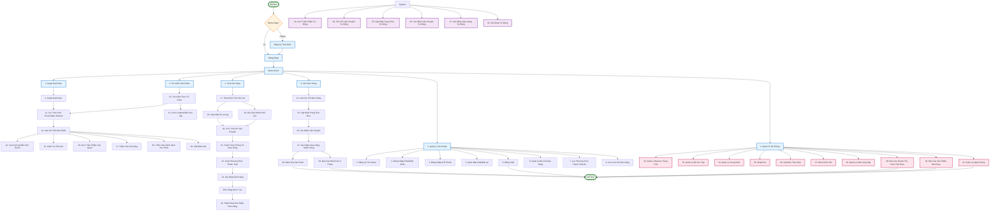

```mermaid
flowchart TD
    Start([Bắt Đầu]) --> Auth{Đăng Nhập?}
    
    %% Authentication Flow
    Auth -->|Có| Login[Đăng Nhập]
    Auth -->|Không| Register[Đăng Ký Tài Khoản]
    Register --> Login
    Login --> MainMenu[Menu Chính]
    
    %% Main Menu Options
    MainMenu --> Browse[1. Duyệt Danh Mục]
    MainMenu --> Search[2. Tìm Kiếm Sản Phẩm]
    MainMenu --> Cart[3. Xem Giỏ Hàng]
    MainMenu --> Orders[4. Xem Đơn Hàng]
    MainMenu --> Profile[5. Quản Lý Tài Khoản]
    MainMenu --> Admin[6. Quản Trị Hệ Thống]
    
    %% Browsing Flow
    Browse --> Categories[9. Duyệt Danh Mục]
    Categories --> Filter[11. Lọc Theo Kích Thước/Màu Sắc/Giá]
    Filter --> ProductDetails[12. Xem Chi Tiết Sản Phẩm]
    ProductDetails --> SizeGuide[14. Xem Hướng Dẫn Kích Thước]
    ProductDetails --> CheckStock[15. Kiểm Tra Tồn Kho]
    ProductDetails --> RelatedProducts[16. Gợi Ý Sản Phẩm Liên Quan]
    ProductDetails --> AddToCart[17. Thêm Vào Giỏ Hàng]
    ProductDetails --> AddToWishlist[30. Thêm Vào Danh Sách Yêu Thích]
    ProductDetails --> WriteReview[28. Viết Đánh Giá]
    
    %% Search Flow
    Search --> SearchKeywords[10. Tìm Kiếm Theo Từ Khóa]
    SearchKeywords --> Filter
    SearchKeywords --> Lookbook[13. Xem Lookbook/Bộ Sưu Tập]
    
    %% Cart Management Flow
    Cart --> ViewCart[17. Thêm Biến Thể Vào Giỏ]
    ViewCart --> UpdateQuantity[18. Cập Nhật Số Lượng]
    ViewCart --> RemoveItem[19. Xóa Sản Phẩm Khỏi Giỏ]
    UpdateQuantity --> EstimateShipping[20. Ước Tính Phí Vận Chuyển]
    RemoveItem --> EstimateShipping
    EstimateShipping --> Checkout[21. Thanh Toán Thông Tin Giao Hàng]
    Checkout --> SelectPayment[22. Chọn Phương Thức Thanh Toán]
    SelectPayment --> ConfirmOrder[23. Xác Nhận Đơn Hàng]
    ConfirmOrder --> OrderCreated[Đơn Hàng Được Tạo]
    OrderCreated --> EmailNotification[31. Nhận Email Xác Nhận Đơn Hàng]
    
    %% Order Management Flow
    Orders --> ViewOrderDetails[24. Xem Chi Tiết Đơn Hàng]
    ViewOrderDetails --> UpdateOrderStatus[25. Cập Nhật Trạng Thái Đơn]
    UpdateOrderStatus --> CreateShippingLabel[26. Tạo Nhãn Vận Chuyển]
    CreateShippingLabel --> ConfirmDelivery[27. Xác Nhận Giao Hàng Thành Công]
    ConfirmDelivery --> ReviewProduct[28. Đánh Giá Sản Phẩm]
    ConfirmDelivery --> ReportReview[29. Báo Cáo Đánh Giá Vi Phạm]
    
    %% Profile Management Flow
    Profile --> AccountRegistration[1. Đăng Ký Tài Khoản]
    Profile --> EmailPasswordLogin[2. Đăng Nhập Email/Mật Khẩu]
    Profile --> OTPLogin[3. Đăng Nhập OTP Email]
    Profile --> ForgotPassword[4. Quên Mật Khẩu/Đặt Lại]
    Profile --> Logout[5. Đăng Xuất]
    Profile --> AddressManagement[6. Quản Lý Địa Chỉ Giao Hàng]
    Profile --> PaymentMethod[7. Lưu Phương Thức Thanh Toán Ảo]
    Profile --> OrderHistory[8. Xem Lịch Sử Đơn Hàng]
    
    %% Admin Management Flow
    Admin --> HomepageBanners[32. Quản Lý Banner Trang Chủ]
    Admin --> ManageCollections[33. Quản Lý Bộ Sưu Tập]
    Admin --> CMSPages[34. Quản Lý Trang CMS]
    Admin --> StockIn[35. Nhập Kho]
    Admin --> StockOut[36. Xuất Kho Theo Đơn]
    Admin --> StockAdjustment[37. Điều Chỉnh Tồn]
    Admin --> ManageSuppliers[38. Quản Lý Nhà Cung Cấp]
    Admin --> RevenueReport[39. Báo Cáo Doanh Thu Theo Thời Gian]
    Admin --> BestSellingReport[40. Báo Cáo Sản Phẩm Bán Chạy]
    Admin --> UserManagement[41. Quản Lý Người Dùng]
    
    %% System Automated Processes
    System --> AutoSuggest[16. Gợi Ý Sản Phẩm Tự Động]
    System --> AutoShipping[20. Tính Phí Vận Chuyển Tự Động]
    System --> AutoStatusUpdate[25. Cập Nhật Trạng Thái Tự Động]
    System --> AutoShippingLabel[26. Tạo Nhãn Vận Chuyển Tự Động]
    System --> AutoDeliveryConfirm[27. Xác Nhận Giao Hàng Tự Động]
    System --> AutoEmail[31. Gửi Email Tự Động]
    
    %% End States
    Logout --> End([Kết Thúc])
    ReviewProduct --> End
    ReportReview --> End
    UserManagement --> End
    RevenueReport --> End
    BestSellingReport --> End
    
    %% Styling
    classDef startEnd fill:#e8f5e8,stroke:#2e7d32,stroke-width:3px
    classDef process fill:#e3f2fd,stroke:#1976d2,stroke-width:2px
    classDef decision fill:#fff3e0,stroke:#f57c00,stroke-width:2px
    classDef adminProcess fill:#fce4ec,stroke:#c2185b,stroke-width:2px
    classDef systemProcess fill:#f3e5f5,stroke:#7b1fa2,stroke-width:2px
    
    class Start,End startEnd
    class Auth decision
    class Login,Register,Browse,Search,Cart,Orders,Profile,Admin,MainMenu process
    class HomepageBanners,ManageCollections,CMSPages,StockIn,StockOut,StockAdjustment,ManageSuppliers,RevenueReport,BestSellingReport,UserManagement adminProcess
    class AutoSuggest,AutoShipping,AutoStatusUpdate,AutoShippingLabel,AutoDeliveryConfirm,AutoEmail systemProcess
```