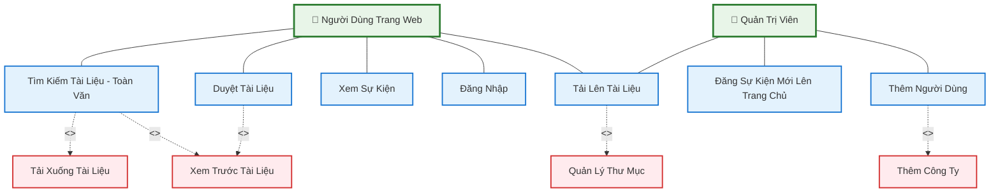

```mermaid
graph TB
    %% Tác Nhân
    SiteUser[👤 Người Dùng Trang Web]
    Webmaster[👤 Quản Trị Viên]
    
    %% Trường Hợp Sử Dụng Chính (Hình Oval Xanh)
    SearchDocs[Tìm Kiếm Tài Liệu - Toàn Văn]
    BrowseDocs[Duyệt Tài Liệu]
    ViewEvents[Xem Sự Kiện]
    Login[Đăng Nhập]
    UploadDocs[Tải Lên Tài Liệu]
    PostEvent[Đăng Sự Kiện Mới Lên Trang Chủ]
    AddUser[Thêm Người Dùng]
    
    %% Trường Hợp Sử Dụng Bao Gồm/Mở Rộng (Hình Oval Đỏ)
    DownloadDocs[Tải Xuống Tài Liệu]
    PreviewDoc[Xem Trước Tài Liệu]
    ManageFolders[Quản Lý Thư Mục]
    AddCompany[Thêm Công Ty]
    
    %% Liên Kết Tác Nhân
    SiteUser --- SearchDocs
    SiteUser --- BrowseDocs
    SiteUser --- ViewEvents
    SiteUser --- Login
    SiteUser --- UploadDocs
    
    Webmaster --- UploadDocs
    Webmaster --- PostEvent
    Webmaster --- AddUser
    
    %% Mối Quan Hệ Bao Gồm
    SearchDocs -.->|<<include>>| DownloadDocs
    SearchDocs -.->|<<include>>| PreviewDoc
    BrowseDocs -.->|<<include>>| PreviewDoc
    
    %% Mối Quan Hệ Mở Rộng
    UploadDocs -.->|<<extend>>| ManageFolders
    AddUser -.->|<<extend>>| AddCompany
    
    %% Định Dạng
    classDef actor fill:#e8f5e8,stroke:#2e7d32,stroke-width:3px
    classDef primaryUseCase fill:#e3f2fd,stroke:#1976d2,stroke-width:2px
    classDef secondaryUseCase fill:#ffebee,stroke:#d32f2f,stroke-width:2px
    
    class SiteUser,Webmaster actor
    class SearchDocs,BrowseDocs,ViewEvents,Login,UploadDocs,PostEvent,AddUser primaryUseCase
    class DownloadDocs,PreviewDoc,ManageFolders,AddCompany secondaryUseCase
```
