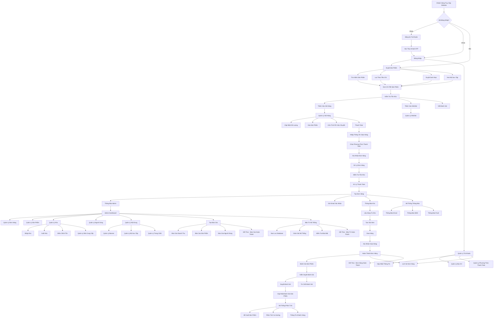

### **MASTER ACTIVITY DIAGRAM - QUY TRÌNH TỔNG THỂ**

```mermaid
flowchart TD
    Start[Khách Hàng Truy Cập Website] --> Auth{Đã Đăng Nhập?}
    
    Auth -->|Chưa| Register[Đăng Ký Tài Khoản]
    Auth -->|Chưa| Login[Đăng Nhập]
    Auth -->|Rồi| Browse[Duyệt Sản Phẩm]
    
    Register --> EmailVerify[Xác Thực Email OTP]
    EmailVerify --> Login
    Login --> Browse
    
    Browse --> Search[Tìm Kiếm Sản Phẩm]
    Browse --> Filter[Lọc Theo Tiêu Chí]
    Browse --> Category[Duyệt Danh Mục]
    Browse --> Collection[Xem Bộ Sưu Tập]
    
    Search --> ProductDetail[Xem Chi Tiết Sản Phẩm]
    Filter --> ProductDetail
    Category --> ProductDetail
    Collection --> ProductDetail
    
    ProductDetail --> CheckStock[Kiểm Tra Tồn Kho]
    CheckStock --> AddToCart[Thêm Vào Giỏ Hàng]
    CheckStock --> AddToWishlist[Thêm Vào Wishlist]
    CheckStock --> WriteReview[Viết Đánh Giá]
    
    AddToCart --> CartManagement[Quản Lý Giỏ Hàng]
    CartManagement --> UpdateQuantity[Cập Nhật Số Lượng]
    CartManagement --> RemoveItem[Xóa Sản Phẩm]
    CartManagement --> EstimateShipping[Ước Tính Phí Vận Chuyển]
    
    AddToWishlist --> WishlistManagement[Quản Lý Wishlist]
    
    CartManagement --> Checkout[Thanh Toán]
    Checkout --> ShippingInfo[Nhập Thông Tin Giao Hàng]
    ShippingInfo --> PaymentMethod[Chọn Phương Thức Thanh Toán]
    PaymentMethod --> OrderConfirmation[Xác Nhận Đơn Hàng]
    
    OrderConfirmation --> OrderProcessing[Xử Lý Đơn Hàng]
    OrderProcessing --> InventoryCheck[Kiểm Tra Tồn Kho]
    InventoryCheck --> PaymentProcessing[Xử Lý Thanh Toán]
    PaymentProcessing --> OrderCreated[Tạo Đơn Hàng]
    
    OrderCreated --> AdminNotification[Thông Báo Admin]
    OrderCreated --> CustomerEmail[Gửi Email Xác Nhận]
    OrderCreated --> WarehouseNotification[Thông Báo Kho]
    
    WarehouseNotification --> PickOrder[Lấy Hàng Từ Kho]
    PickOrder --> CreateShipment[Tạo Vận Đơn]
    CreateShipment --> ShipOrder[Giao Hàng]
    ShipOrder --> DeliveryConfirmation[Xác Nhận Giao Hàng]
    
    DeliveryConfirmation --> OrderComplete[Hoàn Thành Đơn Hàng]
    OrderComplete --> CustomerReview[Đánh Giá Sản Phẩm]
    OrderComplete --> OrderHistory[Lưu Lịch Sử Đơn Hàng]
    
    %% Admin Workflows
    AdminNotification --> AdminDashboard[Admin Dashboard]
    AdminDashboard --> OrderManagement[Quản Lý Đơn Hàng]
    AdminDashboard --> ProductManagement[Quản Lý Sản Phẩm]
    AdminDashboard --> InventoryManagement[Quản Lý Kho]
    AdminDashboard --> UserManagement[Quản Lý Người Dùng]
    AdminDashboard --> ContentManagement[Quản Lý Nội Dung]
    AdminDashboard --> ReportGeneration[Tạo Báo Cáo]
    
    %% Inventory Management
    InventoryManagement --> StockIn[Nhập Kho]
    InventoryManagement --> StockOut[Xuất Kho]
    InventoryManagement --> StockAdjustment[Điều Chỉnh Tồn]
    InventoryManagement --> SupplierManagement[Quản Lý Nhà Cung Cấp]
    
    %% Content Management
    ContentManagement --> BannerManagement[Quản Lý Banner]
    ContentManagement --> CollectionManagement[Quản Lý Bộ Sưu Tập]
    ContentManagement --> CMSManagement[Quản Lý Trang CMS]
    
    %% Reporting
    ReportGeneration --> SalesReport[Báo Cáo Doanh Thu]
    ReportGeneration --> ProductReport[Báo Cáo Sản Phẩm]
    ReportGeneration --> UserReport[Báo Cáo Người Dùng]
    
    %% Customer Account Management
    Login --> AccountManagement[Quản Lý Tài Khoản]
    AccountManagement --> ProfileUpdate[Cập Nhật Thông Tin]
    AccountManagement --> AddressManagement[Quản Lý Địa Chỉ]
    AccountManagement --> PaymentMethodManagement[Quản Lý Phương Thức Thanh Toán]
    AccountManagement --> OrderHistory[Lịch Sử Đơn Hàng]
    
    %% Notification System
    OrderCreated --> NotificationSystem[Hệ Thống Thông Báo]
    NotificationSystem --> EmailNotification[Thông Báo Email]
    NotificationSystem --> SMSNotification[Thông Báo SMS]
    NotificationSystem --> PushNotification[Thông Báo Push]
    
    %% Review and Rating System
    CustomerReview --> ReviewModeration[Kiểm Duyệt Đánh Giá]
    ReviewModeration --> ReviewApproval[Duyệt Đánh Giá]
    ReviewModeration --> ReviewRejection[Từ Chối Đánh Giá]
    ReviewApproval --> ProductRating[Cập Nhật Đánh Giá Sản Phẩm]
    
    %% Analytics and Recommendations
    ProductRating --> AnalyticsSystem[Hệ Thống Phân Tích]
    AnalyticsSystem --> ProductRecommendation[Đề Xuất Sản Phẩm]
    AnalyticsSystem --> TrendAnalysis[Phân Tích Xu Hướng]
    AnalyticsSystem --> CustomerInsight[Thông Tin Khách Hàng]
    
    %% System Maintenance
    AdminDashboard --> SystemMaintenance[Bảo Trì Hệ Thống]
    SystemMaintenance --> DatabaseBackup[Sao Lưu Database]
    SystemMaintenance --> SystemMonitoring[Giám Sát Hệ Thống]
    SystemMaintenance --> SecurityAudit[Kiểm Tra Bảo Mật]
    
    %% End States
    OrderComplete --> End1[Kết Thúc - Đơn Hàng Hoàn Thành]
    SystemMaintenance --> End2[Kết Thúc - Bảo Trì Hoàn Thành]
    ReportGeneration --> End3[Kết Thúc - Báo Cáo Hoàn Thành]
```
