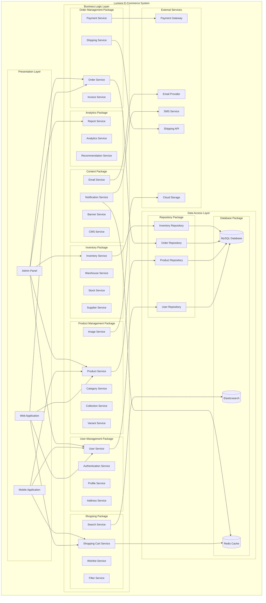

### **PACKAGE DIAGRAM - SƠ ĐỒ GÓI HỆ THỐNG**

```mermaid
graph TB
    subgraph "Lumiere E-Commerce System"
        subgraph "Presentation Layer"
            WebApp[Web Application]
            MobileApp[Mobile Application]
            AdminPanel[Admin Panel]
        end
        
        subgraph "Business Logic Layer"
            subgraph "User Management Package"
                UserService[User Service]
                AuthService[Authentication Service]
                ProfileService[Profile Service]
                AddressService[Address Service]
            end
            
            subgraph "Product Management Package"
                ProductService[Product Service]
                CategoryService[Category Service]
                CollectionService[Collection Service]
                VariantService[Variant Service]
                ImageService[Image Service]
            end
            
            subgraph "Shopping Package"
                CartService[Shopping Cart Service]
                WishlistService[Wishlist Service]
                SearchService[Search Service]
                FilterService[Filter Service]
            end
            
            subgraph "Order Management Package"
                OrderService[Order Service]
                PaymentService[Payment Service]
                ShippingService[Shipping Service]
                InvoiceService[Invoice Service]
            end
            
            subgraph "Inventory Package"
                InventoryService[Inventory Service]
                WarehouseService[Warehouse Service]
                StockService[Stock Service]
                SupplierService[Supplier Service]
            end
            
            subgraph "Content Package"
                BannerService[Banner Service]
                CMSService[CMS Service]
                NotificationService[Notification Service]
                EmailService[Email Service]
            end
            
            subgraph "Analytics Package"
                ReportService[Report Service]
                AnalyticsService[Analytics Service]
                RecommendationService[Recommendation Service]
            end
        end
        
        subgraph "Data Access Layer"
            subgraph "Repository Package"
                UserRepository[User Repository]
                ProductRepository[Product Repository]
                OrderRepository[Order Repository]
                InventoryRepository[Inventory Repository]
            end
            
            subgraph "Database Package"
                MySQL[(MySQL Database)]
                Redis[(Redis Cache)]
                Elasticsearch[(Elasticsearch)]
            end
        end
        
        subgraph "External Services"
            PaymentGateway[Payment Gateway]
            EmailProvider[Email Provider]
            SMSService[SMS Service]
            ShippingAPI[Shipping API]
            CloudStorage[Cloud Storage]
        end
    end
    
    %% Dependencies
    WebApp --> UserService
    WebApp --> ProductService
    WebApp --> CartService
    WebApp --> OrderService
    
    MobileApp --> UserService
    MobileApp --> ProductService
    MobileApp --> CartService
    
    AdminPanel --> UserService
    AdminPanel --> ProductService
    AdminPanel --> OrderService
    AdminPanel --> InventoryService
    AdminPanel --> ReportService
    
    UserService --> UserRepository
    ProductService --> ProductRepository
    OrderService --> OrderRepository
    InventoryService --> InventoryRepository
    
    UserRepository --> MySQL
    ProductRepository --> MySQL
    OrderRepository --> MySQL
    InventoryRepository --> MySQL
    
    SearchService --> Elasticsearch
    CartService --> Redis
    NotificationService --> Redis
    
    PaymentService --> PaymentGateway
    EmailService --> EmailProvider
    NotificationService --> SMSService
    ShippingService --> ShippingAPI
    ImageService --> CloudStorage
```