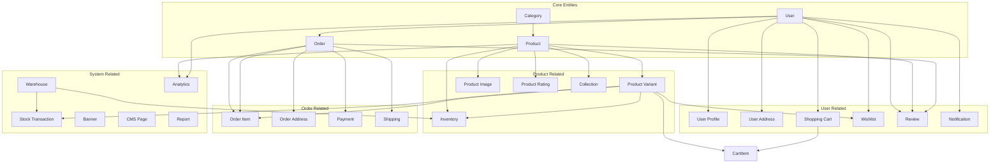

### **RELATIONSHIP DIAGRAM - LƯỢC ĐỒ QUAN HỆ**

```mermaid
graph TB
    subgraph "Core Entities"
        User[User]
        Product[Product]
        Order[Order]
        Category[Category]
    end
    
    subgraph "User Related"
        UserProfile[User Profile]
        UserAddress[User Address]
        ShoppingCart[Shopping Cart]
        Wishlist[Wishlist]
        Review[Review]
        Notification[Notification]
    end
    
    subgraph "Product Related"
        ProductVariant[Product Variant]
        ProductImage[Product Image]
        ProductRating[Product Rating]
        Collection[Collection]
        Inventory[Inventory]
    end
    
    subgraph "Order Related"
        OrderItem[Order Item]
        OrderAddress[Order Address]
        Payment[Payment]
        Shipping[Shipping]
    end
    
    subgraph "System Related"
        Warehouse[Warehouse]
        StockTransaction[Stock Transaction]
        Banner[Banner]
        CMS[CMS Page]
        Report[Report]
        Analytics[Analytics]
    end
    
    %% Core Relationships
    User --> UserProfile
    User --> UserAddress
    User --> ShoppingCart
    User --> Wishlist
    User --> Order
    User --> Review
    User --> Notification
    
    Product --> ProductVariant
    Product --> ProductImage
    Product --> ProductRating
    Product --> Review
    Product --> Inventory
    Product --> Collection
    
    Order --> OrderItem
    Order --> OrderAddress
    Order --> Payment
    Order --> Shipping
    Order --> Review
    
    Category --> Product
    
    %% Cross Relationships
    ProductVariant --> CartItem
    ProductVariant --> OrderItem
    ProductVariant --> Wishlist
    ProductVariant --> Inventory
    ProductVariant --> StockTransaction
    
    ShoppingCart --> CartItem
    Order --> OrderItem
    
    Warehouse --> Inventory
    Warehouse --> StockTransaction
    
    Product --> Analytics
    User --> Analytics
```
