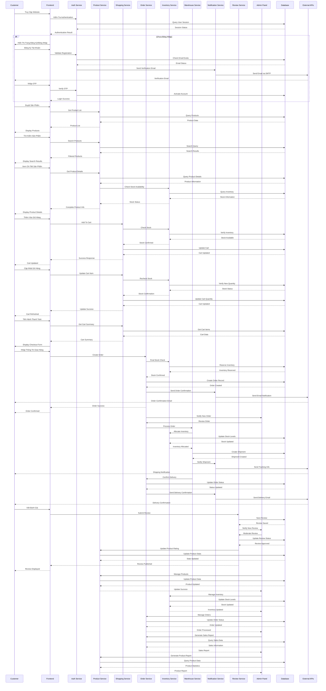

### **SEQUENCE DIAGRAM - TƯƠNG TÁC HỆ THỐNG TỔNG THỂ**

```mermaid
sequenceDiagram
    participant C as Customer
    participant F as Frontend
    participant A as Auth Service
    participant P as Product Service
    participant S as Shopping Service
    participant O as Order Service
    participant I as Inventory Service
    participant W as Warehouse Service
    participant N as Notification Service
    participant R as Review Service
    participant Admin as Admin Panel
    participant D as Database
    participant E as External APIs

    %% Customer Registration and Authentication
    C->>F: Truy Cập Website
    F->>A: Kiểm Tra Authentication
    A->>D: Query User Session
    D-->>A: Session Status
    A-->>F: Authentication Result
    
    alt Chưa Đăng Nhập
        F->>C: Hiển Thị Trang Đăng Ký/Đăng Nhập
        C->>F: Đăng Ký Tài Khoản
        F->>A: Validate Registration
        A->>D: Check Email Exists
        D-->>A: Email Status
        A->>N: Send Verification Email
        N->>E: Send Email via SMTP
        E-->>C: Verification Email
        C->>F: Nhập OTP
        F->>A: Verify OTP
        A->>D: Activate Account
        A-->>F: Login Success
    end
    
    %% Product Browsing and Search
    C->>F: Duyệt Sản Phẩm
    F->>P: Get Product List
    P->>D: Query Products
    D-->>P: Product Data
    P-->>F: Product List
    F-->>C: Display Products
    
    C->>F: Tìm Kiếm Sản Phẩm
    F->>P: Search Products
    P->>D: Search Query
    D-->>P: Search Results
    P-->>F: Filtered Products
    F-->>C: Display Search Results
    
    C->>F: Xem Chi Tiết Sản Phẩm
    F->>P: Get Product Details
    P->>D: Query Product Details
    D-->>P: Product Information
    P->>I: Check Stock Availability
    I->>D: Query Inventory
    D-->>I: Stock Information
    I-->>P: Stock Status
    P-->>F: Complete Product Info
    F-->>C: Display Product Details
    
    %% Shopping Cart Management
    C->>F: Thêm Vào Giỏ Hàng
    F->>S: Add To Cart
    S->>I: Check Stock
    I->>D: Verify Inventory
    D-->>I: Stock Available
    I-->>S: Stock Confirmed
    S->>D: Update Cart
    D-->>S: Cart Updated
    S-->>F: Success Response
    F-->>C: Cart Updated
    
    C->>F: Cập Nhật Giỏ Hàng
    F->>S: Update Cart Item
    S->>I: Recheck Stock
    I->>D: Verify New Quantity
    D-->>I: Stock Status
    I-->>S: Stock Confirmation
    S->>D: Update Cart Quantity
    D-->>S: Cart Updated
    S-->>F: Update Success
    F-->>C: Cart Refreshed
    
    %% Checkout Process
    C->>F: Tiến Hành Thanh Toán
    F->>S: Get Cart Summary
    S->>D: Get Cart Items
    D-->>S: Cart Data
    S-->>F: Cart Summary
    F->>C: Display Checkout Form
    
    C->>F: Nhập Thông Tin Giao Hàng
    F->>O: Create Order
    O->>I: Final Stock Check
    I->>D: Reserve Inventory
    D-->>I: Inventory Reserved
    I-->>O: Stock Confirmed
    O->>D: Create Order Record
    D-->>O: Order Created
    O->>N: Send Order Confirmation
    N->>E: Send Email Notification
    E-->>C: Order Confirmation Email
    O-->>F: Order Success
    F-->>C: Order Confirmed
    
    %% Order Processing
    O->>Admin: Notify New Order
    Admin->>O: Review Order
    O->>W: Process Order
    W->>I: Allocate Inventory
    I->>D: Update Stock Levels
    D-->>I: Stock Updated
    I-->>W: Inventory Allocated
    W->>D: Create Shipment
    D-->>W: Shipment Created
    W->>N: Notify Shipment
    N->>E: Send Tracking Info
    E-->>C: Shipping Notification
    
    %% Delivery Confirmation
    W->>O: Confirm Delivery
    O->>D: Update Order Status
    D-->>O: Status Updated
    O->>N: Send Delivery Confirmation
    N->>E: Send Delivery Email
    E-->>C: Delivery Confirmation
    
    %% Review and Rating
    C->>F: Viết Đánh Giá
    F->>R: Submit Review
    R->>D: Save Review
    D-->>R: Review Saved
    R->>Admin: Notify New Review
    Admin->>R: Moderate Review
    R->>D: Update Review Status
    D-->>R: Review Approved
    R->>P: Update Product Rating
    P->>D: Update Product Stats
    D-->>P: Stats Updated
    R-->>F: Review Published
    F-->>C: Review Displayed
    
    %% Admin Management
    Admin->>P: Manage Products
    P->>D: Update Product Data
    D-->>P: Product Updated
    P-->>Admin: Update Success
    
    Admin->>I: Manage Inventory
    I->>D: Update Stock Levels
    D-->>I: Stock Updated
    I-->>Admin: Inventory Updated
    
    Admin->>O: Manage Orders
    O->>D: Update Order Status
    D-->>O: Order Updated
    O-->>Admin: Order Processed
    
    %% Reporting and Analytics
    Admin->>O: Generate Sales Report
    O->>D: Query Sales Data
    D-->>O: Sales Information
    O-->>Admin: Sales Report
    
    Admin->>P: Generate Product Report
    P->>D: Query Product Data
    D-->>P: Product Statistics
    P-->>Admin: Product Report
```
