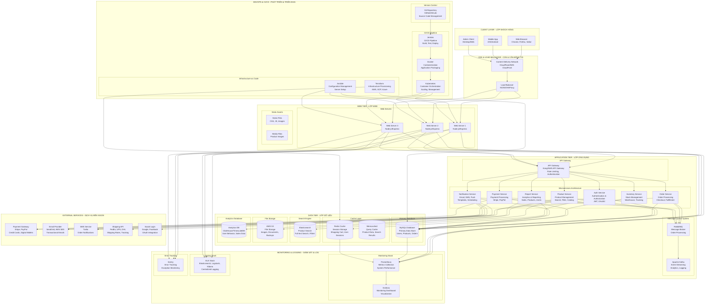

### **SYSTEM ARCHITECTURE DIAGRAM - SƠ ĐỒ KIẾN TRÚC HỆ THỐNG**

```mermaid
graph TB
    subgraph "CLIENT LAYER - LỚP KHÁCH HÀNG"
        WebBrowser[Web Browser<br/>Chrome, Firefox, Safari]
        MobileApp[Mobile App<br/>iOS/Android]
        AdminClient[Admin Client<br/>Desktop/Web]
    end
    
    subgraph "CDN & LOAD BALANCER - CDN & CÂN BẰNG TẢI"
        CDN[Content Delivery Network<br/>CloudFlare/AWS CloudFront]
        LoadBalancer[Load Balancer<br/>NGINX/HAProxy]
    end
    
    subgraph "WEB TIER - LỚP WEB"
        subgraph "Web Servers"
            WebServer1[Web Server 1<br/>Node.js/Express]
            WebServer2[Web Server 2<br/>Node.js/Express]
            WebServer3[Web Server 3<br/>Node.js/Express]
        end
        
        subgraph "Static Assets"
            StaticFiles[Static Files<br/>CSS, JS, Images]
            MediaFiles[Media Files<br/>Product Images]
        end
    end
    
    subgraph "APPLICATION TIER - LỚP ỨNG DỤNG"
        subgraph "API Gateway"
            APIGateway[API Gateway<br/>Kong/AWS API Gateway<br/>Rate Limiting, Authentication]
        end
        
        subgraph "Microservices Architecture"
            AuthService[Auth Service<br/>Authentication & Authorization<br/>JWT, OAuth2]
            ProductService[Product Service<br/>Product Management<br/>Search, Filter, Catalog]
            OrderService[Order Service<br/>Order Processing<br/>Checkout, Fulfillment]
            PaymentService[Payment Service<br/>Payment Processing<br/>Stripe, PayPal]
            InventoryService[Inventory Service<br/>Stock Management<br/>Warehouse, Tracking]
            NotificationService[Notification Service<br/>Email, SMS, Push<br/>Templates, Scheduling]
            ReportService[Report Service<br/>Analytics & Reporting<br/>Sales, Products, Users]
        end
        
        subgraph "Message Queue System"
            RabbitMQ[RabbitMQ<br/>Message Broker<br/>Order Processing]
            Kafka[Apache Kafka<br/>Event Streaming<br/>Analytics, Logging]
        end
    end
    
    subgraph "DATA TIER - LỚP DỮ LIỆU"
        subgraph "Primary Database"
            MySQL[(MySQL Database<br/>Primary Data Store<br/>Users, Products, Orders)]
        end
        
        subgraph "Cache Layer"
            Redis[(Redis Cache<br/>Session Storage<br/>Shopping Cart, User Sessions)]
            Memcached[(Memcached<br/>Query Cache<br/>Product Data, Search Results)]
        end
        
        subgraph "Search Engine"
            Elasticsearch[(Elasticsearch<br/>Product Search<br/>Full-text Search, Filters)]
        end
        
        subgraph "File Storage"
            S3[(AWS S3<br/>File Storage<br/>Images, Documents, Backups)]
        end
        
        subgraph "Analytics Database"
            AnalyticsDB[(Analytics DB<br/>ClickHouse/TimescaleDB<br/>User Behavior, Sales Data)]
        end
    end
    
    subgraph "EXTERNAL SERVICES - DỊCH VỤ BÊN NGOÀI"
        PaymentGateway[Payment Gateway<br/>Stripe, PayPal<br/>Credit Cards, Digital Wallets]
        EmailProvider[Email Provider<br/>SendGrid, AWS SES<br/>Transactional Emails]
        SMSService[SMS Service<br/>Twilio<br/>Order Notifications]
        ShippingAPI[Shipping API<br/>FedEx, UPS, DHL<br/>Shipping Rates, Tracking]
        SocialLogin[Social Login<br/>Google, Facebook<br/>OAuth Integration]
    end
    
    subgraph "MONITORING & LOGGING - GIÁM SÁT & LOG"
        subgraph "Monitoring Stack"
            Prometheus[Prometheus<br/>Metrics Collection<br/>System Performance]
            Grafana[Grafana<br/>Monitoring Dashboard<br/>Visualization]
        end
        
        subgraph "Logging Stack"
            ELK[ELK Stack<br/>Elasticsearch, Logstash, Kibana<br/>Centralized Logging]
        end
        
        subgraph "Error Tracking"
            Sentry[Sentry<br/>Error Tracking<br/>Exception Monitoring]
        end
    end
    
    subgraph "DEVOPS & CI/CD - PHÁT TRIỂN & TRIỂN KHAI"
        subgraph "Version Control"
            Git[Git Repository<br/>GitHub/GitLab<br/>Source Code Management]
        end
        
        subgraph "CI/CD Pipeline"
            Jenkins[Jenkins<br/>CI/CD Pipeline<br/>Build, Test, Deploy]
            Docker[Docker<br/>Containerization<br/>Application Packaging]
            Kubernetes[Kubernetes<br/>Container Orchestration<br/>Scaling, Management]
        end
        
        subgraph "Infrastructure as Code"
            Terraform[Terraform<br/>Infrastructure Provisioning<br/>AWS, GCP, Azure]
            Ansible[Ansible<br/>Configuration Management<br/>Server Setup]
        end
    end
    
    %% Client to CDN
    WebBrowser --> CDN
    MobileApp --> CDN
    AdminClient --> CDN
    
    %% CDN to Load Balancer
    CDN --> LoadBalancer
    
    %% Load Balancer to Web Servers
    LoadBalancer --> WebServer1
    LoadBalancer --> WebServer2
    LoadBalancer --> WebServer3
    
    %% Web Servers to API Gateway
    WebServer1 --> APIGateway
    WebServer2 --> APIGateway
    WebServer3 --> APIGateway
    
    %% API Gateway to Microservices
    APIGateway --> AuthService
    APIGateway --> ProductService
    APIGateway --> OrderService
    APIGateway --> PaymentService
    APIGateway --> InventoryService
    APIGateway --> NotificationService
    APIGateway --> ReportService
    
    %% Microservices to Databases
    AuthService --> MySQL
    AuthService --> Redis
    ProductService --> MySQL
    ProductService --> Elasticsearch
    ProductService --> S3
    OrderService --> MySQL
    OrderService --> RabbitMQ
    PaymentService --> MySQL
    PaymentService --> PaymentGateway
    InventoryService --> MySQL
    NotificationService --> MySQL
    NotificationService --> EmailProvider
    NotificationService --> SMSService
    ReportService --> MySQL
    ReportService --> AnalyticsDB
    
    %% Message Queue Connections
    OrderService --> RabbitMQ
    PaymentService --> RabbitMQ
    NotificationService --> RabbitMQ
    RabbitMQ --> Kafka
    
    %% External Service Connections
    PaymentService --> PaymentGateway
    NotificationService --> EmailProvider
    NotificationService --> SMSService
    OrderService --> ShippingAPI
    AuthService --> SocialLogin
    
    %% Monitoring Connections
    WebServer1 --> Prometheus
    WebServer2 --> Prometheus
    WebServer3 --> Prometheus
    MySQL --> Prometheus
    Redis --> Prometheus
    Prometheus --> Grafana
    
    WebServer1 --> ELK
    WebServer2 --> ELK
    WebServer3 --> ELK
    
    WebServer1 --> Sentry
    WebServer2 --> Sentry
    WebServer3 --> Sentry
    
    %% DevOps Connections
    Git --> Jenkins
    Jenkins --> Docker
    Docker --> Kubernetes
    Kubernetes --> WebServer1
    Kubernetes --> WebServer2
    Kubernetes --> WebServer3
    
    Terraform --> MySQL
    Terraform --> Redis
    Ansible --> WebServer1
    Ansible --> WebServer2
    Ansible --> WebServer3
```